# omniplc

#### 介绍
omniplc:一个面向多品牌、多协议 PLC 的 Python 统一通信库。一次编写,即可通过一致的 API 对接三菱、欧姆龙、基恩士、汇川、松下、丰田、罗克韦尔(AB)、倍福(TwinCAT)、西门子(S7)等 PLC/扫码枪、OPC-UA 服务器与 CNC 机床(MTConnect),支持 Modbus、MC(3E/4E/1E 以太网帧、3C/4C 串口帧)、FINS、NJ/NX CIP(EtherNet/IP)、KV Host Link、KV MC 协议兼容(SLMP)、汇川 H3U/H5U(Modbus TCP/RTU、MC 协议兼容 3E)、松下 FP(MC 协议兼容 3E、MEWTOCOL)、SR、TOYOPUC 计算机链接、EtherNet/IP(Logix 标签读写)、TwinCAT ADS(封装 pyads)、西门子 S7(封装 python-snap7,DB/I/Q/M)、通用自定义 TCP(分隔符成帧)、OPC-UA、MTConnect 数采等协议。

- **Python 3.7+**,uv 开发,核心零第三方依赖
- 命名与使用习惯对齐,迁移成本极低
- 全量类型标注(PEP 484 + py.typed),mypy 检查通过
- 内置全局报文调试开关(`omniplc.set_debug(True)` 一键输出所有协议的请求/响应报文)
- 线程安全、惰性自动重连、可配置超时/重试
- 同步 + 异步(异步类 = 同步类名前加 `A`)双轨 API

#### 类继承图

```mermaid
flowchart TB
    BaseClient["BaseClient(ABC,模板方法)<br/>连接状态机 / 事务锁 / 惰性重连 / 类型化读写只写一次"]

    ModbusBaseClient["ModbusBaseClient<br/>寄存器级公共逻辑:字序 / 类型分发 / 范围校验"]
    ModbusTcpClient["ModbusTcpClient — MBAP over TCP(502)"]
    ModbusRtuClient["ModbusRtuClient — 站号+PDU+CRC16 over 串口"]
    InovanceTcpClient["InovanceTcpClient — 汇川 H3U/H5U Modbus TCP(502)<br/>继承 Modbus,只换软元件地址映射"]
    InovanceRtuClient["InovanceRtuClient — 汇川 H3U/H5U Modbus RTU(串口)<br/>继承 Modbus,只换软元件地址映射"]

    MelsecMcTcpClient["MelsecMcTcpClient — 三菱 MC 3E/4E/1E 帧 over TCP(2000)"]
    MelsecMcUdpClient["MelsecMcUdpClient — 三菱 MC 同帧型 over UDP(2000)"]
    MelsecMcSerialClient["MelsecMcSerialClient — 三菱 MC 串口帧(C24)<br/>3C 帧 ASCII 格式 4 / 4C 帧 二进制格式 5,需 pyserial"]
    MelsecMxClient["MelsecMxClient — 三菱 MX Component(Windows,comtypes,逻辑站号)"]
    KeyenceMcTcpClient["KeyenceMcTcpClient — 基恩士 KV MC 协议兼容 / SLMP 3E 帧 over TCP(5000)<br/>继承 MelsecMcTcpClient,只换软元件码表"]
    KeyenceMcUdpClient["KeyenceMcUdpClient — 基恩士 KV MC 协议兼容 SLMP 3E 帧 over UDP(5000)<br/>继承 MelsecMcUdpClient,与 TCP 版共用码表覆写"]
    InovanceMcTcpClient["InovanceMcTcpClient — 汇川 MC 协议兼容 3E 帧<br/>继承 MelsecMcTcpClient,换码表 + 记号换算(S→L 码、R=D+8000、X/Y 八进制)"]
    PanasonicMcTcpClient["PanasonicMcTcpClient — 松下 FP0H/FP7 MC 协议兼容 3E 帧<br/>继承 MelsecMcTcpClient,换码表 + 记号换算(字号×16+位号、R9000+→SM、D90000+→SD)"]
    PanasonicMewtocolTcpClient["PanasonicMewtocolTcpClient — 松下 MEWTOCOL over TCP(1024)<br/>ASCII 帧 + BCC,RCS/WCS 单接点、RD/WD 数据区"]
    PanasonicMewtocolUdpClient["PanasonicMewtocolUdpClient — MEWTOCOL over UDP(1024)"]

    OmronFinsTcpClient["OmronFinsTcpClient — 欧姆龙 FINS + TCP 握手(9600)"]
    OmronFinsUdpClient["OmronFinsUdpClient — 欧姆龙 FINS over UDP(9600)"]

    AllenBradleyEthIpClient["AllenBradleyEthIpClient — 罗克韦尔 AB EtherNet/IP(44818)<br/>Logix 标签读写,标签自描述<br/>unconnected(UC Send 槽号路由)/ connected(Forward Open + SendUnitData)双通道"]

    OmronCipClient["OmronCipClient — 欧姆龙 NJ/NX CIP(44818)<br/>继承 AllenBradleyEthIpClient:unconnected 直发(无背板路由)<br/>connected 连接路径只剩消息路由对象,NJ 变量读写"]

    BeckhoffAdsClient["BeckhoffAdsClient — 倍福 TwinCAT ADS(AMS 851,封装 pyads)<br/>变量名即地址(MAIN.nCounter),类型显式指定<br/>ADSError → DeviceError 不断线"]

    KeyenceHostLinkTcpClient["KeyenceHostLinkTcpClient — 基恩士 KV Host Link over TCP(8000)"]
    KeyenceHostLinkUdpClient["KeyenceHostLinkUdpClient — 基恩士 KV Host Link over UDP(8000)"]

    KeyenceSrClient["KeyenceSrClient — 基恩士 SR 扫码枪 TCP(9004,LON/LOFF 触发扫码)"]

    ToyopucTcpClient["ToyopucTcpClient — 丰田 TOYOPUC 计算机链接 over TCP(1025)"]
    ToyopucUdpClient["ToyopucUdpClient — TOYOPUC 同帧 over UDP(1025)"]

    OpcUaClient["OpcUaClient — OPC-UA opc.tcp 会话(4840,封装 asyncua)"]

    OpenTcpClient["OpenTcpClient — 通用自定义 TCP/IP 客户端(端口按设备)<br/>分隔符/定长成帧 + 内部缓冲,重连/超时沿用 BaseClient 属性<br/>send/send_text/receive/receive_text/transact*"]

    BaseClient --> ModbusBaseClient
    ModbusBaseClient --> ModbusTcpClient
    ModbusBaseClient --> ModbusRtuClient
    ModbusBaseClient --> InovanceTcpClient
    ModbusBaseClient --> InovanceRtuClient
    BaseClient --> MelsecMcTcpClient
    BaseClient --> MelsecMcUdpClient
    BaseClient --> MelsecMcSerialClient
    BaseClient --> MelsecMxClient
    MelsecMcTcpClient --> KeyenceMcTcpClient
    MelsecMcUdpClient --> KeyenceMcUdpClient
    MelsecMcTcpClient --> InovanceMcTcpClient
    MelsecMcTcpClient --> PanasonicMcTcpClient
    BaseClient --> PanasonicMewtocolTcpClient
    BaseClient --> PanasonicMewtocolUdpClient
    BaseClient --> OmronFinsTcpClient
    BaseClient --> OmronFinsUdpClient
    BaseClient --> BeckhoffAdsClient
    BaseClient --> AllenBradleyEthIpClient
    AllenBradleyEthIpClient --> OmronCipClient
    BaseClient --> KeyenceHostLinkTcpClient
    BaseClient --> KeyenceHostLinkUdpClient
    BaseClient --> KeyenceSrClient
    BaseClient --> ToyopucTcpClient
    BaseClient --> ToyopucUdpClient
    BaseClient --> OpcUaClient
    BaseClient --> OpenTcpClient

    AsyncMirror["异步镜像(omniplc.aio,类名 = 同步类名前加 A):<br/>AModbusTcpClient / AModbusRtuClient / AInovanceTcpClient / AInovanceRtuClient / AInovanceMcTcpClient<br/>AMelsecMcTcpClient / AMelsecMcUdpClient / AMelsecMcSerialClient / AMelsecMxClient / AOmronFinsTcpClient<br/>AOmronFinsUdpClient / AOmronCipClient / ABeckhoffAdsClient / AAllenBradleyEthIpClient / AKeyenceHostLinkTcpClient / AKeyenceHostLinkUdpClient / AKeyenceMcTcpClient / AKeyenceMcUdpClient<br/>APanasonicMcTcpClient / APanasonicMewtocolTcpClient / APanasonicMewtocolUdpClient<br/>AKeyenceSrClient / AToyopucTcpClient / AToyopucUdpClient / AOpcUaClient / AOpenTcpClient"]
    BaseClient -.-> AsyncMirror
```



详细架构设计见 [docs/architecture.md](docs/architecture.md)。

#### 安装

```bash
uv add omniplc            # 或 pip install omniplc
uv add 'omniplc[serial]'  # 需要 Modbus RTU 或三菱 MC 串口 3C/4C 帧时(pyserial)
uv add 'omniplc[mx]'      # 需要三菱 MX Component(Windows)时
uv add 'omniplc[opcua]'   # 需要 OPC-UA 时(安装 asyncua)
```

#### 快速上手

```python
from omniplc import ModbusTcpClient, DataType

client = ModbusTcpClient(ip_address="192.168.0.10", port=502, station=1)
client.receive_timeout = 3.0        # 超时走属性,不进构造函数
client.connect()

ok, value = client.read_float("hr100")     # 读返回 (是否成功, 值)
ok = client.write_float("hr100", 3.14)     # 写返回 bool
print(client.last_error)                   # 失败原因在这里

client.disconnect()

# 上下文管理器:进入自动连接,失败抛 ConnectionError
with ModbusTcpClient("192.168.0.10", 502, 1) as client:
    ok, values = client.read_many(["hr0", "hr2"], DataType.FLOAT)

# 通用 read/write 推荐传 DataType 枚举(IDE 自动补全),也兼容字符串
ok, value = client.read("hr0", DataType.FLOAT)

# 掩码写(FC22):设备侧原子位修改,替代读-改-写两段事务
ok = client.write_mask_register("hr100", and_mask=0xFFFE, or_mask=0x0001)

# Modbus RTU(串口)
from omniplc import ModbusRtuClient
rtu = ModbusRtuClient(station=1)
rtu.configure_serial("COM3", baud_rate=9600)
```

#### 三菱 / 欧姆龙 / 基恩士 / 汇川 / 丰田

```python
from omniplc import MelsecMcTcpClient, OmronFinsUdpClient, McFrame

# 三菱 MC:frame=McFrame.FRAME_3E/FRAME_4E(QnA 兼容)或 FRAME_1E(A 兼容,A 系列)
mc = MelsecMcTcpClient(ip_address="192.168.3.39", port=2000, frame=McFrame.FRAME_3E)
mc.connect()
ok, value = mc.read_ushort("D100")
ok = mc.write_bool("M100", True)
ok, values = mc.read_batch([("D100", "short"), ("M100", "bool")])  # 0406 多块批量读,单事务

# 三菱 MC 串口帧(C24 串口模块,需 pyserial):3C=ASCII 格式 4,4C=二进制格式 5
# 软元件地址与 3E 帧一致;串口参数须与 C24"传送设定"一致,默认访问连接站 CPU(PC 号 FF)
from omniplc import MelsecMcSerialClient
mc_sio = MelsecMcSerialClient(frame=McFrame.FRAME_4C)
mc_sio.configure_serial("COM3", baud_rate=9600)
mc_sio.connect()
ok, value = mc_sio.read_ushort("D100")
ok = mc_sio.write_bool("M100", True)

# 三菱 MX Component(Windows):通信参数在通信设置实用程序中配置为逻辑站号
# 安装:pip install 'omniplc[mx]'
from omniplc import MelsecMxClient
mx = MelsecMxClient(logical_station_number=1)
mx.connect()
ok, value = mx.read_ushort("D100")
ok = mx.write_bool("M10", True)
# ReadDeviceRandom 原生随机读:仅 16 位类型(BOOL/SHORT/USHORT),单事务
ok, values = mx.read_batch([("M10", "bool"), ("D100", "short")])

# 欧姆龙 FINS:TCP 自动做节点分配握手,UDP 无握手
fins = OmronFinsUdpClient(ip_address="192.168.250.1", port=9600)
fins.connect()
ok, value = fins.read_ushort("D100")
ok = fins.write_bool("CIO0.5", True)
ok, values = fins.read_batch([("D100", "short"), ("CIO0.5", "bool")])  # 0104 多存储区读,单事务

# 欧姆龙 NJ/NX CIP(内置 EtherNet/IP):Sysmac 变量自描述,地址即变量名
# TestVar / MyArray[5] / Motor[2].Speed;继承 AB 客户端,直发不包 UC Send
from omniplc import OmronCipClient
nj = OmronCipClient(ip_address="192.168.0.10", port=44818)
ok, value = nj.read_int("TestVar")
ok = nj.write_bool("RunFlag", True)
nj_c = OmronCipClient(ip_address="192.168.0.10", connected_messaging=True)  # 连接型

# 倍福 TwinCAT(ADS):变量名即地址(MAIN.nCounter / .gGlobal / GVL.MyVar)
# 安装:pip install 'omniplc[ads]'(Windows 侧还需 Beckhoff TcAdsDll 运行库,随 TwinCAT ADS 安装)
from omniplc import BeckhoffAdsClient
bc = BeckhoffAdsClient(ip_address="192.168.0.10", ads_port=851)  # net_id 默认 IP+.1.1
ok, value = bc.read_int("MAIN.nCounter")
ok = bc.write_bool("MAIN.bStart", True)
ok, text = bc.read_string("MAIN.sRecipe")

# 罗克韦尔 AB EtherNet/IP:Logix 标签自描述,类型不符会明确报错
# 地址即标签名:MyDint / MyArray[5] / MyUdt.Member / MyDint.3(位)/ 程序作用域 Program:prog.Tag
from omniplc import AllenBradleyEthIpClient
ab = AllenBradleyEthIpClient(ip_address="192.168.1.20", port=44818, slot=0)
ab.connect()
ok, value = ab.read_int("MyDint")
ok = ab.write_bool("StartCmd", True)
ok, text = ab.read_string("RecipeName")
# 0x0A 多服务包:一帧混读多个标签(上限 32 条;BOOL 首次批量读会做一次类型发现)
ok, values = ab.read_batch([("MyDint", "int"), ("MyReal", "float"), ("RecipeName", "string")])
ok, info = ab.get_plc_info()      # Identity Object:厂商/序列号/产品名
ok, ident = ab.list_identity()    # ENIP 单播发现
# connected 消息(Forward Open + SendUnitData,大批量轮询吞吐更高):
ab_c = AllenBradleyEthIpClient(ip_address="192.168.1.20", connected_messaging=True)

# 基恩士 KV Host Link:ASCII 行式协议,地址如 DM100 / R515 / W100
from omniplc import KeyenceHostLinkTcpClient
kv = KeyenceHostLinkTcpClient(ip_address="192.168.0.10", port=8000)
kv.connect()
ok, value = kv.read_ushort("DM100")
ok = kv.write_bool("R515", True)

# 基恩士 KV MC 协议兼容(SLMP):二进制 3E 帧复用三菱实现,仅码表不同
# 地址如 R5(位,十进制)/ DM100(字,十进制)/ B1F / W10(十六进制)/ ZR100
from omniplc import KeyenceMcTcpClient, KeyenceMcUdpClient
kvmc = KeyenceMcTcpClient(ip_address="192.168.1.22", port=5000)
ok, value = kvmc.read_ushort("DM100")
ok = kvmc.write_bool("R5", True)
kvmc_u = KeyenceMcUdpClient(ip_address="192.168.1.22", port=5000)  # UDP 走线,一问一答一数据报

# 汇川 H3U/H5U:Modbus TCP/RTU + 汇川软元件地址映射
# 地址如 D100 / R100 / M10 / SM10 / X17(八进制)/ D100.3;T/C 位=接点、字=当前值
from omniplc import InovanceTcpClient, InovanceRtuClient
h3u = InovanceTcpClient(ip_address="192.168.1.88", port=502, station=1)
ok, value = h3u.read_ushort("D100")
ok = h3u.write_bool("M10", True)
rtu2 = InovanceRtuClient(station=1)
rtu2.configure_serial("COM3")   # 汇川缺省 9600-8N2

# 汇川 MC 协议兼容(3E 帧,Easy 系列/H5U 固件 V6.4.0.0+ 的"MC配置"功能)
# 帧按三菱口径编码;S 按三菱 L 码、R 与 D 统一编址(R100=D8100)、X/Y 八进制命名
# 端口无出厂默认,须与 AutoShop"MC配置"中设置一致
from omniplc import InovanceMcTcpClient
imc = InovanceMcTcpClient(ip_address="192.168.1.88", port=2000)
ok, value = imc.read_ushort("R100")
ok = imc.write_bool("X17", True)

# 松下 FP0H/FP7:MC 协议兼容(3E 帧,仅二进制成批读/写)+ MEWTOCOL(TCP/UDP)
# MC:位软元件按"字号+位号"(R1F=字1位F/R1.15),R9000+(字900)起为 SM,D90000+ 为 SD
# 端口以模块配置为准;MEWTOCOL 接点 X/Y/R/T/C/L + 数据 D/L/F/S/K(K=经过值,S=设定值)
from omniplc import PanasonicMcTcpClient, PanasonicMewtocolTcpClient, PanasonicMewtocolUdpClient
pmc = PanasonicMcTcpClient(ip_address="192.168.0.10", port=2000)
ok, value = pmc.read_ushort("D100")
ok = pmc.write_bool("R1F", True)
mew = PanasonicMewtocolTcpClient(ip_address="192.168.0.10", port=1024, station=1)
ok, value = mew.read_ushort("D100")
ok = mew.write_bool("Y0.3", True)
mewu = PanasonicMewtocolUdpClient(ip_address="192.168.0.10", port=1024)

# 基恩士 SR 扫码枪:触发式设备,scan() 返回 (是否读到, 条码文本)
from omniplc import KeyenceSrClient
sr = KeyenceSrClient(ip_address="192.168.0.10", port=9004, scan_dwell=1.0)
sr.connect()
ok, code = sr.scan()        # LON → 窗口 → LOFF → 读应答

# 丰田 TOYOPUC 计算机链接:二进制帧,地址如 D0100 / M0201 / X0010H / M0201W
from omniplc import ToyopucTcpClient
toyopuc = ToyopucTcpClient(ip_address="192.168.0.10", port=1025)
ok, value = toyopuc.read_ushort("D0100")   # 编号为十六进制
ok = toyopuc.write_bool("M0201", True)     # 位软元件 CMD=20/21 直读直写

# OPC-UA:标准 NodeId 寻址,读写按显式数据类型编解码;入口同其他客户端(IP+端口)
# 安装:pip install 'omniplc[opcua]'
from omniplc import OpcUaClient
opc = OpcUaClient("192.168.0.10", 4840)
ok, value = opc.read_float("ns=2;s=Device.Temperature")
ok = opc.write_ushort("ns=2;s=Device.Speed", 1200)

# 通用自定义 TCP:任意分隔符成帧设备(称重仪表、传感器、自定义程序等)
# 分隔符/编码/收发行为构造期可配;超时与重连沿用属性(client.receive_timeout / client.retries)
from omniplc import OpenTcpClient
dev = OpenTcpClient(ip_address="192.168.0.10", port=9000, delimiter="\r\n")
dev.receive_timeout = 2.0
dev.connect()
ok = dev.send_text("READ")             # 自动补分隔符(append_delimiter 可关)
ok, raw = dev.receive()                # 按分隔符收一帧(bytes),跨分片自动拼接
ok, text = dev.transact_text("VER")    # 发送并收一帧(str);坏帧/解码失败断线重连,超时不断线

# CNC 机床数采(MTConnect):数据项 id 即地址,Agent 默认端口 5000(标准库实现,零第三方依赖)
# FANUC/三菱等控制器经适配器喂给 Agent 即可采;先 snapshot() 查看机器实际提供的数据项
from omniplc import MTConnectClient
cnc = MTConnectClient("192.168.0.10", 5000)
cnc.connect()
ok, speed = cnc.read_float("Sspeed")   # 主轴转速(文本值自动转 float)
ok, program = cnc.read_string("program")
ok, items = cnc.snapshot()             # 全量当前值快照 {数据项 id: 文本值}
ok, alarms = cnc.read_conditions()     # 条件项(Fault/Warning/Normal)列表
ok, device = cnc.probe()               # 设备信息(name/uuid 等)

# 西门子 S7(封装 python-snap7):DB/I/Q/M 绝对寻址,ISO-on-TCP 102,rack/slot 路由
# S7-1200/1500 需勾选"允许来自远程对象的 PUT/GET 通信访问",DB 须为非优化块
# 安装:pip install 'omniplc[s7]' —— 依赖按 Python 版本自动二选一:
#   3.7~3.9 → python-snap7 1.3(C 封装,64 位用捆绑库;32 位需自备 snap7.dll 经 dll_path 指定)
#   3.10+   → python-snap7 3.x(纯 Python 实现,无需原生 DLL)
from omniplc import SiemensS7Client
s7 = SiemensS7Client("192.168.0.1", rack=0, slot=1)  # 300/400 的 CPU 常在槽位 2
s7.connect()
ok, temp = s7.read_float("DB1.DBD6")   # DB 双字起点,REAL
ok = s7.write_bool("DB1.DBX0.3", True) # DB 位(锁内读-改-写)
ok, current = s7.read_ushort("MW10")   # Merker 字
ok, text = s7.read_string("DB1.DBS20", length=32)  # S7 String(头 2 字节声明/实际长)
```

#### 批量读取(协议原生,单事务)

`read_many(地址列表, 数据类型)` 与 `read_batch([(地址, 类型), ...])` 全库统一契约：**一帧往返**读回多个点(不是循环单点),任一地址非法或设备拒绝则**整批失败**(原因在 `last_error`;要逐点容错请逐点 `read`)。以下驱动覆写为协议原生批量,其余驱动回退逐点独立事务:

- 三菱 MC 3E/4E:`0406` 多块批量读(混软元件,总块数 ≤120);KV/汇川/松下 MC 兼容子类经继承同享
- 欧姆龙 FINS:`0104` 多存储区读(以太网上限 167 条)
- AB / 欧姆龙 NJ-NX CIP:`0x0A` 多服务包(上限 32 条;BOOL 首次批量读做一次类型发现后缓存)
- OPC-UA:UA Read 服务原生多节点(asyncua `read_values` 单请求)
- MX Component:`ReadDeviceRandom`(软元件列表换行分隔;仅 16 位类型)

```python
# 混类型混软元件:一帧取回全部值(以 MC 为例,其余驱动同款接口)
ok, values = mc.read_batch([
    ("D100", "short"), ("D102", "float"), ("M100", "bool"), ("D110.3", "bool"),
])
# 统一类型批量:read_many(等价于 read_batch 的同类型版本)
ok_list = mc.read_many(["D0", "D2", "D4"], DataType.FLOAT)
```

#### 报文调试(全局开关)

```python
import omniplc

omniplc.set_debug(True)   # 之后所有协议客户端输出请求/响应报文(十六进制)
omniplc.set_debug(False)  # 关闭
```

- 走线型协议(TCP/UDP/串口)在传输层统一挂钩,输出每次收发的原始字节;
  TCP 应答分多段到达时按段输出。输出形如
  `tcp://192.168.0.10:2000 → 发送 12B: 50 00 00 FF …`(单条最多转储 4096B)
- 会话型协议(OPC-UA / ADS / MX Component 无字节流)输出操作级日志,
  如 `ads://192.168.0.10.1.1:851 读 MAIN.rTemp(PLCTYPE_REAL) → 3.14`
- 输出走 `logging`(记录器名 `omniplc.debug`,DEBUG 级):应用已配置
  logging 时自动汇入既有日志体系;未配置时自动挂 stderr 处理器,开箱即用
- 进程级开关,同步与异步客户端共用;连接建立/断开也会输出,便于观察惰性重连

#### 异步(类名前加 A)

```python
import asyncio
from omniplc.aio import AModbusTcpClient

async def main():
    client = AModbusTcpClient("192.168.0.10", 502, 1)
    await client.connect()
    ok, value = await client.read_float("hr100")
    await client.disconnect()

asyncio.run(main())
```

异步客户端是**多设备并发**的手段,不是单连接提速(单设备逐笔轮询用同步即可,异步只多线程切换开销):
协议事务在单连接内本就是"一问一答"串行,收益来自把多台设备的等待重叠——10 台设备并发采集约等于顺序轮询的 1/10 耗时。

```python
import asyncio
from omniplc.aio import AMelsecMcTcpClient, AOmronFinsTcpClient, AAllenBradleyEthIpClient

async def main():
    clients = [
        AMelsecMcTcpClient("192.168.0.11", 2000),
        AOmronFinsTcpClient("192.168.0.12", 9600),
        AAllenBradleyEthIpClient("192.168.0.13", 44818),
    ]
    for client in clients:
        await client.connect()
    # 三台设备的同时刻采集:总耗时 ≈ 最慢一台的往返,而非三者之和
    d1, d2, d3 = await asyncio.gather(
        clients[0].read_float("D100"),
        clients[1].read_float("D100"),
        clients[2].read_float("MyReal"),
    )
    for client in clients:
        await client.disconnect()

asyncio.run(main())
```

#### 点位表(可选)

```python
from omniplc import TagTable

client.bind_tags(TagTable.from_json("tags.json"))
ok, value = client.read_tag("炉温")     # 名称 → 地址+类型,自动应用缩放
```

#### 错误处理约定

**读返回 `(bool, 值)`,写返回 `bool`,不抛自定义异常**;
失败原因记录在 `client.last_error`(含 PLC 原始错误码)。参数非法(地址/类型/
范围错误)抛 `ValueError`。批量操作逐点独立容错,单点失败不影响其他点。

#### 连接健康统计(v0.30.0 起)

所有 `BaseClient` 子类提供 `client.stats` 只读快照,字段:

- `connect_count` / `disconnect_count` / `transactions` / `error_count` /
  `device_error_count`:计数器(锁内更新)
- `last_error_at` / `last_connect_at` / `last_success_at`:`time.monotonic()`
  时间戳(秒);成功/失败/建连时刷新;**跨重启无意义**,用于现场判断
  "多久没成功/多久前出错"
- `last_rtt`:最近一次成功事务的往返耗时(秒,含 PLC 等待),微秒级开销

异步镜像 `ABaseClient.stats` 同步转发。判断示例::

    s = client.stats
    if s["error_count"] > 10 and (s["last_success_at"] or 0) < (time.monotonic() - 60):
        # 错误多且一分钟没成功过:报警/触发诊断
        ...

#### 真机联测待做(v0.30.0 整理)

下表汇总散落各处的真机核证项(实现已完成,缺真机条件或排队中):

| 项                | 驱动               | 现状态                            |
|------------------|------------------|--------------------------------|
| AB 0x0A 多服务包批量读  | AB Logix         | 已实现,HSL 模拟器不支持,待真机核证           |
| NJ CIP 0x0A 多服务包 | 欧姆龙 NJ/NX CIP    | 继承 AB,理论同,待真机核证                |
| 倍福 ADS           | TwinCAT          | 封装 pyads,需 TwinCAT 运行时         |
| 西门子 S7           | S7-300/1200/1500 | 封装 python-snap7,需 PLC 或 PLCSIM |
| NJ STRING 拒绝     | 欧姆龙 NJ/NX CIP    | 编码已禁,待真机复核边界                   |
| KV MC 0406 批量读   | 基恩士 KV MC        | 继承 MelsecMc,码表已覆写,待真机          |
| OPC-UA           | opc.tcp          | 封装 asyncua,需 OPC-UA 服务器        |
| MTConnect        | MTConnect Agent  | 标准库 HTTP/XML,需 CNC 端 Agent     |
| MX Component     | 三菱 MX            | Windows + MX 运行时 + comtypes    |

#### v1 协议 × 走线矩阵

| 协议                                     | TCP                                                   | UDP     | RTU(串口)            | MX Component     |
|----------------------------------------|-------------------------------------------------------|---------|--------------------|------------------|
| Modbus(含 FC22 掩码写)                     | ✅                                                     | —       | ✅(广播写)             | —                |
| 三菱 MC 3E/4E/1E                         | ✅                                                     | ✅       | ✅(3C/4C 串口帧)       | ✅(Windows + COM) |
| 欧姆龙 FINS                               | ✅                                                     | ✅       | v1.x(Host Link)    | —                |
| 欧姆龙 CIP / 连接型 CIP(NJ/NX)               | ✅(44818,unconnected/connected)                        | —       | —                  | —                |
| 倍福 TwinCAT(ADS)                        | ✅(封装 pyads,AMS 851)                                   | —       | —                  | —                |
| 罗克韦尔 AB EtherNet/IP(Logix)             | ✅(44818,unconnected/connected)                        | —       | —                  | —                |
| 基恩士 KV Host Link                       | ✅                                                     | ✅       | —                  | —                |
| 基恩士 KV MC 协议兼容(SLMP 3E)                | ✅(5000)                                               | ✅(5000) | —                  | —                |
| 汇川 H3U/H5U(Modbus + 汇川地址映射)            | ✅(502)                                                | —       | ✅(9600-8N2)        | —                |
| 汇川 MC 协议兼容(3E 帧,Easy/H5U 固件 V6.4.0.0+) | ✅(端口以 MC配置 为准)                                        | —       | —                  | —                |
| 松下 FP0H/FP7 MC 协议兼容(3E 帧)              | ✅(端口以模块配置为准)                                          | —       | —                  | —                |
| 松下 MEWTOCOL                            | ✅(1024)                                               | ✅(1024) | v1.x(MEWTOCOL-COM) | —                |
| 基恩士 SR 扫码枪                             | ✅(9004)                                               | —       | —                  | —                |
| 丰田 TOYOPUC 计算机链接                       | ✅(1025)                                               | ✅(1025) | —                  | —                |
| OPC-UA(opc.tcp)                        | ✅(4840,封装 asyncua)                                    | —       | —                  | —                |
| CNC 机床数采(MTConnect)                    | ✅(Agent 5000,HTTP/XML 只读)                             | —       | —                  | —                |
| 西门子 S7(DB/I/Q/M)                       | ✅(102,封装 python-snap7:3.7~3.9→1.3,3.10+→3.x 纯 Python) | —       | —                  | —                |
| 通用自定义 TCP(分隔符成帧)                       | ✅(分隔符/编码/帧上限可配)                                       | —       | —                  | —                |

#### 路线图

- **v0.1**:架构落地 + 公共层/传输层完整实现 + 协议客户端骨架 + 100 例测试
- **v0.2**:Modbus TCP/RTU 编解码 + 黄金报文样本 + 脚本化链路测试
- **v0.3**:三菱 MC 3E/4E/1E(TCP/UDP)+ 欧姆龙 FINS TCP/UDP(握手/节点分配)
- **v0.4**:三菱 MX Component(comtypes,逻辑站号)+ MC float 解码修正
- **v0.5**:基恩士 KV Host Link(TCP/UDP,RD/RDS/WR/WRS)
- **v0.6**:基恩士 SR 扫码枪(LON/LOFF 触发扫码,bank 预设)
- **v0.7**:丰田 TOYOPUC 计算机链接(TCP/UDP,基础区字/字节/位访问)
- **v0.8**:OPC-UA opc.tcp 会话(封装 asyncua 1.1.5,NodeId 读写)
- **v0.9**:Modbus 协议对照强化(pymodbus 3.15 对照:RTU 广播写、FC22 掩码写、MBAP 长度上限)
- **v0.10**:基恩士 KV MC 协议兼容(SLMP 3E 帧,继承 MelsecMcTcpClient 换码表)
- **v0.11**:汇川 H3U/H5U(Modbus TCP/RTU,继承 Modbus 客户端换汇川地址映射)
- **v0.12**:汇川 MC 协议兼容(3E 帧,继承 MelsecMcTcpClient;S→L 码、R=D+8000 统一编址、X/Y 八进制换算)
- **v0.13**:松下 FP0H/FP7 MC 协议兼容(3E 帧)+ MEWTOCOL(TCP/UDP,1024;RCS/WCS/RD/WD,BCC 校验)
- **v0.14**:三菱 MC 串口帧(C24;3C 帧 ASCII 格式 4 / 4C 帧二进制格式 5,帧格式按 SH-080008 Appendix 7 逐字节核证)
- **v0.15**:基恩士 KV MC 协议兼容 UDP 走线(继承 MelsecMcUdpClient,与 TCP 版共用码表覆写,端口 5000)
- **v0.16**:罗克韦尔 AB EtherNet/IP(CIP,44818;Logix 标签读写,unconnected 消息 + 槽号路由,标签自描述,位/BOOL 数组原子读-改-写,STRING 结构体)
- **v0.17**:AB connected CIP 消息(Forward Open 大/普通回落 + SendUnitData 序列号回显校验 + Forward Close,connected_messaging 参数启用)
- **v0.18**:欧姆龙 CIP / 连接型 CIP(NJ/NX 内置 EtherNet/IP,44818;继承 AB 客户端,unconnected 直发无背板路由 + connected 连接路径只剩消息路由对象,NJ 变量读写;pycomm3 1.2.16 交叉核证)
- **v0.19**:通用自定义 TCP 客户端(OpenTcpClient;分隔符成帧 + 内部缓冲,重连/超时沿用 BaseClient 属性,receive/transact 支持 per-call timeout;超时不断线,坏帧/解码失败断线惰性重连,重连清空接收缓冲)
- **v0.20**:倍福 TwinCAT ADS(封装 pyads 3.5.1,AMS 端口 851;变量名读写,DataType→PLCTYPE 映射,ADSError→DeviceError 不断线;pyads 无 py37 语法障碍,Windows 需 TcAdsDll)
- **v0.21**:全局报文调试开关(omniplc.set_debug;走线型在传输层统一输出请求/响应十六进制,会话型 OPC-UA/ADS/MX 输出操作级日志;logging 记录器 omniplc.debug,无日志配置时自动落 stderr)
- **v0.22**:内部性能与整洁度优化(全驱动地址解析 lru_cache 缓存,MC 事务提速约 12%;会话型调试日志惰性格式化;check_byte_field 归位 core/validation)
- **v0.23**:CNC 机床数采 MTConnect(标准库 HTTP/XML 只读,Agent 默认 5000;数据项 id 即地址,类型化读 + 全量快照 + 报警条件项 + 设备信息;FANUC/三菱等控制器均可经 Agent 采集,零第三方依赖)
- **v0.24**:西门子 S7(封装 python-snap7,rack/slot 路由 102;DB/I/Q/M 绝对寻址,尺寸由 DataType 决定大端序,位读改写,S7 String;64 位 Python 用捆绑 snap7 库,32 位经 dll_path 自备)
- **v0.24.1**:S7 依赖按 Python 版本自动二选一(3.7~3.9 → python-snap7 1.3,extra 带 setuptools 修 pkg_resources;3.10+ → 3.x 纯 Python 无需 DLL),并修复区码需转 snap7 `Areas` 枚举的兼容问题(1.x 裸 int 读抛 ValueError/写抛 AttributeError);错误边界适配 3.x `S7Error` 谱系
- **v0.25**:OpenTcpClient 补定长成帧(`frame_length`,二进制固定帧设备;与 `delimiter` 互斥、构造期二选一校验,`frame_length` ≤ `max_frame`,`append_delimiter` 强制关;跨分片/多帧/残字节语义与分隔符模式一致,异步镜像同步)
- **v0.26**:MC 3E/4E 批量读取,利用协议原生 0406 多块批量读(`read_many` 覆写为单事务、`read_batch` 混类型混软元件;SH-080008 §8.4 逐字节核证,总块数 ≤120;汇川/基恩士 MC 兼容子类经地址换算钩子继承;1E/3C/4C 回退逐点/拒绝)
- **v0.27**:欧姆龙 FINS 批量读取,利用协议原生 0104 多存储区读(`read_many` 覆写为单事务、`read_batch` 混类型混软元件;W342 §5-3-5 核证:每条读 1 字、响应逐条区码回显、仅字码,以太网上限 167 条;BOOL 走包含字提位,T/C 完成标志不支持)
- **v0.28**:CIP 与 OPC-UA 批量读取——AB 0x0A 多服务包(`read_batch` 混标签混类型单事务,BOOL 首次类型发现后入包,NJ/NX CIP 零改动继承;pylogix/cm_ethernetip 双参考核证,内嵌服务 32 条上限;HSL 模拟器不支持 0x0A,真机核证待做)+ OPC-UA UA Read 服务原生多节点(asyncua `read_values` 单请求,`read_many` 覆写)
- **v0.29**:MX Component 批量读取——ActUtlType 原生 `ReadDeviceRandom`(`read_batch` 混软元件单事务、`read_many` 覆写;软元件列表换行分隔每条 1 字;仅 16 位类型 BOOL/SHORT/USHORT,32/64 位因地址编号原文透传无法安全拆字,逐点读取;手册 5.2.5 核证)
- **v0.29.1**:异步镜像完整性收口——全量内省审计补齐 9 处缺口(基恩士 MC ×2/汇川 MC/松下 MC 的 `read_batch` 经对称继承获得,AB/NJ 补 `generic_message`/`list_identity`/`get_plc_info`/`get_attribute_all`/`get_attribute_list`,NJ 补 `slot`,汇川 TCP/RTU 补 `station`/`word_order`/`write_mask_register`);aio 家族镜像改对称继承结构(Keyence/Inovance/Panasonic MC 继承 AMelsecMc*,汇川 Modbus 继承 AModbusBaseClient);新增内省守卫测试:同步扩展必须有异步镜像,防再漂移
- **v0.29.2**:使用范例完善——逐客户端补读写与驱动特有扩展示例(MC/FINS/KV HostLink/MX 补完整读写,MX 补 ReadDeviceRandom 批量,AB 补 0x0A 批量与 Identity 服务),新增"批量读取(协议原生,单事务)"专节(五家原生能力与统一契约),异步节补多设备并发示例与性能提示(并发 ≈ 顺序 1/N 耗时)
- **v0.30.1(当前)**:修复合集——(1)MTConnect keep-alive 失效原位重建透明重试(Agent 空闲超时静默关连接后,下一次 GET 原位重建重试一次,轮询不再周期性断线;`urllib` 已裁决不采用:`urllib.request` 显式 `Connection: close` 每请求新建 TCP,轮询场景是退步);(2)点位表 `write_tag` 整数点位逆缩放还原 int(真除法恒产生 float,被底层整数校验拒收,整数点位写入必挂——默认 scale=1.0 也挂),`scale=0` 建表期拒绝,JSON 元素非对象/CSV 短行等导入异常契约收口;(3)OpenTcp 流式成帧改用 `recv_some`(修复真服务端短帧永远收不到——`TcpTransport.recv` 的"读满恰好 size"契约被当流式读误用,短帧凑不满卡到超时);(4)全协议收包语义收口:MC 1E 读错误响应按结束码分流(1E 帧无长度域,错误响应只有 2 字节头,原实现按成功长度继续收数据,阻塞到超时误判断线)、SR 扫码枪超时残留尽力清理防串帧(读超时不断线语义保留)、KV UDP 整包上限 2048→4096 对齐流式上限;测试基建新增 size 感知假 socket(`scripted.ChunkSocket` + `mount_real_tcp`),MC 1E/3E、Modbus、AB 真传输凑满语义回归
- **v0.30.0**:工业场景可靠性与观测诊断收口——(A1)`receive_timeout` setter 下发到 live socket(TCP/UDP/串口);(A2)整事务 deadline 防涓流拖死(TCP/串口按 `monotonic()` 绝对 deadline 重设 `settimeout`);(A3)新增 `TransportTimeoutError(DeviceError)`,串口/UDP 超时按链路完好不断线,TCP 仍 OSError 拆连防串帧;(A4)`connect()`/`_after_connect()` 异常统一清理到干净状态(失败必 close+null+返回 False);(A5)AB connected 模式 CIP 状态 0x01(`Connection failure`)映射为 `ProtocolFrameError`,断开惰性重连重建 Forward Open;其余 CIP 状态(只读等)保持 DeviceError 不拆连;(A6)TCP 默认启用 SO_KEEPALIVE,Linux `TCP_KEEPIDLE/INTVL/CNT`(30s/5s/3 次),Windows `SIO_KEEPALIVE_VALS`,best-effort 静默降级;(A7)aio `close()` 幂等——先尽力断开同步客户端再 shutdown executor,关闭后协议调用抛 `RuntimeError`;(A8)UDP datagram 上限 2048→8192(`MC_MAX_DATAGRAM`/`FINS_MAX_DATAGRAM`);(A9)FINS/TCP 重连刷新自动节点号(构造期 `auto_*` 标志保留,握手结果在自动模式下每次覆盖);(A10)MX COM `Close()` 先于 `_com` 清空,失败也清引用,`CoUninitialize` 配对释放线程计数;(B1)`BaseClient.stats` 健康统计(connect/disconnect/transactions/error/device_error 计数 + last_error_at/last_connect_at/last_success_at/last_rtt 时间戳),aio 镜像转发,README 字段说明 + 真机联测待做汇总清单


#### 开发

```bash
uv sync --extra dev --extra mx   # 安装开发依赖(Windows 加装 comtypes 供静态检查解析)
uv run python -m pytest          # 测试(无需真机;32 位 py3.7 venv 的 exe shim 兼容性问题走 -m)
uv run ruff check .              # 代码检查
uv run mypy                      # 类型检查(python_version = 3.7,配置见 pyproject.toml)
uvx ty check                     # ty 类型检查(Astral,配置见 pyproject.toml [tool.ty])
```

#### License

[MIT](LICENSE)
