# omniplc

#### 介绍
omniplc —— 一个面向多品牌、多协议 PLC 的 Python 统一通信库。一次编写,即可通过一致的 API 对接三菱、欧姆龙、基恩士、汇川、松下、丰田等 PLC/扫码枪与 OPC-UA 服务器,支持 Modbus、MC(3E/4E/1E)、FINS、KV Host Link、KV MC 协议兼容(SLMP)、汇川 H3U/H5U(Modbus TCP/RTU、MC 协议兼容 3E)、松下 FP(MC 协议兼容 3E、MEWTOCOL)、SR、TOYOPUC 计算机链接、OPC-UA 等协议。

- **Python 3.7+**,uv 开发,核心零第三方依赖
- 命名与使用习惯对齐 pyhsl,迁移成本极低
- 全量类型标注(PEP 484 + py.typed),mypy 检查通过
- 线程安全、惰性自动重连、可配置超时/重试
- 同步 + 异步(异步类 = 同步类名前加 `A`)双轨 API

#### 类继承图

```mermaid
flowchart TB
    BaseClient["BaseClient(ABC,模板方法)<br/>连接状态机 / 事务锁 / 惰性重连 / 类型化读写只写一次"]

    ModbusBaseClient["ModbusBaseClient<br/>寄存器级公共逻辑:字序 / 类型分发 / 范围校验"]
    ModbusTcpClient["ModbusTcpClient — MBAP over TCP(502)"]
    ModbusRtuClient["ModbusRtuClient — 站号+PDU+CRC16 over 串口"]
    InovanceTcpClient["InovanceTcpClient — 汇川 H3U/H5U Modbus TCP(502)<br/>继承 Modbus,只换软元件地址映射"]
    InovanceRtuClient["InovanceRtuClient — 汇川 H3U/H5U Modbus RTU(串口)<br/>继承 Modbus,只换软元件地址映射"]

    MelsecMcTcpClient["MelsecMcTcpClient — 三菱 MC 3E/4E/1E 帧 over TCP(2000)"]
    MelsecMcUdpClient["MelsecMcUdpClient — 三菱 MC 同帧型 over UDP(2000)"]
    MelsecMxClient["MelsecMxClient — 三菱 MX Component(Windows,comtypes,逻辑站号)"]
    KeyenceMcTcpClient["KeyenceMcTcpClient — 基恩士 KV MC 协议兼容 / SLMP 3E 帧(5000)<br/>继承 MelsecMcTcpClient,只换软元件码表"]
    InovanceMcTcpClient["InovanceMcTcpClient — 汇川 MC 协议兼容 3E 帧<br/>继承 MelsecMcTcpClient,换码表 + 记号换算(S→L 码、R=D+8000、X/Y 八进制)"]
    PanasonicMcTcpClient["PanasonicMcTcpClient — 松下 FP0H/FP7 MC 协议兼容 3E 帧<br/>继承 MelsecMcTcpClient,换码表 + 记号换算(字号×16+位号、R9000+→SM、D90000+→SD)"]
    PanasonicMewtocolTcpClient["PanasonicMewtocolTcpClient — 松下 MEWTOCOL over TCP(1024)<br/>ASCII 帧 + BCC,RCS/WCS 单接点、RD/WD 数据区"]
    PanasonicMewtocolUdpClient["PanasonicMewtocolUdpClient — MEWTOCOL over UDP(1024)"]

    OmronFinsTcpClient["OmronFinsTcpClient — 欧姆龙 FINS + TCP 握手(9600)"]
    OmronFinsUdpClient["OmronFinsUdpClient — 欧姆龙 FINS over UDP(9600)"]

    KeyenceHostLinkTcpClient["KeyenceHostLinkTcpClient — 基恩士 KV Host Link over TCP(8000)"]
    KeyenceHostLinkUdpClient["KeyenceHostLinkUdpClient — 基恩士 KV Host Link over UDP(8000)"]

    KeyenceSrClient["KeyenceSrClient — 基恩士 SR 扫码枪 TCP(9004,LON/LOFF 触发扫码)"]

    ToyopucTcpClient["ToyopucTcpClient — 丰田 TOYOPUC 计算机链接 over TCP(1025)"]
    ToyopucUdpClient["ToyopucUdpClient — TOYOPUC 同帧 over UDP(1025)"]

    OpcUaClient["OpcUaClient — OPC-UA opc.tcp 会话(4840,封装 asyncua)"]

    BaseClient --> ModbusBaseClient
    ModbusBaseClient --> ModbusTcpClient
    ModbusBaseClient --> ModbusRtuClient
    ModbusBaseClient --> InovanceTcpClient
    ModbusBaseClient --> InovanceRtuClient
    BaseClient --> MelsecMcTcpClient
    BaseClient --> MelsecMcUdpClient
    BaseClient --> MelsecMxClient
    MelsecMcTcpClient --> KeyenceMcTcpClient
    MelsecMcTcpClient --> InovanceMcTcpClient
    MelsecMcTcpClient --> PanasonicMcTcpClient
    BaseClient --> PanasonicMewtocolTcpClient
    BaseClient --> PanasonicMewtocolUdpClient
    BaseClient --> OmronFinsTcpClient
    BaseClient --> OmronFinsUdpClient
    BaseClient --> KeyenceHostLinkTcpClient
    BaseClient --> KeyenceHostLinkUdpClient
    BaseClient --> KeyenceSrClient
    BaseClient --> ToyopucTcpClient
    BaseClient --> ToyopucUdpClient
    BaseClient --> OpcUaClient

    AsyncMirror["异步镜像(omniplc.aio,类名 = 同步类名前加 A):<br/>AModbusTcpClient / AModbusRtuClient / AInovanceTcpClient / AInovanceRtuClient / AInovanceMcTcpClient<br/>AMelsecMcTcpClient / AMelsecMcUdpClient / AMelsecMxClient / AOmronFinsTcpClient<br/>AOmronFinsUdpClient / AKeyenceHostLinkTcpClient / AKeyenceHostLinkUdpClient / AKeyenceMcTcpClient<br/>APanasonicMcTcpClient / APanasonicMewtocolTcpClient / APanasonicMewtocolUdpClient<br/>AKeyenceSrClient / AToyopucTcpClient / AToyopucUdpClient / AOpcUaClient"]
    BaseClient -.-> AsyncMirror
```



详细架构设计见 [docs/architecture.md](docs/architecture.md)。

#### 安装

```bash
uv add omniplc            # 或 pip install omniplc
uv add 'omniplc[serial]'  # 需要 Modbus RTU(串口)时
uv add 'omniplc[mx]'      # 需要三菱 MX Component(Windows)时
uv add 'omniplc[opcua]'   # 需要 OPC-UA 时(安装 asyncua)
```

#### 快速上手

```python
from omniplc import ModbusTcpClient, DataType

client = ModbusTcpClient(ip_address="192.168.0.10", port=502, station=1)
client.receive_timeout = 3.0        # 超时走属性,不进构造函数
client.connect()

ok, value = client.read_float("hr100")     # 读返回 (是否成功, 值)
ok = client.write_float("hr100", 3.14)     # 写返回 bool
print(client.last_error)                   # 失败原因在这里

client.disconnect()

# 上下文管理器:进入自动连接,失败抛 ConnectionError
with ModbusTcpClient("192.168.0.10", 502, 1) as client:
    ok, values = client.read_many(["hr0", "hr2"], DataType.FLOAT)

# 通用 read/write 推荐传 DataType 枚举(IDE 自动补全),也兼容字符串
ok, value = client.read("hr0", DataType.FLOAT)

# 掩码写(FC22):设备侧原子位修改,替代读-改-写两段事务
ok = client.write_mask_register("hr100", and_mask=0xFFFE, or_mask=0x0001)

# Modbus RTU(串口)
from omniplc import ModbusRtuClient
rtu = ModbusRtuClient(station=1)
rtu.configure_serial("COM3", baud_rate=9600)
```

#### 三菱 / 欧姆龙 / 基恩士 / 汇川 / 丰田

```python
from omniplc import MelsecMcTcpClient, OmronFinsUdpClient, McFrame

# 三菱 MC:frame=McFrame.FRAME_3E/FRAME_4E(QnA 兼容)或 FRAME_1E(A 兼容,A 系列)
mc = MelsecMcTcpClient(ip_address="192.168.3.39", port=2000, frame=McFrame.FRAME_3E)

# 三菱 MX Component(Windows):通信参数在通信设置实用程序中配置为逻辑站号
# 安装:pip install 'omniplc[mx]'
from omniplc import MelsecMxClient
mx = MelsecMxClient(logical_station_number=1)

# 欧姆龙 FINS:TCP 自动做节点分配握手,UDP 无握手
fins = OmronFinsUdpClient(ip_address="192.168.250.1", port=9600)

# 基恩士 KV Host Link:ASCII 行式协议,地址如 DM100 / R515 / W100
from omniplc import KeyenceHostLinkTcpClient
kv = KeyenceHostLinkTcpClient(ip_address="192.168.0.10", port=8000)

# 基恩士 KV MC 协议兼容(SLMP):二进制 3E 帧复用三菱实现,仅码表不同
# 地址如 R5(位,十进制)/ DM100(字,十进制)/ B1F / W10(十六进制)/ ZR100
from omniplc import KeyenceMcTcpClient
kvmc = KeyenceMcTcpClient(ip_address="192.168.1.22", port=5000)
ok, value = kvmc.read_ushort("DM100")
ok = kvmc.write_bool("R5", True)

# 汇川 H3U/H5U:Modbus TCP/RTU + 汇川软元件地址映射
# 地址如 D100 / R100 / M10 / SM10 / X17(八进制)/ D100.3;T/C 位=接点、字=当前值
from omniplc import InovanceTcpClient, InovanceRtuClient
h3u = InovanceTcpClient(ip_address="192.168.1.88", port=502, station=1)
ok, value = h3u.read_ushort("D100")
ok = h3u.write_bool("M10", True)
rtu2 = InovanceRtuClient(station=1)
rtu2.configure_serial("COM3")   # 汇川缺省 9600-8N2

# 汇川 MC 协议兼容(3E 帧,Easy 系列/H5U 固件 V6.4.0.0+ 的"MC配置"功能)
# 帧按三菱口径编码;S 按三菱 L 码、R 与 D 统一编址(R100=D8100)、X/Y 八进制命名
# 端口无出厂默认,须与 AutoShop"MC配置"中设置一致
from omniplc import InovanceMcTcpClient
imc = InovanceMcTcpClient(ip_address="192.168.1.88", port=2000)
ok, value = imc.read_ushort("R100")
ok = imc.write_bool("X17", True)

# 松下 FP0H/FP7:MC 协议兼容(3E 帧,仅二进制成批读/写)+ MEWTOCOL(TCP/UDP)
# MC:位软元件按"字号+位号"(R1F=字1位F/R1.15),R9000+(字900)起为 SM,D90000+ 为 SD
# 端口以模块配置为准;MEWTOCOL 接点 X/Y/R/T/C/L + 数据 D/L/F/S/K(K=经过值,S=设定值)
from omniplc import PanasonicMcTcpClient, PanasonicMewtocolTcpClient, PanasonicMewtocolUdpClient
pmc = PanasonicMcTcpClient(ip_address="192.168.0.10", port=2000)
ok, value = pmc.read_ushort("D100")
ok = pmc.write_bool("R1F", True)
mew = PanasonicMewtocolTcpClient(ip_address="192.168.0.10", port=1024, station=1)
ok, value = mew.read_ushort("D100")
ok = mew.write_bool("Y0.3", True)
mewu = PanasonicMewtocolUdpClient(ip_address="192.168.0.10", port=1024)

# 基恩士 SR 扫码枪:触发式设备,scan() 返回 (是否读到, 条码文本)
from omniplc import KeyenceSrClient
sr = KeyenceSrClient(ip_address="192.168.0.10", port=9004, scan_dwell=1.0)
sr.connect()
ok, code = sr.scan()        # LON → 窗口 → LOFF → 读应答

# 丰田 TOYOPUC 计算机链接:二进制帧,地址如 D0100 / M0201 / X0010H / M0201W
from omniplc import ToyopucTcpClient
toyopuc = ToyopucTcpClient(ip_address="192.168.0.10", port=1025)
ok, value = toyopuc.read_ushort("D0100")   # 编号为十六进制
ok = toyopuc.write_bool("M0201", True)     # 位软元件 CMD=20/21 直读直写

# OPC-UA:标准 NodeId 寻址,读写按显式数据类型编解码;入口同其他客户端(IP+端口)
# 安装:pip install 'omniplc[opcua]'
from omniplc import OpcUaClient
opc = OpcUaClient("192.168.0.10", 4840)
ok, value = opc.read_float("ns=2;s=Device.Temperature")
ok = opc.write_ushort("ns=2;s=Device.Speed", 1200)
```

#### 异步(类名前加 A)

```python
import asyncio
from omniplc.aio import AModbusTcpClient

async def main():
    client = AModbusTcpClient("192.168.0.10", 502, 1)
    await client.connect()
    ok, value = await client.read_float("hr100")
    await client.disconnect()

asyncio.run(main())
```

#### 点位表(可选)

```python
from omniplc import TagTable

client.bind_tags(TagTable.from_json("tags.json"))
ok, value = client.read_tag("炉温")     # 名称 → 地址+类型,自动应用缩放
```

#### 错误处理约定

与 pyhsl 一致:**读返回 `(bool, 值)`,写返回 `bool`,不抛自定义异常**;
失败原因记录在 `client.last_error`(含 PLC 原始错误码)。参数非法(地址/类型/
范围错误)抛 `ValueError`。批量操作逐点独立容错,单点失败不影响其他点。

#### v1 协议 × 走线矩阵

| 协议             | TCP | UDP | RTU(串口)       | MX Component        |
|------------------|-----|-----|-----------------|---------------------|
| Modbus(含 FC22 掩码写) | ✅  | —   | ✅(广播写)     | —                   |
| 三菱 MC 3E/4E/1E | ✅  | ✅  | v1.x(2C/3C/4C)  | ✅(Windows + COM)  |
| 欧姆龙 FINS      | ✅  | ✅  | v1.x(Host Link) | —                   |
| 基恩士 KV Host Link | ✅ | ✅ | —               | —                   |
| 基恩士 KV MC 协议兼容(SLMP 3E) | ✅(5000) | — | — | —              |
| 汇川 H3U/H5U(Modbus + 汇川地址映射) | ✅(502) | — | ✅(9600-8N2) | —      |
| 汇川 MC 协议兼容(3E 帧,Easy/H5U 固件 V6.4.0.0+) | ✅(端口以 MC配置 为准) | — | — | —      |
| 松下 FP0H/FP7 MC 协议兼容(3E 帧) | ✅(端口以模块配置为准) | — | — | —      |
| 松下 MEWTOCOL | ✅(1024) | ✅(1024) | v1.x(MEWTOCOL-COM) | —      |
| 基恩士 SR 扫码枪 | ✅(9004) | — | —            | —                   |
| 丰田 TOYOPUC 计算机链接 | ✅(1025) | ✅(1025) | — | —              |
| OPC-UA(opc.tcp) | ✅(4840,封装 asyncua) | — | — | —                   |

#### 路线图

- **v0.1**:架构落地 + 公共层/传输层完整实现 + 协议客户端骨架 + 100 例测试
- **v0.2**:Modbus TCP/RTU 编解码 + 黄金报文样本 + 脚本化链路测试
- **v0.3**:三菱 MC 3E/4E/1E(TCP/UDP)+ 欧姆龙 FINS TCP/UDP(握手/节点分配)
- **v0.4**:三菱 MX Component(comtypes,逻辑站号)+ MC float 解码修正
- **v0.5**:基恩士 KV Host Link(TCP/UDP,RD/RDS/WR/WRS)
- **v0.6**:基恩士 SR 扫码枪(LON/LOFF 触发扫码,bank 预设)
- **v0.7**:丰田 TOYOPUC 计算机链接(TCP/UDP,基础区字/字节/位访问)
- **v0.8**:OPC-UA opc.tcp 会话(封装 asyncua 1.1.5,NodeId 读写)
- **v0.9**:Modbus 协议对照强化(pymodbus 3.15 对照:RTU 广播写、FC22 掩码写、MBAP 长度上限)
- **v0.10**:基恩士 KV MC 协议兼容(SLMP 3E 帧,继承 MelsecMcTcpClient 换码表)
- **v0.11**:汇川 H3U/H5U(Modbus TCP/RTU,继承 Modbus 客户端换汇川地址映射)
- **v0.12**:汇川 MC 协议兼容(3E 帧,继承 MelsecMcTcpClient;S→L 码、R=D+8000 统一编址、X/Y 八进制换算)
- **v0.13(当前)**:松下 FP0H/FP7 MC 协议兼容(3E 帧)+ MEWTOCOL(TCP/UDP,1024;RCS/WCS/RD/WD,BCC 校验)
- **v1.0**:点位表完善 + 示例 + 文档,正式发布
- **v1.x**:MC 串口帧、FINS Host Link、TOYOPUC 扩展区/PC10/中继/时钟、OPC-UA 安全策略/订阅、心跳保活、轮询器、连接池
- **v2**:西门子 S7(驱动插槽已预留)

#### 开发

```bash
uv sync --extra dev --extra mx   # 安装开发依赖(Windows 加装 comtypes 供静态检查解析)
uv run python -m pytest          # 测试(无需真机;32 位 py3.7 venv 的 exe shim 兼容性问题走 -m)
uv run ruff check .              # 代码检查
uv run mypy                      # 类型检查(python_version = 3.7,配置见 pyproject.toml)
uvx ty check                     # ty 类型检查(Astral,配置见 pyproject.toml [tool.ty])
```

#### License

[MIT](LICENSE)
