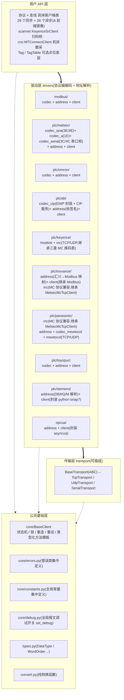
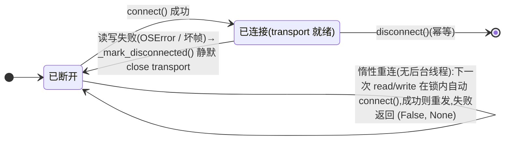

# omniplc 架构设计

> 版本:v0.29.2 · 更新日期:2026-09-22 · 状态:Modbus / 三菱 MC(以太网 + 串口帧)/ FINS / NJ/NX CIP / KV / SR / TOYOPUC / AB EtherNet/IP / 倍福 TwinCAT ADS / 西门子 S7 / OPC-UA / 通用自定义 TCP / CNC MTConnect 已全部落地,全局报文调试开关已上线

omniplc 是面向多品牌、多协议 PLC 的 Python 统一通信库(Python 3.7+,uv 开发)。
本文档描述 v1.0 的完整架构:分层、类设计、继承树、线程安全模型、类型标注纪律、
地址语法、字序、连接状态机与测试策略。

---

## 1. 总体分层



设计原则:

1. **codec 全部是纯函数**(bytes ↔ 结构),不接触 socket——可以用黄金报文样本
   做无硬件测试;
2. **协议层只依赖 `BaseTransport` 抽象**——新增走线不动协议层;
3. **公共逻辑在 `BaseClient` 收口一次**——锁、重连、重试、类型化读写全协议共享;
4. **对外 API 不抛自定义异常**——读返回 `(bool, value)`,写返回 `bool`,
   失败原因进 `last_error`(与 pyhsl 使用习惯一致)。

报文调试(全局开关):`omniplc.core.debug.set_debug(True)` 进程级生效。
走线型协议在 ``TcpTransport``/``UdpTransport``/``SerialTransport`` 的
``send``/``recv`` 统一输出原始字节(方向 + 长度 + 十六进制,单条最多转储
4096B),连接建立/断开事件一并输出;会话型(OPC-UA/ADS/MX Component)
无字节流,在会话读写方法/客户端 COM 调用点输出操作级日志。输出统一走
logging 记录器 ``omniplc.debug``(DEBUG 级):应用已配置日志时沿 propagate
汇入既有体系;未配置任何处理器时自动挂 stderr 处理器,保证开箱即用。

## 2. 类继承图

```mermaid
flowchart TB
    %% ═══ 公共基类(实线 = 继承,虚线 = 使用/适配) ═══
    BaseClient["BaseClient(ABC,模板方法)— core/base_client.py<br/>连接状态机 / RLock 事务锁 / 惰性重连 / 重试 / last_error / 上下文管理器<br/>read()/write()/read_many()/write_many()/read_tag()/bind_tags()<br/>read_bool…read_double / read_string + write_* ——类型化方法只写一次"]

    %% ═══ Modbus ═══
    ModbusBaseClient["ModbusBaseClient(ABC)— modbus/modbus.py<br/>_read/_write 落到位/寄存器原语;字序 ABCD/CDAB/BADC/DCBA<br/>int16…float64 编解码与范围校验;station / word_order 属性"]
    ModbusTcpClient["ModbusTcpClient<br/>MBAP 帧"]
    ModbusRtuClient["ModbusRtuClient<br/>站号 + PDU + CRC16(configure_serial)"]
    InovanceTcpClient["InovanceTcpClient — plc/inovance/<br/>汇川 H3U/H5U Modbus TCP(502)"]
    InovanceRtuClient["InovanceRtuClient<br/>汇川 Modbus RTU(缺省 9600-8N2)"]

    %% ═══ 三菱 MC / MX ═══
    MelsecMcBase["_MelsecMcBase(ABC,私有)— plc/melsec/melsec.py<br/>帧型按走线白名单校验(TCP/UDP:3E/4E/1E;串口:3C/4C)、软元件地址分发"]
    MelsecMcTcpClient["MelsecMcTcpClient<br/>MC 3E/4E/1E 帧"]
    MelsecMcUdpClient["MelsecMcUdpClient<br/>同帧型 over UDP"]
    MelsecMcSerialClient["MelsecMcSerialClient — plc/melsec/melsec.py<br/>MC 串口帧(C24,configure_serial + pyserial)<br/>3C 帧 ASCII 格式 4 / 4C 帧 二进制格式 5<br/>核心命令与 3E 完全一致(codec_qna.build_core 复用)"]
    KeyenceMcCodeMixin["_KeyenceMcCodeMixin(混入,私有)— plc/keyence/mc.py<br/>基恩士码表覆写:device_info/build_frame 走 KEYENCE_MC_DEVICE_CODES<br/>TCP/UDP 两走线共用,帧层仍走三菱实现"]
    KeyenceMcTcpClient["KeyenceMcTcpClient — plc/keyence/mc.py<br/>基恩士 KV MC 协议兼容(SLMP),帧固定 3E<br/>地址:R 位十进制 / DM 字十进制 / B 位、W 字十六进制 / ZR 字十进制"]
    KeyenceMcUdpClient["KeyenceMcUdpClient<br/>同帧型 over UDP(一问一答一数据报)"]
    InovanceMcTcpClient["InovanceMcTcpClient — plc/inovance/mc.py<br/>汇川 MC 协议兼容,帧固定 3E<br/>码表 INOVANCE_MC_DEVICE_CODES + 记号换算:<br/>S→三菱 L 码(92h)/ R≡D+8000 统一编址 / X,Y 八进制名→帧内十六进制"]
    PanasonicMcTcpClient["PanasonicMcTcpClient — plc/panasonic/mc.py<br/>松下 FP0H/FP7 MC 协议兼容,帧固定 3E(仅二进制)<br/>码表 PANASONIC_MC_DEVICE_CODES(与三菱同码)+ 记号换算:<br/>X/Y/L/R 字号×16+位号 / R 字号≥900→SM / D≥90000→SD"]
    PanasonicMewtocolTcpClient["PanasonicMewtocolTcpClient — plc/panasonic/mewtocol.py<br/>MEWTOCOL ASCII 帧 + BCC(无 ETX),端口 1024<br/>RCS/WCS 单接点、RD/WD 数据区;TCP 按头 4 字节分支后精确收齐"]
    PanasonicMewtocolUdpClient["PanasonicMewtocolUdpClient<br/>同帧型 over UDP(一问一答一数据报)"]
    MelsecMxClient["MelsecMxClient — plc/melsec/mx.py<br/>MX Component(Windows,comtypes),ActUtlType 按逻辑站号<br/>无字节流收发;GetDevice/SetDevice/ReadDeviceBlock/WriteDeviceBlock"]

    %% ═══ 欧姆龙 FINS ═══
    OmronFinsBase["_OmronFinsBase(ABC,私有)— plc/omron/omron.py<br/>FINS 节点地址、软元件地址分发"]
    OmronFinsTcpClient["OmronFinsTcpClient<br/>FINS 帧 + TCP 握手(_after_connect 钩子)"]
    OmronFinsUdpClient["OmronFinsUdpClient<br/>FINS 帧,无握手"]

    %% ═══ 罗克韦尔 AB EtherNet/IP ═══
    AllenBradleyEthIpClient["AllenBradleyEthIpClient — plc/ab/ab.py<br/>Logix 标签读写(Tag Read/Write 0x4C/0x4D、RMW 0x4E)<br/>RegisterSession(_after_connect 钩子)+ Unconnected Send<br/>标签自描述:首访类型发现按基名缓存,STRING 走 0xA0 结构体"]

    OmronCipClient["OmronCipClient — plc/omron/cip.py<br/>NJ/NX 内置 EtherNet/IP 变量读写(继承 AB 客户端)<br/>覆写三钩子:_route_path=空 / _wrap_unconnected=直发<br/>/_parse_unconnected_reply=一层服务头;STRING 待真机核证拒绝"]

    %% ═══ 倍福 TwinCAT ADS ═══
    BeckhoffAdsClient["BeckhoffAdsClient — plc/beckhoff/ads.py<br/>TwinCAT 变量名读写(封装 pyads 3.5.1,AMS 851)<br/>DataType→PLCTYPE 映射 + 范围校验;ADSError→DeviceError 不断线<br/>NetId 默认 IP+.1.1;Windows 需 TcAdsDll 运行库"]

    %% ═══ 基恩士 Host Link / SR ═══
    KeyenceHlBase["_KeyenceHostLinkBase(ABC,私有)— plc/keyence/hostlink.py<br/>ASCII 行式协议(RD/RDS/WR/WRS + CR 结束)"]
    KeyenceHostLinkTcpClient["KeyenceHostLinkTcpClient<br/>按行逐字节收包"]
    KeyenceHostLinkUdpClient["KeyenceHostLinkUdpClient<br/>一问一答一数据报"]
    KeyenceSrClient["KeyenceSrClient — scanner/keyence_sr.py<br/>SR 扫码枪:LON → 窗口 → LOFF → 读应答<br/>scan() 返回(是否读到, 条码文本);不实现 _read/_write"]

    %% ═══ 丰田 TOYOPUC / OPC-UA ═══
    ToyopucBase["_ToyopucBase(ABC,私有)— plc/toyopuc/toyopuc.py<br/>TOYOPUC 二进制帧(00 00 LL LH CMD / 80 RC LL LH CMD)<br/>TCP 按帧头长度分段收包,UDP 一问一答一数据报"]
    MewtocolBase["_MewtocolBase(ABC,私有)— plc/panasonic/mewtocol.py<br/>站号(01~99/EE)、接点 RCS/WCS 与数据区 RD/WD 分发、位写读-改-写<br/>TCP 按响应头 4 字节判正常/错误后精确收齐,UDP 整包校验"]
    ToyopucTcpClient["ToyopucTcpClient"]
    ToyopucUdpClient["ToyopucUdpClient"]
    OpcUaClient["OpcUaClient — opcua/client.py<br/>OPC-UA opc.tcp(封装 asyncua 1.1.5,官方继任 python-opcua)<br/>get_node().read_value()/write_value() 按 VariantType 编解码,无字节流"]
    MxComLink["_MxComLink<br/>COM 会话(Open/Close)适配为传输对象外形"]
    OpcUaSession["_OpcUaSession<br/>asyncua 同步会话适配;UaError 在会话边界翻译为 DeviceError"]
    AdsSession["_AdsSession<br/>pyads Connection 适配;ADSError 在会话边界翻译为 DeviceError"]
    MtcSession["_MtConnectSession<br/>http.client keep-alive 连接适配;HTTP/MTConnectError 在会话边界翻译"]
    S7Session["_S7Session<br/>snap7 Client 适配;snap7 错误(1.x/2.x RuntimeError、3.x S7Error)按连接态翻译(在线 DeviceError/断连 OSError)"]

    %% ═══ CNC 机床数采(MTConnect) ═══
    MTConnectClient["MTConnectClient — cnc/mtconnect.py<br/>CNC 只读数采(HTTP/XML,Agent 默认端口 5000,标准库零依赖)<br/>地址=数据项 id/name;read_* 类型化 + snapshot() + read_conditions() + probe()"]

    %% ═══ 西门子 S7 ═══
    SiemensS7Client["SiemensS7Client — plc/siemens/client.py<br/>S7-300/400/1200/1500(封装 python-snap7:3.7~3.9→1.3,3.10+→3.x 纯 Python)<br/>rack/slot 102;DB/I/Q/M 绝对寻址,尺寸由 DataType 决定大端序;位读改写;S7 String"]

    %% ═══ 通用自定义 TCP ═══
    OpenTcpClient["OpenTcpClient — opentcp/client.py<br/>任意设备收发壳(分隔符 delimiter 或定长 frame_length 成帧;<br/>encoding/append·strip/max_frame 可配)<br/>内部缓冲:跨分片拼接、多帧逐次返回;重连清空缓冲<br/>send/send_text/receive/receive_text/transact/transact_text;无点位语义"]

    %% ═══ 继承关系 ═══
    BaseClient --> ModbusBaseClient
    ModbusBaseClient --> ModbusTcpClient
    ModbusBaseClient --> ModbusRtuClient
    ModbusBaseClient -->|"只换汇川地址映射"| InovanceTcpClient
    ModbusBaseClient -->|"只换汇川地址映射"| InovanceRtuClient
    BaseClient --> MelsecMcBase
    MelsecMcBase --> MelsecMcTcpClient
    MelsecMcBase --> MelsecMcUdpClient
    MelsecMcBase --> MelsecMcSerialClient
    MelsecMcBase --> KeyenceMcCodeMixin
    KeyenceMcCodeMixin --> KeyenceMcTcpClient
    KeyenceMcCodeMixin --> KeyenceMcUdpClient
    MelsecMcTcpClient -->|"码表 + 记号换算"| InovanceMcTcpClient
    MelsecMcTcpClient -->|"码表 + 记号换算"| PanasonicMcTcpClient
    BaseClient --> MewtocolBase
    MewtocolBase --> PanasonicMewtocolTcpClient
    MewtocolBase --> PanasonicMewtocolUdpClient
    BaseClient --> MelsecMxClient
    BaseClient --> OmronFinsBase
    OmronFinsBase --> OmronFinsTcpClient
    OmronFinsBase --> OmronFinsUdpClient
    BaseClient --> AllenBradleyEthIpClient
    AllenBradleyEthIpClient -->|"三钩子覆写:NJ/NX 直发 + 空路由"| OmronCipClient
    BaseClient --> BeckhoffAdsClient
    BaseClient --> KeyenceHlBase
    KeyenceHlBase --> KeyenceHostLinkTcpClient
    KeyenceHlBase --> KeyenceHostLinkUdpClient
    BaseClient --> KeyenceSrClient
    BaseClient --> ToyopucBase
    ToyopucBase --> ToyopucTcpClient
    ToyopucBase --> ToyopucUdpClient
    BaseClient --> OpcUaClient
    BaseClient --> OpenTcpClient
    BaseClient --> MTConnectClient
    BaseClient --> SiemensS7Client

    %% ═══ 传输层(可插拔;标签为默认端口) ═══
    subgraph TransportLayer["传输层(omniplc.transport,可插拔)"]
        BaseTransportABC["BaseTransport(ABC)"]
        TcpTransport["TcpTransport<br/>TCP_NODELAY;recv 精确凑齐 size 字节(流式粘包处理)"]
        UdpTransport["UdpTransport<br/>已连接 UDP;一次返回一条数据报"]
        SerialTransport["SerialTransport<br/>pyserial(延迟导入),8N1 可配,SerialConfig 校验"]
        BaseTransportABC --> TcpTransport
        BaseTransportABC --> UdpTransport
        BaseTransportABC --> SerialTransport
    end

    ModbusTcpClient -.->|"502"| TcpTransport
    ModbusRtuClient -.-> SerialTransport
    InovanceTcpClient -.->|"502"| TcpTransport
    InovanceRtuClient -.->|"9600-8N2"| SerialTransport
    MelsecMcTcpClient -.->|"2000"| TcpTransport
    MelsecMcUdpClient -.->|"2000"| UdpTransport
    MelsecMcSerialClient -.->|"configure_serial"| SerialTransport
    KeyenceMcTcpClient -.->|"5000"| TcpTransport
    KeyenceMcUdpClient -.->|"5000"| UdpTransport
    InovanceMcTcpClient -.->|"以 MC配置 为准"| TcpTransport
    PanasonicMcTcpClient -.->|"以模块配置为准"| TcpTransport
    PanasonicMewtocolTcpClient -.->|"1024"| TcpTransport
    PanasonicMewtocolUdpClient -.->|"1024"| UdpTransport
    OmronFinsTcpClient -.->|"9600"| TcpTransport
    OmronFinsUdpClient -.->|"9600"| UdpTransport
    AllenBradleyEthIpClient -.->|"44818"| TcpTransport
    OmronCipClient -.->|"44818"| TcpTransport
    OpenTcpClient -.->|"9000(占位默认,按设备)"| TcpTransport
    KeyenceHostLinkTcpClient -.->|"8000"| TcpTransport
    KeyenceHostLinkUdpClient -.->|"8000"| UdpTransport
    KeyenceSrClient -.->|"9004"| TcpTransport
    ToyopucTcpClient -.->|"1025"| TcpTransport
    ToyopucUdpClient -.->|"1025"| UdpTransport
    MelsecMxClient -.-> MxComLink
    OpcUaClient -.->|"4840"| OpcUaSession
    MTConnectClient -.->|"5000(Agent)"| MtcSession
    SiemensS7Client -.->|"102(rack/slot)"| S7Session
    BeckhoffAdsClient -.->|"AMS 851"| AdsSession

    %% ═══ 点位表 / 异步镜像 ═══
    TagNode["Tag(dataclass)/ TagTable(Mapping)— tag.py(from_json / from_csv)"]
    BaseClient -.->|"bind_tags"| TagNode

    subgraph AsyncMirror["异步镜像(omniplc.aio):ABaseClient 组合同步实例 + 单线程 ThreadPoolExecutor,签名同名同型"]
        AsyncList["AModbusBaseClient → AModbusTcpClient / AModbusRtuClient<br/>AInovanceTcpClient / AInovanceRtuClient(configure_serial 对称暴露)/ AInovanceMcTcpClient<br/>AMelsecMcTcpClient / AMelsecMcUdpClient / AMelsecMcSerialClient / AMelsecMxClient<br/>AOmronFinsTcpClient / AOmronFinsUdpClient / AOmronCipClient / ABeckhoffAdsClient / AAllenBradleyEthIpClient<br/>AKeyenceHostLinkTcpClient / AKeyenceHostLinkUdpClient / AKeyenceMcTcpClient / AKeyenceMcUdpClient<br/>APanasonicMcTcpClient / APanasonicMewtocolTcpClient / APanasonicMewtocolUdpClient<br/>AToyopucTcpClient / AToyopucUdpClient / AOpcUaClient / AOpenTcpClient / AMTConnectClient / ASiemensS7Client / AKeyenceSrClient"]
    end
    BaseClient -.->|"组合 + 镜像"| AsyncList

    classDef abstract fill:#f5f5f5,stroke:#999,stroke-dasharray:4;
    class BaseClient,ModbusBaseClient,MelsecMcBase,KeyenceMcCodeMixin,OmronFinsBase,KeyenceHlBase,ToyopucBase,MewtocolBase,BaseTransportABC abstract;
```



v1 共 **28 个同步具体类 + 28 个异步镜像类**,三菱三帧型(3E/4E/1E)× 两走线(TCP/UDP)
加串口帧(3C/4C,同一 `_MelsecMcBase` 基类),基恩士 KV MC 兼容 TCP/UDP 两走线
(共用 `_KeyenceMcCodeMixin` 码表覆写),罗克韦尔 AB EtherNet/IP(TCP 44818,
unconnected 消息),欧姆龙 NJ/NX CIP(继承 AB 客户端,三钩子覆写),
倍福 TwinCAT ADS(封装 pyads,会话适配),
通用自定义 TCP(分隔符成帧,无点位语义),
另加 MX Component(Windows/COM,
单线程 executor 天然满足 ActUtlType 的 STA 模型)。

### 2.1 继承设计要点(模板方法模式)

- `BaseClient` 定义抽象原语:**`_create_transport()` / `_read()` / `_write()`**,
  外加可选钩子 `_after_connect()`(FINS/TCP 握手)、`_read_string/_write_string`。
- 类型化方法 `read_float(addr)` 的实现只有一份:
  `read_float → read(addr, FLOAT) → _execute(锁内) → _read(addr, FLOAT)(驱动)`;
  新增协议只需实现 2 个原语,自动获得全部 20+ 个类型化方法。
- `ModbusBaseClient` 中间层封装"寄存器级"公共性(类型分发、字序、范围校验),
  三个走线子类只实现 `_transact()`(MBAP vs RTU 帧装拆)与 `_create_transport()`。
- 三菱 MC 的 TCP/UDP 子类完全共享帧编解码(帧内无走线信息);
  帧层按 **QnA 兼容(3E/4E,`codec_qna.py`)**、**A 兼容(1E,`codec_a.py`)**
  与 **QnA 串口帧(3C/4C,`codec_serial.py`)** 拆三个模块——1E 帧无网络号/PC 号
  前缀字段、软元件码表不同;3C/4C 无监视定时器、路由为站号+网络号+PC号
  (+4C 目标模块 I/O)+本站号,核心命令经 `codec_qna.build_core` 复用。
- 异步侧是**组合 + 镜像**:每个 `A*Client` 持有对应同步实例,方法签名与同步版
  完全一致(返回可 await),协议逻辑只有一份。
- **镜像对称性约定(2026-09 全库复审确立)**:A 类必须暴露同步类的全部
  公共属性与扩展方法(`frame`/`endpoint`/`local_node`/`scan_dwell`/
  `scan`/`reset`/`write_mask_register`/`configure_serial`…),构造参数
  与同步版同名同型;唯二例外均由协议决定:FINS/UDP 无握手故无
  `local_node`,OPC-UA 端点为 URL 故在统一 `ip_address/port` 入口外
  另备 `path`(URL 路径)与 `endpoint`(完整 URL 显式覆盖)。
- **入口与返回风格(全库约定)**:网络型客户端构造统一
  `ip_address/port(+协议参数)`,串口为 `station + configure_serial()`;
  读返回 `(bool, Optional[值])`、写返回 `bool`、触发式 `scan()` 返回
  `(bool, Optional[str])`,失败原因一律进 `last_error`。

## 3. 线程安全设计

1. **单锁模型**:每个客户端实例一把 `threading.RLock`,保护三样东西:
   连接状态、请求/响应事务、`last_error`。`connected` / `last_error` 读到的是加锁快照。
2. **事务粒度持锁**:一次读/写在锁内完成全部步骤(必要时惰性重连 → 组帧 → send →
   recv → 校验 → 解码),保证请求/响应帧不被其他线程交错(interleaving)。
3. **文档化取舍**:持锁做网络 IO,意味着同一客户端的并发调用是**串行化**的——
   这保证正确性而非并行吞吐;需要高并发时使用多个客户端实例(连接池留 v1.x)。
4. **重试语义在锁内**:读失败按 `retries` 重试;写默认 `write_retries=0`
   (防止重复写入危险动作),可显式开启。重试与**惰性重连**配合:
   传输失败标记断开,重试前自动重建连接。
5. **PLC 明确报错(`DeviceError`)不断线、不重试**——链路是好的,只有传输层
   故障(OSError / 坏帧)才标记断开。
6. **Transport 自身非线程安全**,只由持有事务锁的客户端串行访问;
   异步侧所有调用经**单线程 executor** 串行执行,与同步侧同一把 RLock,双保险且保序。

## 4. 连接状态机与惰性重连



- `connect()` 幂等:已连接直接返回 True;`disconnect()` 幂等。
- `with client:` 进入时连接,失败抛 `ConnectionError`(与 pyhsl 一致);
  `async with AClient(...):` 同语义。
- `_after_connect()` 钩子:连接建立后执行协议级初始化(FINS/TCP 节点分配握手)。

## 5. 错误处理约定

公共 API **不抛自定义异常**(pyhsl 风格):

| 操作 | 成功 | 失败 |
|---|---|---|
| `read_*` / `read` / `read_tag` | `(True, 值)` | `(False, None)` |
| `write_*` / `write` / `write_tag` | `True` | `False` |
| `read_many` / `write_many` | 逐点独立容错的结果列表 | 单点失败不影响其他点 |
| `connect` / `disconnect` | `True` | `False` |

- 失败原因一律记录在 `last_error` 属性(含 PLC 原始错误码,如 Modbus 异常码、
  MC 结束码、FINS 结束码);成功读写后清空。
- **参数校验错误**(非法地址、未知类型、范围越界、未绑定点位名)直接抛
  `ValueError`——这是调用方编码错误,静默吞掉反而有害。
- 内部异常(`omniplc.core.errors`,**错误类统一在 core 层定义**):
  `TransportClosedError` /
  `ProtocolFrameError` / `DeviceError(code)`,只用于库内控制流,
  由 `_execute()` 统一转换为元组语义,不逃逸到调用方。

## 6. 数据类型与类型标注

### 6.1 类型系统(`types.py`)

`DataType` 枚举:名称与 pyhsl 的 `read_*`/`write_*` 后缀一一对应——
`bool / short / ushort / int / uint / long / ulong / float / double / string`
(有符号整型依次为 16/32/64 位;float=float32;double=float64)。

字序 `WordOrder`:`ABCD`(大端默认)/ `CDAB`(字交换,现场最常见)/
`BADC`(字节交换)/ `DCBA`(小端)。各协议默认值与覆盖方式:

| 协议 | 字序 | 说明 |
|---|---|---|
| Modbus | 默认 ABCD,`word_order` 属性可配 | 现场设备常为 CDAB,读写共用同一配置 |
| 三菱 MC | 固定小端字序(低字在前) | 编码层处理,不暴露配置 |
| 欧姆龙 FINS | 固定大端 | 编码层处理,不暴露配置 |

`convert.py` 提供全部转换纯函数:`crc16 / lrc / get_bit / set_bit`、
`bytes ↔ int16/uint16`、`registers ↔ int32/uint32/float32/float64(四字序)`、
`encode_string / decode_string`。字序变换为对合变换,编解码共用一套实现。

### 6.1.1 字符串参数枚举化(类型检查与 IDE 补全)

凡取值封闭的参数一律用**枚举**定义,字符串仅作兼容输入:

| 参数 | 枚举类型 | 取值 |
|---|---|---|
| `read/write(data_type)` | `omniplc.types.DataType` | `DataType.FLOAT`、`DataType.SHORT`… |
| Modbus 区域(`ModbusAddress.area`) | `omniplc.modbus.ModbusArea` | `COIL / DISCRETE_INPUT / HOLDING_REGISTER / INPUT_REGISTER` |
| Modbus 字序(`word_order`) | `omniplc.types.WordOrder` | `ABCD / CDAB / BADC / DCBA` |
| 字节序(`byteorder`) | `omniplc.types.ByteOrder` | `BIG / LITTLE` |
| 三菱 MC 帧型(`frame`) | `omniplc.types.McFrame` | `FRAME_3E / FRAME_4E / FRAME_1E` |
| 串口校验位(`parity`) | `omniplc.types.SerialParity` | `NONE / EVEN / ODD` |

约定:枚举成员为**权威定义**;所有公开参数标注为 `Union[枚举, str]`,
内部经统一的 `coerce` 辅助函数解析,非法值抛 `ValueError`。
开放集合(如 MC 软元件记号 `D/M/X…`、FINS 存储区)仍用 `str`。

### 6.2 类型标注纪律(100% PEP 484)

- 所有类/方法/函数的参数与返回值**全部显式标注**;
- 文件头统一 `from __future__ import annotations`,3.7 运行期只用
  `typing.Tuple/List/Optional/Union/Sequence`;
- 返回类型精确到方法(`read_short → Tuple[bool, Optional[int]]`),
  内部用 `_narrow_int/_narrow_float` 收窄,不用 `Any` 敷衍;
- 上下文管理器用 `TypeVar(_C, bound="BaseClient")` 保持 self 类型;
- 发布 **py.typed**(PEP 561),下游项目可直接获得类型检查;
- CI 固定跑 `mypy --python-version 3.7`(配置见 `pyproject.toml`)与 `ruff`
  (`target-version = "py37"`)双静态检查,语法越界在 CI 就被拦下;
- 追加 **ty**(Astral)作为第二类型检查器(`uvx ty check`,配置见
  `pyproject.toml` 的 `[tool.ty]`),双检查器交叉验证;
  不使用 `# type: ignore[...]` 工具特定抑制码,可空传输引用一律用
  局部变量 + 断言收窄(两种检查器通用)。

### 6.3 核心接口签名(完整版见源码 docstring)

```python
class BaseClient(ABC):
    def connect(self) -> bool: ...
    def disconnect(self) -> bool: ...
    @property
    def connected(self) -> bool: ...
    @property
    def last_error(self) -> Optional[str]: ...
    @property
    def connect_timeout(self) -> float: ...          # setter 校验 > 0,即时生效
    @property
    def receive_timeout(self) -> float: ...
    @property
    def retries(self) -> int: ...                    # 读重试次数
    @property
    def write_retries(self) -> int: ...              # 写重试次数,默认 0

    def read(self, address: str, data_type: str) -> Tuple[bool, Optional[PrimitiveValue]]: ...
    def write(self, address: str, data_type: str, value: PrimitiveValue) -> bool: ...
    def read_many(self, addresses: Sequence[str], data_type: str
                  ) -> List[Tuple[bool, Optional[PrimitiveValue]]]: ...
    def write_many(self, items: Sequence[Tuple[str, str, PrimitiveValue]]) -> List[bool]: ...

    def read_bool(self, address: str) -> Tuple[bool, Optional[bool]]: ...
    def read_short(self, address: str) -> Tuple[bool, Optional[int]]: ...
    def read_ushort(self, address: str) -> Tuple[bool, Optional[int]]: ...
    def read_int(self, address: str) -> Tuple[bool, Optional[int]]: ...
    def read_uint(self, address: str) -> Tuple[bool, Optional[int]]: ...
    def read_long(self, address: str) -> Tuple[bool, Optional[int]]: ...
    def read_ulong(self, address: str) -> Tuple[bool, Optional[int]]: ...
    def read_float(self, address: str) -> Tuple[bool, Optional[float]]: ...
    def read_double(self, address: str) -> Tuple[bool, Optional[float]]: ...
    def read_string(self, address: str, length: int = 32,
                    encoding: str = "ascii") -> Tuple[bool, Optional[str]]: ...
    # write_bool(address, value: bool) → bool,write_short(address, value: int) → bool,
    # …write_double(address, value: float),write_string(address, value: str, encoding)

    def bind_tags(self, table: TagTable) -> None: ...
    def read_tag(self, tag: Union[str, Tag]) -> Tuple[bool, Optional[PrimitiveValue]]: ...
    def write_tag(self, tag: Union[str, Tag], value: PrimitiveValue) -> bool: ...

    def __enter__(self: _C) -> _C: ...               # 失败抛 ConnectionError
    def __exit__(self, exc_type, exc_val, exc_tb) -> None: ...

    # 以下为驱动子类协议原语
    @abstractmethod
    def _create_transport(self) -> BaseTransport: ...
    @abstractmethod
    def _read(self, address: str, data_type: DataType) -> PrimitiveValue: ...
    @abstractmethod
    def _write(self, address: str, data_type: DataType, value: PrimitiveValue) -> None: ...
    def _after_connect(self) -> None: ...            # 可选钩子(FINS/TCP 握手)
```

## 7. 地址语法

| 协议 | 语法示例 | 说明 |
|---|---|---|
| Modbus | `hr0` / `c7` / `di10` / `ir3` / `hr0.15` / `40001` | 前缀语法为主;兼容 Modicon 1 基风格(自动转 0 基);位号 0~15;已实现(`modbus/address.py`) |
| 三菱 MC | `D100` / `M10` / `X1F` / `Y40` / `W100` / `R100` / `Z0` / `ZR100` / `D100.3` | 已实现(`plc/melsec/`);编号进制按码表:X/Y/W/B 十六进制、其余十进制(Q/L/R 口径,SH-080956;1E 帧下 X/Y 八进制),地址解析保留数字原文;批量读取:3E/4E 覆写 `read_many` 为 0406 多块批量读单事务 + `read_batch` 混类型混软元件(SH-080008 §8.4,总块数 ≤120,整批容错) |
| 欧姆龙 FINS | `D100` / `CIO0` / `CIO0.5` / `W10` / `H20` / `A0` / `E0_100` / `T0` / `C10` | 已实现(`plc/omron/`);存储区码随帧 codec 实现,EM 区 bank 用下划线;T/C 为定时器/计数器(位=完成标志只读,字=当前值 PV);批量读取:覆写 `read_many` 为 0104 多存储区读单事务 + `read_batch` 混类型混软元件(W342 §5-3-5,仅字码,每条读 1 字、响应逐条区码回显校验,以太网上限 167 条;BOOL 走包含字提位) |
| 丰田 TOYOPUC | `D0100` / `D0100L` / `D0100H` / `M0201` / `M0201W` / `X0010H` | 已实现(`plc/toyopuc/`);编号一律十六进制(手册口径);字区 S/N/R/D/B,位区 P/K/V/T/C/L/X/Y/M;L/H=低/高字节(字节访问),W=位软元件打包字 |
| 基恩士 KV MC 兼容 | `R5` / `B1F` / `W10` / `DM100` / `ZR100` / `DM100.3` | 已实现(`plc/keyence/mc.py`,继承 MC);编号进制:R/DM/ZR 十进制、B/W 十六进制;仅基恩士记号(无三菱 D/M/X/Y) |
| 汇川 H3U/H5U(Modbus) | `D100` / `R100` / `M10` / `SM10` / `SD10` / `S10` / `B10` / `T10` / `C10` / `X17` / `Y17` / `D100.3` | 已实现(`plc/inovance/`,继承 Modbus);位软元件→线圈区(基址按手册:M=编号、SM/SD=0x2400、S=0xE000、T=0xF000、C=0xF400、X=0xF800、Y=0xFC00、B=0x3000),字软元件→保持寄存器区(D=编号、R=0x3000);X/Y 八进制;T/C 位=接点、字=当前值(C 字仅 C0~C199,C200+ 为 32 位双寄存器不支持) |
| 汇川 MC 兼容 | `D100` / `M10` / `S10` / `B1F` / `W10` / `R100` / `X17` / `Y7` / `D100.3` | 已实现(`plc/inovance/mc.py`,继承 MC);帧按三菱口径编码,S 按三菱 L 码、R≡D+8000 统一编址、X/Y 八进制命名换算为帧内十六进制;范围 M0~7999/S0~4095/B、D0~7999/R0~32767/W、X/Y0~1777(越界由 PLC 返回 4031);SM/SD/ZR 不在 MC 范围 |
| 松下 MC 兼容(FP0H/FP7) | `R000F` / `R1.15` / `X0000` / `Y000F` / `L001F` / `SM10` / `TS0` / `CS0` / `D100` / `LD10` / `SD10` / `TN0` / `CN0` / `D100.3` | 已实现(`plc/panasonic/mc.py`,继承 MC);帧与三菱同码;位软元件 X/Y/L/R 按"字号(十进制)+位号(十六进制一位)"→ 帧内字号×16+位号,R 字号 ≥900(R9000 起)映射 SM、D 编号 ≥90000 映射 SD;D/LD/TN/CN 字、TS/CS/SM 位(十进制);仅二进制 3E(松下仅提供成批读/写) |
| 松下 MEWTOCOL | `R000F` / `R1.15` / `X0.3` / `Y0003` / `L001F`(接点)+ `D100` / `L10` / `F5` / `S0` / `K0` / `D100.3`(数据) | 已实现(`plc/panasonic/mewtocol.py`,TCP/UDP 1024);接点区 X/Y/R/T/C/L = 字号(十进制)+位号(十六进制一位),点号形式同效;数据区 D=DT、L=LT、F=FL、S=SV 设定值、K=EV 经过值(定时器/计数器当前值用 S/K,T/C 为接点);L 按语境解析(位=链接继电器,字=LT) |
| OPC-UA | `ns=2;s=Device.Tag` / `ns=4;i=100` / `i=2258` / `b=AAECAw==` / `g=…` | 已实现(`opcua/`);标准 NodeId 字符串,ns 省略默认 0;前缀大小写规范化,标识符值保留原文(`opcua/address.py`) |
| 罗克韦尔 AB(EtherNet/IP) | `MyDint` / `MyArray[5]` / `MyMatrix[1,2]` / `MyUdt.Member` / `Program:prog.Tag` / `MyDint.3` | 已实现(`plc/ab/`);地址即 Logix 标签名,多级成员/数组下标/程序作用域透传;`.N` 为整型位访问(设备侧 0x4E 原子读-改-写);标签自描述,实际类型由 PLC 应答返回(`ab/address.py`) |
| 欧姆龙 NJ/NX(CIP) | `TestVar` / `MyArray[5]` / `Motor[2].Speed`(同 AB 语法) | 已实现(`plc/omron/cip.py`,继承 AB);地址即 Sysmac 变量名,标签自描述同款;NJ 标量 BOOL 直读直写、BOOL 数组按元素访问(不做 Logix 32 位打包);解析复用 `ab/address.py` |
| 通用自定义 TCP | —(无地址概念) | 已实现(`opentcp/`);报文内容由调用方解释,`send/send_text` 发送、`receive/receive_text` 收帧(分隔符或定长)、`transact/transact_text` 一锁内发+收;`delimiter`(或 `frame_length`,二者互斥必填其一)/`encoding`/`append_delimiter`/`strip_delimiter`/`max_frame` 构造期可配 |
| 倍福 TwinCAT(ADS) | `MAIN.nCounter` / `.gGlobal` / `GVL.MyVar` | 已实现(`plc/beckhoff/`,封装 pyads);变量名原样透传 ADS 符号服务,数据类型显式指定(IEC INT=16 位口径映射 PLCTYPE);NetId 默认 IP+.1.1、可显式覆盖 |
| CNC MTConnect | `Sspeed` / `Xact` / `execution` / `program`(数据项 id 或 name) | 已实现(`cnc/`);地址即 Agent 数据项 id(兼容 name 属性),值为文本按显式 DataType 收窄;`UNAVAILABLE` → DeviceError 不断线;`snapshot()`/`read_conditions()`/`probe()` 为只读扩展操作 |
| 西门子 S7 | `DB1.DBX0.3` / `DB1.DBD6` / `M10.2` / `MW10` / `IW64` / `Q0.1` / `DB1.DBS20` | 已实现(`plc/siemens/`);地址只定区域+字节起点,尺寸由 DataType 决定(2/4/8 字节大端),位访问 0~7;`B/W/D` 习惯记号保留;String 头 2 字节(声明/实际长)(`siemens/address.py`) |

解析失败统一抛 `ValueError`(参数错误约定)。

## 8. v1 协议 × 走线矩阵与实现选型

| 协议 | TCP | UDP | RTU(串口) | MX Component |
|---|---|---|---|---|
| Modbus(FC 01/02/03/04/05/06/0F/10/16) | ✅ `ModbusTcpClient` | — | ✅ `ModbusRtuClient` | — |
| 三菱 MC 3E/4E(QnA 兼容) | ✅ `MelsecMcTcpClient(frame="3E"/"4E")` | ✅ `MelsecMcUdpClient` | ✅ `MelsecMcSerialClient`(3C/4C 帧) | ✅ `MelsecMxClient` |
| 三菱 MC 1E(A 兼容,A 系列) | ✅ `frame="1E"` | ✅ | v1.x | ✅ |
| 欧姆龙 FINS | ✅ `OmronFinsTcpClient`(含握手) | ✅ `OmronFinsUdpClient` | v1.x(Host Link) | — |
| 罗克韦尔 AB EtherNet/IP(Logix) | ✅ `AllenBradleyEthIpClient`(44818) | — | — | — |
| 欧姆龙 CIP / 连接型 CIP(NJ/NX) | ✅ `OmronCipClient`(44818,继承 AB) | — | — | — |
| 通用自定义 TCP(分隔符/定长成帧) | ✅ `OpenTcpClient`(端口按设备) | — | — | — |
| 倍福 TwinCAT(ADS) | ✅ `BeckhoffAdsClient`(封装 pyads,AMS 851) | — | — | — |
| 基恩士 KV Host Link | ✅ `KeyenceHostLinkTcpClient` | ✅ `KeyenceHostLinkUdpClient` | — | — |
| 基恩士 KV MC 协议兼容(SLMP 3E) | ✅ `KeyenceMcTcpClient`(5000,继承 MC) | ✅ `KeyenceMcUdpClient`(5000,继承 MC) | — | — |
| 汇川 H3U/H5U(Modbus + 汇川映射) | ✅ `InovanceTcpClient`(502) | — | ✅ `InovanceRtuClient`(串口) | — |
| 汇川 MC 协议兼容(3E 帧) | ✅ `InovanceMcTcpClient`(端口以 MC配置 为准,继承 MC) | — | — | — |
| 松下 MC 协议兼容(3E 帧,FP0H/FP7) | ✅ `PanasonicMcTcpClient`(端口以模块配置为准,继承 MC) | — | — | — |
| 松下 MEWTOCOL | ✅ `PanasonicMewtocolTcpClient`(1024) | ✅ `PanasonicMewtocolUdpClient`(1024) | v1.x(MEWTOCOL-COM 串口) | — |
| 基恩士 SR 扫码枪 | ✅ `KeyenceSrClient`(9004) | — | — | — |
| 丰田 TOYOPUC 计算机链接 | ✅ `ToyopucTcpClient` | ✅ `ToyopucUdpClient` | — | — |
| OPC-UA(opc.tcp) | ✅ `OpcUaClient`(封装 asyncua) | — | — | — |
| CNC 机床数采(MTConnect) | ✅ `MTConnectClient`(Agent 5000,HTTP/XML 只读) | — | — | — |
| 西门子 S7(DB/I/Q/M) | ✅ `SiemensS7Client`(102,封装 python-snap7) | — | — | — |

MX Component 说明:``MelsecMxClient`` 经三菱 MX Component 的 ``ActUtlType``
COM 控件(实用程序设置型)通信,通信参数在**通信设置实用程序**中配置为逻辑站号
(0~1023),Python 侧经 comtypes 调用(``pip install omniplc[mx]``)。地址语法与
MC 驱动一致(如 ``D100``/``M10``),软元件可用范围与进制由配置的 CPU 决定,
编号原文直接透传给控件;错误以十六进制出错代码记入 ``last_error``(手册第 7 章)。
COM 调用全部在客户端事务锁内串行;异步镜像经单工作线程执行,天然满足 STA。

三菱 MC 串口帧说明(2026-09):C24 等串口通信模块的 MC 协议提供 QnA 兼容
**3C 帧(格式 1~4,ASCII)** 与 **QnA 扩展 4C 帧(格式 1~5,格式 5 为二进制)**。
``MelsecMcSerialClient`` 实现其中 **3C 格式 4**(ENQ 起始,和校验后接 CR LF,
最常用的非过程协议格式)与 **4C 格式 5**(DLE STX/DLE ETX 定界的二进制帧),
帧格式按 SH-080008《MELSEC Communication Protocol Reference Manual》
4.2/4.3 节与 **Appendix 7 完整报文示例逐字节核证**(黄金向量入库)。
要点:串口帧**无监视定时器/请求数据长字段**;3C 路由 = 站号/网络号/PC号/本站号
(各 2 位十六进制 ASCII),4C 另加请求目标模块 I/O(2 字节小端,CPU 直连
``03FF``)+目标模块局号;核心命令(命令/子命令/软元件码/编号/点数/写数据)与
3E 帧完全一致(``codec_qna.build_core`` 复用),ASCII 侧字段宽度为串口规格
(码 2 字符 ``*`` 补位、编号 6 位按码表进制、点数 4 位);位数据 ASCII 每点
1 字符、二进制每点 1 个半字节(高半字节在前)。和校验 = 范围字节和的低 8 位、
恒以 2 位 ASCII 十六进制发送:3C 读响应范围**含 ETX**(手册 Appendix 7
小计 22BH+18FH),4C 范围为数据长起至数据;4C 的 DLE 附加码(数据区
10H → 10H 10H)在收包层还原为逻辑帧后校验。默认参数 = 手册"连接站"示例
(站号 0/网络号 0/PC 号 ``FF``/本站号 0/CPU 目标 I/O ``03FF``);
点数上限沿用 900;NAK/结束代码按 DeviceError 处理不断线,和校验不符/
帧识别码错按坏帧断线惰性重连。1C/2C 帧(A 兼容串口)留 v1.x。

罗克韦尔 AB EtherNet/IP 说明(2026-09):ControlLogix/CompactLogix 的
标签读写走 CIP 消息路由,``AllenBradleyEthIpClient`` TCP **44818**,连接即注册
CIP 会话(RegisterSession,``_after_connect`` 钩子,断线重连自动重新注册;
disconnect 尽力注销)。标签读写走 **unconnected 消息**:SendRRData 内以
Unconnected Send(0x52)包裹、背板路由到 ``slot`` 槽号——无 Forward Open
连接状态,惰性重连零恢复。Logix 标签**自描述**:首次访问先读 1 个元素获取
实际类型(按基名缓存),请求类型与实际类型不符抛 ValueError;写请求须携带
类型码,故写前必查。位访问:整型标签 ``Tag.3`` 读词提位、写走 0x4E 设备侧
原子读-改-写;BOOL 数组(Logix 按 DWORD 32 位打包)按 ``下标//32`` 定词、
``%32`` 定位。STRING 走 0xA0 结构体(模板 0x0FCE,len(u32)+82 字符)。
UDT 整体读取、批量多服务(0x0A)、分片读写(>480 字节应答)留 v1.x。
帧格式经 pylogix 1.1.6 / cm_ethernetip 0.1.0 / aphyt 0.1.30 三份参考实现
交叉核证(见 §8.1)。

connected 消息(v0.17):``connected_messaging=True`` 启用 Forward Open
(Class 3 应用触发连接)——优先 Large Forward Open(0x5B,连接尺寸 4002),
被拒回落普通(0x54,504);标签读写改走 SendUnitData(0xA1 地址项携 O->T
连接 ID、0xB1 数据项携递增序列号,应答校验 T->O ID/序列号/服务回显);
disconnect 尽力 Forward Close。connected 单事务开销更小、大批量轮询吞吐
更高;代价是连接状态在目标侧维护,PLC 侧重连容忍度依固件而异——默认仍为
unconnected。连接路径为背板端口 + 槽号 + 消息路由对象(20 02 24 01);
O->T 连接 ID 由目标分配(请求传 0),T->O 连接 ID 由发起方指定。
应答布局(O->T ID 紧跟状态域)经 cm_ethernetip 服务端组成与 pylogix
客户端解析双向印证。

欧姆龙 NJ/NX CIP 说明(2026-09):NJ/NX(Sysmac)系列没有 FINS/TCP-UDP,
变量经标准 CIP 显式报文访问——与 AB 同属 ODVA EtherNet/IP,故
``OmronCipClient`` **继承 ``AllenBradleyEthIpClient``**,仅覆写三个钩子:
`_route_path()` 返回空(NJ/NX 内置口 CPU 即目标,无背板路由段,连接路径
只剩消息路由对象 20 02 24 01)、`_wrap_unconnected()` 直发不包 UC Send
(目标即消息路由器本体,0xB2 项直接承载服务请求——pycomm3 对 Micro800
同款处理)、`_parse_unconnected_reply()` 剥一层服务头
(``codec_cip.parse_direct_service_reply``)。类型发现/位访问/RMW、
connected 消息全套(Forward Open 大/普通回落、SendUnitData 序列号回显、
Forward Close)与错误契约(状态非 0 → DeviceError 不断线)全部复用 AB 实现。
NJ 标量 BOOL 直读直写(C1);BOOL 数组按元素访问(NJ 不做 Logix 的 DWORD
32 位打包,D3 分支在 NJ 上不会触发);整型 ``.位号`` 写走 0x4E,设备侧
支持与否随固件,不支持时报 DeviceError 不断线。NJ STRING 结构布局与 AB
不同(长度域宽度待真机核证),v1 显式拒绝字符串读写(经 ``read_string``
返回 ``(False, None)``,与 BaseClient 缺省字符串契约一致)。
发起方厂商号沿用 0x1337(仅标识发起端,目标不校验)。走线差异经
pycomm3 1.2.16 交叉核证(见 §8.1);真机联测待做。

通用自定义 TCP 说明(2026-09):``OpenTcpClient`` 面向无标准协议的现场
设备,只做"连接 + 成帧 + 错误契约",报文内容由调用方解释。成帧两种
模式**二选一**(构造期互斥校验):接收按 ``delimiter`` 分隔符切分
(默认 CR LF),或按 ``frame_length`` 每帧定长硬切(二进制固定帧设备,
``append_delimiter`` 必须为 False);带内部缓冲——一次到达多帧逐次
返回、跨分片到达自动拼接;超过 ``max_frame`` 未成帧判定流内失步,按
坏帧断线惰性重连。发送:``send`` 原样字节;``send_text`` 编码后可自动
补分隔符(``append_delimiter``;空文本 + append = 发裸分隔符
空行,合法)。**重连/超时不新增参数**,沿用 BaseClient 属性机制:
``connect_timeout``/``receive_timeout``/``retries``/``write_retries``;
``receive``/``receive_text``/``transact*`` 另支持 per-call ``timeout``。
错误契约映射:接收超时 → DeviceError 不断线(慢设备不触发重连);
连接错误/对端关闭 → 标记断开待重连;解码失败/帧超限 → ProtocolFrameError
断线重同步。**重连时清空接收缓冲**(``_after_connect`` 钩子),旧连接的
残字节不得串入新会话。无点位语义,``read``/``write`` 系列返回失败并
提示使用 ``receive``/``transact``(DeviceError,不断线)。长度域成帧
(头 + 长度字段:偏移/字节数/字节序/是否含头)与空闲切块成帧留 v1.x,
待具体设备核证后再定配置面。

倍福 TwinCAT ADS 说明(2026-09):**选封装不自研**(用户确认)——ADS 帧
本身不复杂(AMS 头 + 0xF005 符号句柄三次事务),难点在部署面:AMS
NetId/路由(TC3 远程连接需先加路由)、Windows 本机路由器与直连两条路径、
字符串定长语义、SUM 读批量、通知机制,均为 pyads 十余年现场经验覆盖;
版本 **pyads==3.5.1**(py3.7 可解析运行,与 asyncua 同为"最后支持
py3.7 的版本线"口径)。``BeckhoffAdsClient`` 结构对标 OPC-UA 驱动:
`_AdsSession(BaseTransport)` 适配 pyads Connection,pyads 异常在会话
边界统一翻译——ADSError(状态码:符号不存在/长度不符等)→ DeviceError
(code=ADS 错误码,不断线),其余 → OmniPLCInternalError 断线惰性重连。
**注意 Windows 缺 Beckhoff TcAdsDll 运行库时 `import pyads` 抛 OSError
而非 ImportError**(`_load_pyads` 按 Exception 全量捕获)。构造入口
IP + AMS 端口(TC3 运行时 1 为 851),NetId 默认 IP 拼 `.1.1` 后缀、
可显式覆盖(6 段 0~255 校验)。DataType→PLCTYPE 按_IEC_ 口径:
SHORT→INT(16 位)、INT→DINT(32 位)、LONG→LINT(64 位);写入先按
本库范围校验再交 pyads(pyads 对越界直接 struct 报错,须拦截为
ValueError)。字符串:pyads 写只发 len+1 字节(不超 PLC 变量声明长度
即可,STRING 默认 80),字节编码由 pyads 固定 utf-8,`encoding` 参数
不生效(docstring 已注明)。超时:连接建立时尽力 `set_timeout`
下发 ``receive_timeout``,部分平台不支持则忽略。数组/结构体/通知
(AdsSymbol、SUM 读)留后续版本。**本机无 TcAdsDll,真机联测待做**;
测试以桩模块注入,不依赖 pyads 安装。

CNC MTConnect 说明(2026-09):``MTConnectClient`` 面向机床数控**只读
数采**——机器侧运行 MTConnect Agent(HTTP,默认端口 5000,由控制器
适配器喂入 FANUC/三菱等数据),本驱动用标准库 ``http.client`` +
``xml.etree`` 直接实现,**零第三方依赖、跨平台**(开放标准 + 文档型
协议,无自研风险,与 DLL 封装路线相反)。地址即数据项 ``id``(兼容
``name``),``/current`` 每次全量快照后按 id/name 取值;类型化读前先做
参数校验再发请求。错误契约:数据项不存在/值为 ``UNAVAILABLE`` →
DeviceError(设备侧条件,不断线);HTTP 4xx/5xx 携带 MTConnectError
文档 → DeviceError(code=0),无错误文档 → OSError 断线;XML 非法/
非 MTConnect 文档 → ProtocolFrameError 断线;socket/超时 → OSError
惰性重连。`_MtConnectSession(BaseTransport)` 维护 keep-alive 连接,
``receive_timeout`` 变更在每次请求前重新下发 socket。`_new_connection`
为模块级工厂(单测以假连接替换,同 MX Component 惯例)。v1 只读:
类型化读 + ``snapshot()`` + ``read_conditions()``(Fault/Warning/
Normal 条件项)+ ``probe()``;写入、/sample 历史流留后续。FANUC
FOCAS(fwlib32.dll)与三菱 CNC EZSocket 的 DLL 封装走 v1.x(判据同
ADS:部署面复杂、厂商运行库,真机联测前置)。

西门子 S7 说明(2026-09):**选封装不自研(用户指示)**——S7comm 为
完整私有协议栈(TPKT/COTP/S7 PDU、机架/槽位路由、1200/1500 的
PUT-GET 授权与优化块限制),封装 `python-snap7`。**依赖按解释器版本
二选一(``s7`` extra 环境标记,目标环境 3.7 与 3.12)**:3.7~3.9 →
`1.3`(C 库封装末版线,wheel 捆绑 **64 位** 原生库;32 位 py3.7 venv
实测捆绑库不可用(WinError 193),``dll_path`` 参数透传
``Client(lib_location=)`` 供自备 32 位 DLL;**1.3 导入期依赖
pkg_resources** → extra 显式带 ``setuptools``);3.10+ → `3.x`
(3.0 起纯 Python 实现不再需要 DLL,官方最低 3.10;2.x 线仅 py3.9
且 area 校验更严,窗口窄不单独适配)。结构对标 ADS 驱动:
`_S7Session(BaseTransport)` 适配 snap7 Client。**双线 API 差异在边界
适配**(v0.24.1,均经真库实测核证):① 错误类——1.x/2.x 抛
RuntimeError、3.x 抛 `S7Error` 谱系(`_new_client` 探测
`snap7.client.S7Error` 并入错误表),以 **``Cli_GetConnected`` 连接态
判别**——在线 → DeviceError(PLC 拒绝/地址错,不断线),断连 →
OSError 惰性重连(连接建立失败 → OSError);② 区码——地址层出协议
区码 int,会话边界统一转 snap7 `Areas` 枚举成员(1.x `read_area` 对
area 做枚举成员校验,裸 int 抛 ValueError、`write_area` 取
`area.value` 抛 AttributeError,3.x 虽收 int 也统一转,转换在
`_snap7_area` 探测 `snap7.type`/`snap7.types` 缓存);③ 构造——
无 dll_path 时 `Client()` 无参调用(1.x 默认参、3.x 兼容),
dll_path 位置透传仅 C 封装线生效。地址只定区域+字节起点,
尺寸由 DataType 决定(SHORT 2B/INT 4B/LONG 8B/REAL 4B/LREAL 8B,
大端 int.from_bytes/struct);位为锁内读-改-写;S7 String 头 2 字节
(声明长/实际长),写头部按实际长度(建议 ≤ PLC 声明长)。1200/1500
须开启 PUT-GET 授权且 DB 为非优化块(docstring 注明)。多变量组包/
块操作/SZL 留后续。**真机联测待做**;测试以假 Client 注入内存字节数组,
不依赖 snap7 安装与 64 位环境(1.3 枚举转换路径在装真 1.3 的 venv 中
顺带实测,3.1.2 全路径经 uv 临时 py3.12 环境冒烟核证)。

KV Host Link 说明:``KeyenceHostLinkTcpClient/UdpClient`` 使用 ASCII 行式命令
(RD/RDS/WR/WRS,CR 结束;响应行以 CR/LF 结束,出错应答 ``E0``~``E9`` 记入
``last_error``)。地址语法:位软元件 ``R515``(位组:组号+两位位号)/``B1F``、
``W100``(十六进制)/``X0F``(组号十进制+位一位十六进制)/``M100``;字软元件
``DM100`` 等,16/32 位整型经 ``.S/.U/.L/.D`` 后缀由 PLC 原生解析,float32 为
连续两字小端拼接,64 位整型/浮点为连续四/八字小端拼接;字软元件位访问
(``DM100.5``,omniplc 约定十进制位号)走读-改-写。

KV MC 协议兼容说明(2026-09):KV-7500/8000/X 系列以太网单元提供 MC 协议
兼容(SLMP)模式,**TCP 与 UDP 走线均可用**。``KeyenceMcTcpClient`` /
``KeyenceMcUdpClient`` 分别继承 ``MelsecMcTcpClient`` / ``MelsecMcUdpClient``,
共用私有混入 ``_KeyenceMcCodeMixin`` **只换软元件码表**
(``KEYENCE_MC_DEVICE_CODES``),收发、按长收包(TCP)/一问一答一数据报(UDP)
与响应解析全部复用三菱实现——帧格式(副头部 ``50 00``、成批读 0104/写 0114、
结束代码)与三菱 3E 二进制完全一致,默认端口 **5000**(KV Studio 单元编辑器
"MC协议端口"设置,TCP/UDP 各自可配,以各机型单元设置为准)。码表:
R(继电器,位,十进制)用三菱 M 的 ``90h``、
DM(数据存储,字,十进制)用 D 的 ``A8h``、ZR(文件寄存器,字,十进制)
同 ``B0h``、B(位,十六进制)/W(字,十六进制)与三菱同码同进制。
帧型固定 3E(KV 的 SLMP 兼容不提供 4E/1E);仅接受基恩士软元件记号,
连三菱机型请直接用 ``MelsecMcTcpClient``。

汇川 H3U/H5U 说明(2026-09):汇川小型 PLC(H3U/H3S/H5U/Easy 系列)的
TCP 与串口通信**本质是标准 Modbus**——网口 Modbus TCP 从站默认开启
(端口 502,多数机型不可改),串口 Modbus RTU(缺省 9600-8N2)。
``InovanceTcpClient`` / ``InovanceRtuClient`` 因此**继承 Modbus 客户端**,
只在地址原语入口做一层翻译:位软元件(M/SM/S/T/C 接点/X/Y/B)映射到
线圈区,字软元件(D/SD/R/T/C 当前值)映射到保持寄存器区,基址照手册
(``INOVANCE_BIT_DEVICES``/``INOVANCE_WORD_DEVICES``);X/Y 八进制编号;
M 编号即偏移(H3U 的 M8000~M8511 从 0x1F40 连续);C200~C255 为 32 位
计数器(Modbus 双寄存器展开),本库 v1 不提供其字访问。T/C 为位/字
双性质软元件,按访问类型(BOOL=接点走线圈,其余=当前值走寄存器)换算。
字序沿用 Modbus 客户端 ``word_order`` 属性(汇川 32 位 D 值如与现场不符可改 CDAB)。
来源:H3U 指令及编程手册 9.4.3(19010394)、H5U&Easy 编程手册 9.5.1
"被 ModBus 访问的线圈/寄存器地址"(19011157);另对照 EMQX Neuron /
TopStack 的汇川 Modbus 映射表(一致)。

汇川 MC 协议兼容说明(2026-09):H5U&Easy 手册第 16 章"MC通信"——
Easy 系列(Easy523/522/521/320,固件 V6.4.0.0+、AutoShop V4.10.0.0+)
以太网口提供三菱 MC 协议服务器,支持 3E/4E 帧、TCP/UDP、二进制/ASCII
(同卷 H5U 未单列,接入前确认固件有"MC配置")。``InovanceMcTcpClient``
**继承 ``MelsecMcTcpClient``,帧固定 3E 二进制**,帧层复用三菱实现,
只做汇川记号 → 三菱帧记号换算(手册 16.4"对应三菱软元件"列 +
"注意三菱软元件编码与汇川软元件编码的进制转换"):

- **S 按三菱 L 编码**(``92h``)访问,编号不变;
- **R 与 D 统一编址**:R n ≡ D(8000+n),如 R0 按三菱 D8000 访问
  (``INOVANCE_MC_R_BASE``);
- **X/Y 八进制命名**(X0~X1777,恰 1024 点)换算为 3E 帧的十六进制
  编号(X17 → 帧 0x0F),帧内进制沿用三菱 Q/L 口径;
- M/B/W/D 同码同进制(90h/A0h/B4h/A8h)。

点数上限与故障码照三菱口径(批量读写字 1~960;越界返回 4031 等
结束码,按 DeviceError 处理)。端口由"MC配置"设置(范围
1025~4999、5010~49151,避开 502/9600/44818/2222/34980/12939/12940;
注意 5000 被区间排除),手册未规定出厂默认,客户端默认 2000 仅为
沿用三菱惯例的占位,以现场配置为准。地址记号与 Modbus 驱动一致
用汇川命名(M/S/B/D/R/W/X/Y),SM/SD/ZR 等不在 MC 范围。

松下 MC 协议兼容说明(2026-09):FP0H/FP7 以太网口提供三菱 MC 协议
兼容模式(**QnA 兼容 3E 帧,仅二进制、成批读/写**,FP0H 以太网通信
手册),``PanasonicMcTcpClient`` **继承 ``MelsecMcTcpClient``,帧固定
3E 二进制**,帧层复用三菱实现。软元件码与三菱 Q/L 一致
(``PANASONIC_MC_DEVICE_CODES``,对照 HSL ``PanasonicMcNet``/
``MelsecMcDataType.Panasonic_*``):位软元件 X/Y/L/R 为"字号 + 位号"
组织,帧内编号 = 字号×16+位号(记法 ``R1F`` = 字 1 位 F,或点号形式
``R1.15``);R 字号 ≥900(记法 R9000 起)映射系统继电器 SM(线性
-14400),D 编号 ≥90000 映射系统寄存器 SD(-90000);D/LD/TN/CN 字、
TS/CS/SM 位均纯十进制。端口以模块配置为准(默认 2000 为三菱惯例
占位)。

松下 MEWTOCOL 说明(2026-09):MEWTOCOL-COM ASCII 文本帧,以太网
TCP/UDP 默认端口 **1024**(Pro-face《MEWTOCOL-COM Ethernet Driver》;
MewtocolNet 等可配)。帧结构(对照 Panasonic《MEWTOCOL Communication
User's Manual》、HSL ``PanasonicMewtocol``、OpenLogics/MewtocolNet
及后者 BCC 单元测试向量 ``%01#RCSX0000``→``1D``):请求 = ``%`` +
站号(2 位,``EE`` 直连或 01~99)+ ``#`` + 命令文本 + BCC(全字符
异或,2 位十六进制)+ CR,**无 ETX**;正常响应 = ``%`` + 站号 +
``$`` + 命令名回显(2 字符)+ 数据 + BCC + CR(数据固定从下标 6 起);
错误响应 = ``%`` + 站号 + ``!`` + 错误码(2 字符,20~67)+ BCC + CR,
按 DeviceError 处理不断线。命令:RCS/WCS 单接点(字号 3 位十进制 +
位号 1 位十六进制)、RD/WD 数据区(起止编号各 5 位十进制,每字 4 位
十六进制高字节在前,多字数据低字在前)。接点区 X/Y/R/T/C/L,数据区
D=DT、L=LT、F=FL、S=SV 设定值、K=EV 经过值(定时器/计数器当前值用
S/K,T/C 为接点);``L`` 按访问语境解析(位=链接继电器,字=LT);
字软元件位访问走读-改-写。TCP 按响应头 4 字节判正常/错误后按命令
与点数精确收齐;UDP 一次收整包。本库地址记号用松下原生记号;
MEWTOCOL-COM 串口走线留 v1.x。

TOYOPUC 计算机链接说明:``ToyopucTcpClient/UdpClient`` 使用二进制帧
(命令 ``00 00 LL LH CMD [数据]``,响应 ``80 RC LL LH CMD [数据]``,
帧长 = CMD + 数据字节数,小端)。地址语法:字软元件 ``D0100``(S/N/R/D/B,
编号十六进制)→ 字访问(CMD=1C/1D);``D0100L``/``D0100H`` 低/高字节 →
字节访问(CMD=1E/1F,字符串默认从低字节起);位软元件 ``M0201``
(P/K/V/T/C/L/X/Y/M)→ 位访问(CMD=20/21);``M0201W`` 打包字 → 字访问。
软元件基地址(字/字节/位三套)与位编号段范围照手册实现(L/M 有 0x1000
起的第二段)。多字数据小端、低字在前(32/64 位类型与 float32/64 一致);
出错响应 ``RC=10`` 的详细出错代码(0x40 地址越界等)记入 ``last_error``。
v0.7 覆盖基础软元件区;扩展区(CMD=94~99)、PC10(CMD=C2~C6)、
中继(CMD=60)与时钟/CPU 状态(CMD=32/A0)留 v1.x。

OPC-UA 说明:``OpcUaClient`` **不自研协议**(OPC-UA 是完整规范栈:
二进制编码/会话/订阅/X.509 安全栈,自研数月且加密做错即安全事故),
封装官方继任库 **asyncua**(``pip install omniplc[opcua]``)。
版本钉 ``1.1.5``——官方弃用的 python-opcua(2022-07)之外唯一生态,
且为最后支持 Python 3.7 的版本(其后版本 requires_python ≥3.8)。
``_OpcUaSession`` 把 asyncua 同步会话适配为传输对象外形
(connect 建 opc.tcp 会话 / close 断开并回收其后台事件循环线程,
无字节流收发),DataType ↔ ``ua.VariantType`` 显式映射,读写走
服务端原生编解码;``UaError``(Bad 状态码)翻译为 ``DeviceError``
不断线,连接故障标记断开惰性重连。v0.8 为匿名/NoSecurity 连接下的
节点读写;安全策略配置、订阅/浏览(不符合本库拉模式)留 v1.x。

Modbus 与 pymodbus 3.15.0 对照(2026-09 复审,源码
`D:\DOWNLOAD\pymodbus-3.15.0.tar\pymodbus-3.15.0\pymodbus\`):
帧格式、地址域 0~65535、位打包 LSB、线圈 ON=0xFF00、异常码表
(01~08/0A/0B)、MBAP 事务号/协议号/站号校验、RTU CRC16(0xA001
反射,低字节在前)全部一致。差异与决策:

- **数量上限**:本库写线圈上限 1968(规范 0x7B0);pymodbus 的
  ``WriteMultipleCoilsRequest.MAX_COUNT = 2000`` 比规范宽松
  (>1968 会被合规设备拒绝),本库不改。
- **响应校验更严**:读响应字节计数域与实际长度**精确相等**、
  MBAP 长度域上限 254(超出按坏帧,防按长收包挂死)、FC22 掩码写
  校验 7 字节回显;pymodbus 对三者均宽松(只按计数域解析、无上限、
  不比对回显)。FC05/06/0F/10 写回显**有意不校验**与 pymodbus 一致
  (兼容改写回显字段的网关;功能码与异常位仍校验)。
- **RTU 广播(站号 0)**:写操作发送后不等响应(pymodbus
  ``no_response_expected`` 同语义),读操作直接拒绝;TCP 无广播
  概念,站号 0 照常收发。
- **新增 FC 0x16 掩码写**:`write_mask_register()` 单笔设备侧原子
  AND/OR 位修改,替代"读-改-写"两段事务(需设备支持)。
- **不做**:ASCII 走线、诊断/报告类功能码(07/0B/0C/11/08/2B)
  与本库"点位读写"契约不符,留 v1.x;RTU 收包靠长度推算而非
  t1.5/t3.5 帧间时序,pymodbus 同样不做 3.5 字符静默。

实现选型:MC、FINS 无支持 Python 3.7 的成熟维护库 → 自研;
pymodbus 2.5.3 已停止维护且 3.x 不支持 3.7 → **Modbus 也自研**
(报文简单,超时/重连/错误语义与另两家完全统一;如遇特殊需求,
`ModbusBaseClient` 层也允许替换为 pymodbus 适配,对外 API 不变)。

### 8.1 协议实现参考资料(C# HslCommunication)

帧格式实现对照本地 C# 源码 `D:\DOWNLOAD\Hsl7.0.1\新建文件夹\
HslCommunication_7.0.1_Vs2019\...\HslCommunication_Net45\`
(**只参考组帧/解析逻辑与默认值,不移植其 API;语言与架构保持 Python 原生**):

| 本库模块 | C# 参考文件 |
|---|---|
| Modbus 编解码 | `ModBus/ModbusInfo.cs`(功能码/异常码/MBAP 组帧)、`Core/IMessage/ModbusTcpMessage.cs`(事务号/协议号校验、按长收包);2026-09 复审另对照 `D:\DOWNLOAD\pymodbus-3.15.0.tar\...\pymodbus\`(framer/pdu/异常码表,见 §8 差异决策) |
| Modbus TCP/RTU 客户端 | `ModBus/ModbusTcp/ModbusTcpNet.cs`、`ModBus/ModbusRtu/ModbusRtu.cs`(CRC16 校验) |
| 三菱 MC(3E/4E/1E,已实现) | `Profinet/Melsec/MelsecMcNet.cs`(3E)、`MelsecMcAsciiNet.cs`(ASCII 帧,v1.x)、`MelsecA1ENet.cs`(1E)、`MelsecMcDataType.cs` / `MelsecA1EDataType.cs`(软元件码表)、`MelsecHelper.cs`(核心命令构造) |
| 三菱 MC 串口帧 3C/4C(已实现) | 官方手册本地 PDF:`D:\DOWNLOAD\sh080008ab.pdf`(SH-080008-AB《MELSEC Communication Protocol Reference Manual》,2022/05):4.2 节五种通信格式、4.3 节帧识别码(4C=F8H/3C=F9H)/和校验/控制码、6.1~6.2 节各帧路由字段、8.2 节成批读/写命令、**Appendix 7 完整报文设置示例**(3C 格式 1 与 4C 格式 5 读/写四例,黄金向量来源);协议核心命令复用本库 MC 模块 |
| 三菱 MX Component(已实现) | `docs/MX Component Version 4编程手册.pdf`(ActUtlType 逻辑站号、Open/Close/GetDevice/SetDevice/ReadDeviceBlock/WriteDeviceBlock 数据布局、第 7 章出错代码) |
| 基恩士 KV Host Link(已实现) | 本地 Python 参考库 `D:\DOWNLOAD\plc-comm-hostlink-python-main\src\hostlink\`(RD/RDS/WR/WRS 命令、.U/.S/.D/.L/.H 数据格式、E0~E6 出错代码、float32 两字小端、位组/X-Y 编号规则) |
| 基恩士 KV MC 协议兼容(已实现) | HslCommunication `KeyenceMcNet`(QnA 3E 帧,地址支持三菱与基恩士两套记号)、Mech-Mind 集成文档 `docs.mech-mind.net`(KV-8000 MC 协议 TCP 默认端口 5000、3E 帧配置)、MELSEC/SLMP 手册软元件码表(KV SLMP 兼容:R=90h/B=A0h/DM=A8h/W=B4h/ZR=B0h);UDP 走线另对照 KV-8000/7000《用户手册》Ethernet 通信编(SLMP 兼容协议可选 TCP/UDP,端口各自可配)与 Pro-Face《KV 系列接续手册》以太网 UDP(MC 协议兼容对端)接续例;协议帧层不另立实现,复用本库 MC 模块 |
| 汇川 H3U/H5U(已实现) | 官方手册本地 PDF:`D:\DOWNLOAD\19010394-SC_A20(19010394《H3U H3S系列可编程逻辑控制器指令及编程手册》).pdf` 第 9.4 节(Modbus 协议帧/变量编址/9.4.3 通信地址)、`D:\DOWNLOAD\19011157-SC_A21_H5U&Easy系列可编程逻辑控制器编程手册_CN_20260904.pdf` 第 9.5 节(被 ModBus 访问的线圈/寄存器地址、9600-8N2 缺省);协议帧层不另立实现,复用本库 Modbus 模块,仅做软元件→线圈/保持寄存器地址映射 |
| 汇川 MC 协议兼容(已实现) | 官方手册本地 PDF:`D:\DOWNLOAD\19011157-SC_A21_H5U&Easy系列可编程逻辑控制器编程手册_CN_20260904.pdf` 第 16 章"MC通信"(16.1 规格 3E/4E × TCP/UDP × 二进制/ASCII、16.2 MC配置端口范围、16.4 支持规格/软元件映射表、16.5 故障码 4031/C05x);协议帧层复用本库 MC 模块,仅做汇川记号换算(S→L 码、R=D+8000、X/Y 八进制→帧内十六进制) |
| 松下 MC 兼容(已实现) | 本地 HSL 源码 `PanasonicMcNet.cs` + `Core/Address/MelsecMcAddressData.cs`(ParsePanasonicFrom:字号×16+位号、R≥900→SM、D≥90000→SD)+ `MelsecMcDataType.cs`(Panasonic_* 软元件码,与三菱同码);松下 FP0H 产品页/以太网通信手册(QnA 兼容 3E 帧,仅二进制成批读/写);协议帧层复用本库 MC 模块 |
| 松下 MEWTOCOL(已实现) | 本地 HSL 源码 `PanasonicMewtocol.cs`(命令 RCS/RCC/RD/WD/WCS/WCC、BCC 异或、错误码表);OpenLogics/MewtocolNet(jsdelivr:`MewtocolInterfaceRequests.cs` RD/RCC 十进制编号、站号 EE/01~99;`BCCBuilderChecks.cs` 金样本 `%01#RCSX0000`→`1D`);Panasonic《MEWTOCOL Communication User's Manual》(帧结构/错误码 20~67)与 Autopack《MEWTOCOL Protocol》(接点=十进制字号+十六进制位号);Pro-face《MEWTOCOL-COM Ethernet Driver》(以太网目标端口 1024);帧层为本库原生纯函数实现 |
| 基恩士 SR 扫码枪(已实现) | 本地 Python 参考库 `D:\DOWNLOAD\vention_barcode_scanner-0.8.3.tar\...\scanners\keyence.py`(TCP 9004、LON/LOFF 时序——应答在 LOFF 之后才发送、bank 0~15、BCLR/RESET、ERROR/OK 应答) |
| 丰田 TOYOPUC 计算机链接(已实现) | 本地 Python 参考库 `D:\DOWNLOAD\plc_comm_toyopuc-4.2.0.tar\...\toyopuc\`(**只学习协议本身**:帧格式 `00 00 LL LH CMD`/`80 RC LL LH CMD`、CMD=1C~21 基础区字/字节/位命令、软元件字/字节/位基地址与编号段、RC=10 出错码表、低字在前多字节序;**架构不参考**,仍用本库 BaseClient/Transport 模式) |
| OPC-UA(已实现) | `asyncua==1.1.5` 安装源码(`.venv\...\asyncua\`,sync.Client 会话/`ua.VariantType` 类型表/`ua.uaerrors` 异常层次);python-opcua 已弃用仅作背景,不作为依赖 |
| MTConnect(已实现) | MTConnect 官方规范(<https://www.mtconnect.org/>;MTConnectStreams/Devices/Error 文档结构与数据项语义);`inventcom.net` FOCAS 函数参考为后续 FOCAS 封装备查 |
| 西门子 S7(已实现) | `python-snap7` 安装源码:1.3(`.venv\...\snap7\`,Client 会话/`check_error` RuntimeError 约定/`Areas` 普通枚举码表,裸 int 区码被拒)与 3.1.2(纯 Python 实现,`snap7.error.S7Error` 谱系、`snap7.type.Areas` IntEnum、`lib_location` 兼容保留);snap7 原生库文档(<https://snap7.sourceforge.net/>) |
| 倍福 TwinCAT ADS(已实现) | pyads==3.5.1(pip 安装源码,**封装而非移植**):`connection.py`(Connection.open/close/read_by_name/write_by_name/set_timeout 接口面)、`pyads_ex.py`(ADSError + err_code;字符串写 len+1 字节、读 1024 缓冲已核证;Windows 载 TcAdsDll.dll / Linux 载 adslib 的平台分支)、`constants.py`(PLCTYPE_* 表、STRING_BUFFER=1024、PORT_TC3PLC1=851)、`structs.py`(AmsAddr/NetId 6 字节);封装层只做 DataType→PLCTYPE 映射、范围校验、异常翻译与 NetId 组装;帧层零自研 |
| 欧姆龙 FINS(TCP/UDP,已实现) | `Profinet/Omron/OmronFinsNet.cs`、`OmronFinsUdp.cs`、`OmronFinsNetHelper.cs`(帧组装/解析)、`OmronFinsDataType.cs`(存储区码)、`Core/IMessage/FinsMessage.cs`(TCP 握手/帧长);2026-09 复审另对照 `fins-driver 0.3.1`(PyPI,indrarudianto/fins-driver,见 §8 对照结论) |
| 罗克韦尔 AB EtherNet/IP(已实现) | 本地 Python 参考库三份交叉核证(**只学习协议本身,不移植 API**):`D:\DOWNLOAD\pylogix-1.1.6-py2.py3-none-any\pylogix\`(ENIP 封装/RegisterSession/0x4C·0x4D·0x4E 服务/IOI 路径段 0x91·0x28·0x29·0x2A/位字与 BOOL 数组词操作/STRING 0xA0 布局;1.1.6 默认 connected 消息,本库采用其 unconnected 通道并恒包 UC Send)、`D:\DOWNLOAD\cm_ethernetip-0.1.0.tar\...\src\ethernetip\`(规范向实现:CPF 项类型 RRData=0x00B2、UC Send 请求/应答布局、CIP 状态语义)、`D:\DOWNLOAD\aphyt-0.1.30.tar\...\src\aphyt\`(unconnected 显式报文客户端佐证、符号段编码);协议帧层为本库原生纯函数实现(`plc/ab/codec_cip.py`) |
| 欧姆龙 NJ/NX CIP(已实现) | pycomm3 1.2.16(pip 安装源码,**只学习协议本身,不移植 API**):`logix_driver.py` / `cip_driver.py`(Forward Open 连接路径 = cip_path + MSG_ROUTER_PATH,空路由时只剩消息路由对象 20 02 24 01;Micro800 为"IP 直连无背板路由"先例;`parse_cip_route` 空 path 语义)、`packets/util.py` `wrap_unconnected_send`(UC Send 布局,本库直发不包)、`const.py`(PRIORITY 0x0A/TRANSPORT_CLASS 0xA3/参数域基底 0x4200 与本库一致;tick/乘数为建议值,沿用 AB 已验证值);协议帧层零新增,复用 `plc/ab/codec_cip.py` + 三钩子覆写;NJ STRING 布局与真机行为待真机联测 |

三菱帧实现另对照本地 Python SLMP 参考库
`D:\DOWNLOAD\plc-comm-slmp-python-main\slmp\`(SH-080956 口径,pcap 验证):
**4E 帧带序列号**(请求副头部恒 `54 00`、响应 `D4 00`,与 Hsl 的 0x58 说法不同,
以 SLMP 库为准)、软元件编号进制(X/Y/W/B 十六进制、ZR 十进制)、
应答数据长字段校验均与该库一致。

FINS 与 fins-driver 0.3.1 对照(2026-09 复审):FINS 帧头 10 字节布局
(ICF=0x80/RSV=0/GCT/目的 3 + 源 3 + SID)、命令 0101/0102、存储区码
(CIO 30/B0、W 31/B1、H 32/B2、A 33/B3、D 02/82、EM 位 20+bank/字 A0+bank)、
地址 3 字节编码(字 2 字节大端 + 位 1 字节)、位写每点 1 字节/字写逐字
2 字节大端、结束码偏移 12:14 与 UDP 一问一答——**逐字节一致**。
据此对照修正与采纳:

- **修正 EM 字码基址笔误**:本库原为 `0xE0`,正确 `0xA0`
  (手册 W340 5-2-2 与 fins-driver `EM0_WORD=0xA0~EMF_WORD=0xAF`
  一致;0xE0 段是 bank≥16 扩展区的**位**码),原测试断言一并纠正。
- **补 T/C(定时器/计数器)存储区**:与 fins-driver 码表一致——
  位 09 = 完成标志(只读,地址不带位号),字 89 = 当前值 PV(可读写);
  位写拒绝,防止误走 D/EM 的读-改-写路径改写 PV。
- **采纳其结束码全表**(约 70 条,手册 W340 5-4-2)补全
  `FINS_END_CODE_TEXT`,`last_error` 可读性对齐。
- **不采纳其三处缺陷**:客户端 GCT=0x07(其自身 `Header.default()`
  与手册均为固定 0x02,本库正确);TCP 模式裸发 FINS 帧——无 `FINS`
  魔数/长度/命令/错误域封装、无节点分配握手,不符合 W340,无法对接
  标准 FINS/Ethernet(本库实现完整 TCP 封帧 + 握手);代码
  `b"\70"` 八进制转义(CIO 强制位码错)与 `MESSAGE_CLEAR`/
  `FAL_FALS_READ` 重复为 0x0920。
- **不采纳的功能**:0103 填充/0104 多区读/0105 传送/0401·0402 启停/
  2301 强制置复位等运维命令与本库"点位读写"契约不符,留 v1.x;
  EM bank≥16 扩展区(位 E0~/字 60~)与当前 bank EM(0A/98)留 v1.x。

## 9. 测试策略

分层推进,CI 全部无硬件可跑;**不内置 PLC 模拟器**,协议联调使用
用户自有的模拟器工具:

1. **纯函数单测**(已就位):`convert` / 地址解析 / `SerialConfig` 校验。
2. **传输层测试**(已就位):本机回环 TCP/UDP echo 服务验证字节精确往返、
   粘包凑齐、超时校验、拒绝连接。
3. **黄金报文样本**(已就位,`tests/golden/`,格式见其 README):
   独立实现生成的标准帧 JSON,编解码双向断言,含异常码路径;
   MC/FINS 阶段按同格式补充,真机/模拟器抓包可持续入库。
4. **脚本化传输链路测试**(已就位):假传输按脚本应答,验证各走线的
   组帧、按长收包、事务号/站号/CRC 校验、坏帧断线重连、异常码不断线、
   寄存器位"读-改-写"。
5. **外部联调(本地,不进 CI)**:用户自有模拟器工具;可选专用软件——
   Modbus:`Modbus Slave`、`diagslave`、`ModRSSim2`、`OpenPLC`;
   三菱:GX Works + GX Simulator3(面向 GX Works 内部仿真,对外以太网
   MC 联调依版本/SLMP 配置);欧姆龙:CX-Simulator(接受外部 FINS 命令,
   基本仅 UDP/9600,FINS/TCP 建议真机验证)。
6. **真机手动验证清单**:发版前用真实 PLC 过一遍(不进 CI)。

## 10. Python 3.7 兼容纪律

- 运行期注解:`typing.Optional/Union/...` + `from __future__ import annotations`;
- 不用 walrus(3.8)、`X | Y` 类型(3.10)、`asyncio.to_thread`(3.9)、
  `str.removeprefix`(3.9);异步用 `loop.run_in_executor` + 单线程池;
- **常量集中管理**:所有默认端口/超时/站号边界/报文常量统一定义在
  `core/constants.py`(大写下划线命名,运行期只读),业务代码禁止内联
  魔法数字;
- **值对象统一用 dataclass**(3.7 原生支持):不可变值对象用
  `@dataclass(frozen=True)`(如 `ModbusAddress`),可变配置用
  `@dataclass`(如 `Tag`、`SerialConfig`),结构固定的多返回值用
  `NamedTuple`(如 `McAddress`、`FinsAddress`);禁止手写
  `__eq__/__hash__/__repr__` 样板;
- 开发环境 `.python-version=3.8`(与 3.7 同代,可运行 mypy 1.4.1),
  CI 静态检查钉住 py37;发布前用本机 Python 3.7.9 做导入验证。

## 11. 路线图

| 阶段 | 内容 | 状态 |
|---|---|---|
| 本次 | 架构文档 + 项目骨架 + 公共层/传输层完整实现 + 测试基座 | ✅ 完成 |
| v0.2 | Modbus TCP/RTU 编解码 + 黄金样本 + 脚本化链路测试 | ✅ 完成 |
| v0.3 | 三菱 MC 3E/4E/1E(TCP/UDP)+ 欧姆龙 FINS TCP/UDP(握手/节点分配)+ 黄金样本 | ✅ 完成 |
| v0.4 | 三菱 MX Component(comtypes,逻辑站号)+ Modbus UDP 移除 + MC float 解码修正 | ✅ 完成 |
| v0.5 | 基恩士 KV Host Link(TCP/UDP,RD/RDS/WR/WRS,位组/十六进制地址)| ✅ 完成 |
| v0.6 | 基恩士 SR 扫码枪(TCP 9004,LON/LOFF 触发扫码,bank 预设)| ✅ 完成 |
| v0.7 | 丰田 TOYOPUC 计算机链接(TCP/UDP,基础区字/字节/位访问,CMD=1C~21)| ✅ 完成 |
| v0.8 | OPC-UA opc.tcp 会话(封装 asyncua==1.1.5,NodeId 读写,会话适配)| ✅ 完成 |
| v0.9 | Modbus 对照 pymodbus 3.15 强化(RTU 广播写、FC22 掩码写、MBAP 上限);FINS 对照 fins-driver 修正 EM 字码、补 T/C 区与结束码全表 | ✅ 完成 |
| v0.10 | 基恩士 KV MC 协议兼容(SLMP 3E 帧,继承 MelsecMcTcpClient 换软元件码表,端口 5000)| ✅ 完成 |
| v0.11 | 汇川 H3U/H5U(Modbus TCP/RTU,继承 Modbus 客户端换汇川软元件地址映射,官方手册口径)| ✅ 完成 |
| v0.12 | 汇川 MC 协议兼容(3E 帧,继承 MelsecMcTcpClient;S→L 码、R=D+8000 统一编址、X/Y 八进制换算,官方手册第 16 章口径)| ✅ 完成 |
| v0.13 | 松下 FP0H/FP7 MC 协议兼容(3E 帧,继承 MelsecMcTcpClient)+ MEWTOCOL(TCP/UDP 1024,RCS/WCS/RD/WD,BCC 校验,错误码表)| ✅ 完成 |
| v0.14 | 三菱 MC 串口帧(C24;3C 帧 ASCII 格式 4 / 4C 帧二进制格式 5,SH-080008 Appendix 7 黄金向量,DLE 附加码)| ✅ 完成 |
| v0.15 | 基恩士 KV MC 协议兼容 UDP 走线(继承 MelsecMcUdpClient,与 TCP 版共用码表混入,端口 5000)| ✅ 完成 |
| v0.16 | 罗克韦尔 AB EtherNet/IP(CIP;TCP 44818,RegisterSession + Unconnected Send 槽号路由,Logix 标签自描述类型发现,位/BOOL 数组 0x4E 原子写,STRING 结构体,三参考库交叉核证)| ✅ 完成 |
| v0.17 | AB connected CIP 消息(Forward Open 大/普通回落 + SendUnitData 序列号回显校验 + Forward Close,connected_messaging 参数)| ✅ 完成 |
| v0.18 | 欧姆龙 CIP / 连接型 CIP(NJ/NX 内置 EtherNet/IP 44818;继承 AB 客户端,unconnected 直发无背板路由 + connected 连接路径只剩消息路由对象,NJ 变量读写;pycomm3 1.2.16 交叉核证)| ✅ 完成 |
| v0.19 | 通用自定义 TCP 客户端(OpenTcpClient;分隔符成帧 + 内部缓冲,重连/超时沿用 BaseClient 属性,per-call timeout;超时不断线,坏帧/解码失败断线惰性重连,重连清空接收缓冲)| ✅ 完成 |
| v0.20 | 倍福 TwinCAT ADS(封装 pyads 3.5.1,AMS 端口 851;变量名读写,DataType→PLCTYPE 映射,ADSError→DeviceError 不断线,NetId 默认 IP+.1.1 可覆盖)| ✅ 完成 |
| v0.21 | 全局报文调试开关(omniplc.set_debug;走线型在传输层统一输出请求/响应十六进制与连接事件,会话型 OPC-UA/ADS/MX 输出操作级日志;logging 记录器 omniplc.debug,无日志配置时自动落 stderr,单条转储上限 4096B)| ✅ 完成 |
| v0.22 | 内部性能与整洁度优化(全驱动地址解析 lru_cache 4096 条缓存,结果类型均不可变,MC 事务实测提速约 12%;会话型调试日志 log_op 改 %-惰性格式化,关闭时零格式化成本;check_byte_field 由 codec_serial 归位 core/validation,纯搬家无行为变化)| ✅ 完成 |
| v0.23 | CNC 机床数采 MTConnect(cnc/ 包;HTTP/XML 只读,Agent 默认 5000,标准库零依赖跨平台;地址=数据项 id/name,类型化读 + snapshot + read_conditions + probe;不存在/UNAVAILABLE 不断线,坏 XML 断线,MTConnectError→DeviceError;FANUC/三菱控制器经 Agent 喂数均可采)| ✅ 完成 |
| v0.24 | 西门子 S7(封装 python-snap7,rack/slot 102;DB/I/Q/M 绝对寻址,尺寸由 DataType 决定大端序,位读改写,S7 String;错误按 GetConnected 连接态翻译;s7 extra 带 setuptools 修 pkg_resources;64 位捆绑库/32 位 dll_path 自备)| ✅ 完成 |
| v0.24.1 | S7 依赖按解释器版本二选一(3.7~3.9 → python-snap7 1.3,3.10+ → 3.x 纯 Python 无需 DLL,环境标记自动生效);修复区码兼容(裸 int → snap7 Areas 枚举成员,1.x 裸 int 读 ValueError/写 AttributeError);错误边界适配 3.x S7Error 谱系(均真库实测:1.3 于本机 venv,3.1.2 于 uv 临时 py3.12)| ✅ 完成 |
| v0.25 | OpenTcpClient 补定长成帧(`frame_length`,二进制固定帧设备;与 `delimiter` 互斥、构造期二选一校验,`frame_length` ≤ `max_frame`,`append_delimiter` 强制关;跨分片/多帧/残字节语义与分隔符模式一致,异步镜像同步;长度域/空闲切块成帧留 v1.x)| ✅ 完成 |
| v0.26 | MC 3E/4E 批量读取:协议原生 0406 多块批量读(`read_many` 覆写为单事务整批容错,`read_batch` 混类型混软元件;SH-080008 §8.4 二进制例逐字节核证,总块数 ≤120;位块 1 点 = 16 位、点内首软元件 bit15,与 0403 半字节打包不同;品牌兼容子类经 `_translate_address` 钩子继承换算;1E/3C/4C 回退逐点/拒绝)| ✅ 完成 |
| v0.27 | 欧姆龙 FINS 批量读取:协议原生 0104 多存储区读(`read_many` 覆写单事务 + `read_batch` 混类型;W342 §5-3-5 核证:每条 = 区码 1B + 字地址 2B 大端 + 位 0,读 1 字,响应逐条区码回显,仅字码,以太网 167 条/SYSMAC LINK 89;BOOL 走包含字提位,T/C 完成标志拒绝;W342 PDF 由 Lakewood Automation 镜像获取)| ✅ 完成 |
| v0.28 | CIP/OPC-UA 批量读取:AB 0x0A 多服务包(`read_batch` 混标签单事务,偏移自条数域起算、内嵌请求字对齐补齐,内嵌应答标准 CIP 帧逐条校验;pylogix/cm_ethernetip 双参考核证;BOOL 首次类型发现,上限 32 条;NJ 继承)+ OPC-UA UA Read 多节点(asyncua read_values 单请求)| ✅ 完成 |
| v0.29 | MX Component 批量读取:ActUtlType 原生 ReadDeviceRandom(`read_batch` 混软元件单事务 + `read_many` 覆写;软元件列表换行分隔、每条 1 字;仅 16 位类型 BOOL/SHORT/USHORT——地址编号原文透传无法安全拆 32 位相邻字;手册 5.2.5 核证)| ✅ 完成 |
| v0.29.1 | 异步镜像完整性收口:全量内省审计补齐 9 处缺口(Keyence/Inovance/Panasonic MC 的 read_batch 经对称继承获得,AB/NJ 补 5 个通用 CIP 服务 + NJ slot,Inovance TCP/RTU 补 station/word_order/write_mask_register);aio 家族镜像改对称继承结构;新增内省守卫测试防再漂移;性能实测:单设备异步零收益(线程切换 +67µs/笔),10 台并发 10.0 倍| ✅ 完成 |
| v0.29.2 | 使用范例完善:逐客户端补读写与驱动扩展示例(MC/FINS/KV/MX、AB 批量与 Identity 服务),新增"批量读取(协议原生,单事务)"专节,异步节补多设备并发示例与性能提示| ✅ 完成 |
| 之后 | Tag 完善 + 示例 → v1.0 | 待开工 |
| v1.x | MC 1C/2C 帧(A 兼容串口)、FINS Host Link、TOYOPUC 扩展区/PC10/中继/时钟、OPC-UA 安全策略/订阅、通用 TCP 长度域成帧/空闲切块成帧、心跳保活、轮询器、连接池 | 规划 |
| v2 | 更多品牌/协议按需扩展(drivers 插槽沿用 BaseClient 原语模式) | 规划 |
