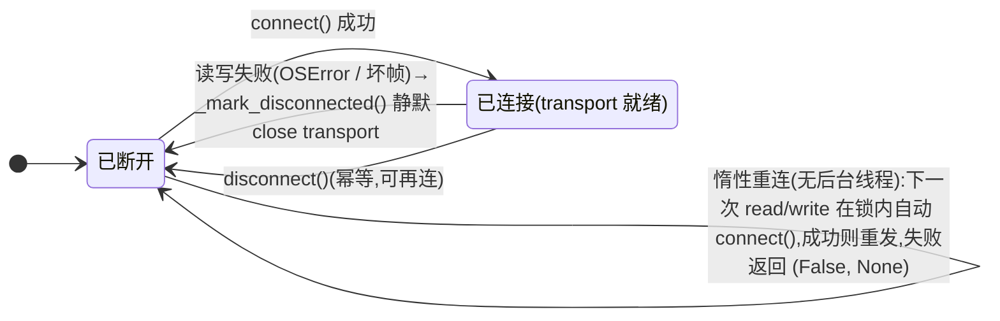

# omniplc 架构设计

> 版本:v0.42.0 · 更新日期:2026-09-26 · 状态:Modbus / 汇川 H3U/H5U 与汇川 MC / 松下 MC 与 MEWTOCOL / 三菱 MC(以太网 + 串口 1C/3C/4C)与 MX Component / FINS / NJ/NX CIP / KV / SR / TOYOPUC / AB EtherNet/IP / 倍福 TwinCAT ADS / 西门子 S7 / OPC-UA / 通用自定义 TCP / CNC MTConnect 已全部落地,全局报文调试开关已上线;工业场景可靠性 + 观测诊断收口(per-call timeout 立即下发、整事务 deadline、超时分流、AB connected 重连、TCP keepalive、aio close 生命周期、UDP datagram 上限、FINS 重连节点刷新、MX COM 清理、连接健康统计);v0.30.1 修复批:MTConnect keep-alive 透明重试 / 点位表整数写入 / OpenTcp 流式收包 / 全协议收包语义收口;v0.30.2 安全修复批:网络长度域上限 / 整事务 deadline / MTConnect 响应体上限;v0.31.0 MX 真机批:COM 出参口径真机核证修正 / write_batch 随机批量写 / CPU 型号·时钟·出错文本查询;v0.31.1 MX 块读写 raw 调用补 lplRetCode 出参缓冲(4 参)修复;v0.31.2 文档完善批:全库客户端构造参数注释补全(43 处)/ README 类图·安装节·范例修正/ README 变更历史按版本降序重排(本文 §11 履历表保持升序);v0.31.3 CI 发布流水线:GitHub Actions 标签触发 uv build → GitHub Release + PyPI 可信发布;v0.31.4 CI 修复批:uv build 显式指定 3.12 解释器(绕开 .python-version 钉 3.7.9);v0.32.0 API 对齐批:FINS 节点号自动推导(IP 末段/握手)/ 参数归位四分法成文 + 属性补齐 / 双入口取消 / S7 签名对齐;v0.32.1 CI 修复:Release 发布物收紧为 *.whl/*.tar.gz(排除 uv build 生成的 dist/.gitignore);v0.33.0 MC A 兼容 1C 帧落地 + 点位表 schema 破坏性变更(`Tag.name` → `tag_id` + `remark`);v0.34.0 可靠性 P0 双项:连接退避门控(`reconnect_backoff`/`next_connect_in`)+ 失败结构化(`ErrorCategory`/`last_error_category`/`last_error_code`);v0.35.0 OPC-UA 推模式补齐:DataChange/Event 订阅(`OpcUaSubscription` 句柄、回调异常吞掉不杀订阅)+ 地址树 Browse(语义别名/递归/深度上限);v0.36.0 Modbus 规范能力补齐 + 协议校验加固:原生批量读(`read_batch` 5 类分组连续地址合并)/ FC 15·16 合并写 / FC 23 单事务读写多寄存器 / FC 43·14 设备标识(自动翻页 + RTU 增量收包)/ 起始地址+数量越界组帧期拒绝,FINS 构造期路由校验 + 应答帧 ICF·SID·命令码回显、MTConnect 拒绝 DOCTYPE 子集(XXE 与实体炸弹);v0.37.0 契约/口径收口批:`_execute` 超时独立分支(0 字节已读 → 不拆连、不计 `device_error_count`、按 `retries` 重试,三走线口径统一)+ `DeviceError(code=0)` 归 `None` + `device_error_count` 有码才计;SR 能力缺失改抛 `DeviceError` 不断线、`scan()` 并入 `_execute`;Modbus 批量写四处收口(超限切片并入前判定 / 写侧异常穿透落 `last_error` / 写事务补 `is_write` / 地址跨度入参期校验)、`write_bool` 拒绝非 bool/int;MC 4C 帧中途超时改按截断拆连重同步;松下 MC 补批量地址换算钩子(修静默错址);aio `close()` 安全关闭(关闸 → 排空 → `shutdown(wait=True)`)与异步层边界公示(同步 I/O + 单线程池包装、无原生取消);v0.38.0 转换助手与类型面收口:`convert.words_to_value` 支持 BOOL/STRING(BOOL 按"字值非 0 为真"、STRING 不限字数按新增 `encoding` 解码、读文本须显式 `ByteOrder.BIG`)+ `value_to_words` 维持数值类型并写明不对称理由;`stats` 返回类型改 `ClientStats`(TypedDict,3.7 按 `sys.version_info` 分支退化为 `dict` 子类、运行期零变化、包顶层导出);v0.39.0 原生异步层落地:新增 `omniplc.native`(`Async*` 前缀,与 `omniplc.aio` 包装层并存的真 asyncio 协议栈,零第三方依赖),首批 Modbus TCP / MC 1E·3E(TCP+UDP)/ FINS(TCP+UDP),只重写 `_transact` 薄层、编解码与错误口径全复用同步侧;属性直读原子、原生取消(按是否已发出决定拆连)、UDP 走已连接 socket + `sock_recv_into`(3.7 Proactor 不支持数据报端点)、主机名解析钉 AF_INET;同步 × 异步对拍 + 双事件循环测试锁口径(详见 §12);**v0.40.0 修复与复查收口**:AB 连接初始化失败时注销 CIP 会话(新增基类钩子 `_after_connect_failure`,**关传输之前**调用,放之后注销帧发不出去且异常被静默吞)+ 原生层两处真缺陷修复(取消 UDP 读后关套接字不再崩事件循环——selector 残留收口到 `AsyncUdpTransport.close()`;FINS/UDP 主机名目标的节点推导改用传输层已解析的 `peer_ip`,事件循环零阻塞,修复前实测停顿 260ms)+ K1(Keyence MC 位组地址)复核更正为"证据不足、现状不改"(3E 设备号字段是 3 字节,非评审说的 16 位)并把真机判据写入清单 + 构造签名与边界入参对拍固化为门禁(1078 → 1112);**v0.40.1 补丁**:取消异常口径跨 3.7/3.8+ 统一(`core/errors._CANCELLED_ERRORS`——3.8 起 `asyncio.CancelledError` 与 `concurrent.futures.CancelledError` 不再是同一个类,原捕获在 3.8+ 全部漏网:native 超时不再翻译成 `socket.timeout`/`TransportTimeoutError`、取消不拆连、aio `close()` 取消回退不触发;CI 3.12 腿抓到 7 例 FAILED)+ 3.12 测试收尾不再挂死(3.12 起 `Server.wait_closed()` 还等每个连接由应用侧关净,新增 `close_server` 助手;非库缺陷);**v0.41.0 评审必修批**:MC 位软元件位号后缀静默丢弃(P0)校验下沉组帧层(3E/4E/1E/3C/4C/1C 全帧型 + 0406 批量位块,品牌子类换算先行)、MC 设备码表扩容(L/F/SB/V/DX/DY/TS/TC/TN/CS/CC/CN/SM/SD/SW)、NJ BOOL 数组按元素访问(应答类型自描述,DWORD 回退 `//32`)、NJ STRING 按 `len(u32)+字符` 实现、AB 0x0A 按 (≤32 条, ≤480B) 自动拆包、S7 STRING 读截断 / 写保留声明长、ADS transport 三码分流、FX5U `xy_octal` 开关;CI 版本矩阵改 3.7.9 + 3.12(3.7 必保)

omniplc 是面向多品牌、多协议 PLC 的 Python 统一通信库(Python 3.7.9+,uv 开发)。
本文档描述目标架构(v1.0 形态):分层、类设计、继承树、线程安全模型、类型标注纪律、
地址语法、字序、连接状态机与测试策略。

---

## 1. 总体分层

```mermaid
flowchart TB
    subgraph UserApi["用户 API 层"]
        Clients["协议 × 走线 具体客户端类<br/>28 个同步 + 28 个异步(A 前缀镜像,omniplc.aio 线程池包装)<br/>5 个原生异步(Async 前缀,omniplc.native 真 asyncio 协议栈,零第三方依赖)<br/>scanner:KeyenceSrClient 扫码枪 · cnc:MTConnectClient 机床数采<br/>Tag / TagTable 可选点位表层"]
    end
    subgraph Drivers["驱动层 drivers(协议编解码 + 地址解析)"]
        Modbus["modbus/<br/>codec + address + client"]
        Melsec["plc/melsec/<br/>codec_qna(3E/4E)+ codec_a(1E)+ codec_serial(3C/4C 串口帧)<br/>+ codec_serial_a(1C 串口帧)+ address + client"]
        Omron["plc/omron/<br/>codec + address + client"]
        Ab["plc/ab/<br/>codec_cip(ENIP 封装 + CIP 服务)+ address(标签名)+ client"]
        Keyence["plc/keyence/<br/>hostlink + mc(TCP/UDP,继承三菱 MC 换码表)"]
        InovanceD["plc/inovance/<br/>address(汇川→Modbus 映射)+ client(继承 Modbus)<br/>mc(MC 协议兼容,继承 MelsecMcTcpClient)"]
        PanasonicD["plc/panasonic/<br/>mc(MC 协议兼容,继承 MelsecMcTcpClient)<br/>address + codec_mewtocol + mewtocol(TCP/UDP)"]
        Toyopuc["plc/toyopuc/<br/>codec + address + client"]
        SiemensD["plc/siemens/<br/>address(DB/I/Q/M 解析)+ client(封装 python-snap7)"]
        BeckhoffD["plc/beckhoff/<br/>ads(封装 pyads,AMS 851;DataType→PLCTYPE 映射)"]
        OpenTcpD["opentcp/<br/>client(分隔符/定长成帧,任意设备收发壳,无点位语义)"]
        Opcua["opcua/<br/>address + client(封装 asyncua)"]
    end
    subgraph TransportLayer["传输层 transport(可插拔)"]
        TransportList["BaseTransport(ABC)→ TcpTransport / UdpTransport / SerialTransport"]
    end
    subgraph CoreLayer["公共基础层"]
        BaseClientC["core/BaseClient<br/>状态机 / 锁 / 重连 / 重试 / 类型化方法模板"]
        Errors["core/errors.py(错误类集中定义)"]
        Constants["core/constants.py(全局常量集中定义)"]
        DebugC["core/debug.py(全局报文调试开关 set_debug)"]
        ValidationC["core/validation.py(字段校验纯函数)"]
        TypesC["types.py(DataType / WordOrder…)"]
        ConvertC["convert.py(纯转换函数)"]
    end

    UserApi ==> Drivers
    Drivers ==> TransportLayer
    UserApi -.-> CoreLayer
    Drivers -.-> CoreLayer
    TransportLayer -.-> CoreLayer
```



设计原则:

1. **codec 全部是纯函数**(bytes ↔ 结构),不接触 socket——可以用黄金报文样本
   做无硬件测试;
2. **协议层只依赖 `BaseTransport` 抽象**——新增走线不动协议层;
3. **公共逻辑在 `BaseClient` 收口一次**——锁、重连、重试、类型化读写全协议共享;
4. **对外 API 不抛自定义异常**——读返回 `(bool, value)`,写返回 `bool`,
   失败原因进 `last_error`。

报文调试(全局开关):`omniplc.core.debug.set_debug(True)` 进程级生效。
走线型协议在 ``TcpTransport``/``UdpTransport``/``SerialTransport`` 的
``send``/``recv`` 统一输出原始字节(方向 + 长度 + 十六进制,单条最多转储
4096B),连接建立/断开事件一并输出;会话型(OPC-UA/ADS/MX Component)
无字节流,在会话读写方法/客户端 COM 调用点输出操作级日志。输出统一走
logging 记录器 ``omniplc.debug``(DEBUG 级):应用已配置日志时沿 propagate
汇入既有体系;未配置任何处理器时自动挂 stderr 处理器,保证开箱即用。

## 2. 类继承图

```mermaid
flowchart TB
    %% ═══ 公共基类(实线 = 继承,虚线 = 使用/适配) ═══
    BaseClient["BaseClient(ABC,模板方法)— core/base_client.py<br/>连接状态机 / RLock 事务锁 / 惰性重连 / 重试 / last_error / 上下文管理器<br/>read()/write()/read_many()/write_many()/read_tag()/bind_tags()<br/>read_bool…read_double / read_string + write_* ——类型化方法只写一次"]

    %% ═══ Modbus ═══
    ModbusBaseClient["ModbusBaseClient(ABC)— modbus/modbus.py<br/>_read/_write 落到位/寄存器原语;字序 ABCD/CDAB/BADC/DCBA<br/>int16…float64 编解码与范围校验;station / word_order 属性"]
    ModbusTcpClient["ModbusTcpClient<br/>MBAP 帧"]
    ModbusRtuClient["ModbusRtuClient<br/>站号 + PDU + CRC16(configure_serial)"]
    InovanceTcpClient["InovanceTcpClient — plc/inovance/<br/>汇川 H3U/H5U Modbus TCP(502)"]
    InovanceRtuClient["InovanceRtuClient<br/>汇川 Modbus RTU(缺省 9600-8N2)"]

    %% ═══ 三菱 MC / MX ═══
    MelsecMcBase["_MelsecMcBase(ABC,私有)— plc/melsec/melsec.py<br/>帧型按走线白名单校验(TCP/UDP:3E/4E/1E;串口:1C/3C/4C)、软元件地址分发"]
    MelsecMcTcpClient["MelsecMcTcpClient<br/>MC 3E/4E/1E 帧"]
    MelsecMcUdpClient["MelsecMcUdpClient<br/>同帧型 over UDP"]
    MelsecMcSerialClient["MelsecMcSerialClient — plc/melsec/melsec.py<br/>MC 串口帧(C24,configure_serial + pyserial)<br/>3C 帧 ASCII 格式 4 / 4C 帧 二进制格式 5<br/>核心命令与 3E 完全一致(codec_qna.build_core 复用)"]
    KeyenceMcCodeMixin["_KeyenceMcCodeMixin(混入,私有)— plc/keyence/mc.py<br/>基恩士码表覆写:device_info/build_frame 走 KEYENCE_MC_DEVICE_CODES<br/>TCP/UDP 两走线共用,帧层仍走三菱实现"]
    KeyenceMcTcpClient["KeyenceMcTcpClient — plc/keyence/mc.py<br/>基恩士 KV MC 协议兼容(SLMP),帧固定 3E<br/>地址:R 位十进制 / DM 字十进制 / B 位、W 字十六进制 / ZR 字十进制"]
    KeyenceMcUdpClient["KeyenceMcUdpClient<br/>同帧型 over UDP(一问一答一数据报)"]
    InovanceMcTcpClient["InovanceMcTcpClient — plc/inovance/mc.py<br/>汇川 MC 协议兼容,帧固定 3E<br/>码表 INOVANCE_MC_DEVICE_CODES + 记号换算:<br/>S→三菱 L 码(92h)/ R≡D+8000 统一编址 / X,Y 八进制名→帧内十六进制"]
    PanasonicMcTcpClient["PanasonicMcTcpClient — plc/panasonic/mc.py<br/>松下 FP0H/FP7 MC 协议兼容,帧固定 3E(仅二进制)<br/>码表 PANASONIC_MC_DEVICE_CODES(与三菱同码)+ 记号换算:<br/>X/Y/L/R 字号×16+位号 / R 字号≥900→SM / D≥90000→SD"]
    PanasonicMewtocolTcpClient["PanasonicMewtocolTcpClient — plc/panasonic/mewtocol.py<br/>MEWTOCOL ASCII 帧 + BCC(无 ETX),端口 1024<br/>RCS/WCS 单接点、RD/WD 数据区;TCP 按头 4 字节分支后精确收齐"]
    PanasonicMewtocolUdpClient["PanasonicMewtocolUdpClient<br/>同帧型 over UDP(一问一答一数据报)"]
    MelsecMxClient["MelsecMxClient — plc/melsec/mx.py<br/>MX Component(Windows,comtypes),ActUtlType 按逻辑站号<br/>无字节流收发;GetDevice/SetDevice/Read·WriteDeviceBlock/Read·WriteDeviceRandom<br/>GetCpuType/Get·SetClockData/GetErrorMessage(ActSupportMsg)"]

    %% ═══ 欧姆龙 FINS ═══
    OmronFinsBase["_OmronFinsBase(ABC,私有)— plc/omron/omron.py<br/>FINS 节点地址、软元件地址分发"]
    OmronFinsTcpClient["OmronFinsTcpClient<br/>FINS 帧 + TCP 握手(_after_connect 钩子)"]
    OmronFinsUdpClient["OmronFinsUdpClient<br/>FINS 帧,无握手"]

    %% ═══ 罗克韦尔 AB EtherNet/IP ═══
    AllenBradleyEthIpClient["AllenBradleyEthIpClient — plc/ab/ab.py<br/>Logix 标签读写(Tag Read/Write 0x4C/0x4D、RMW 0x4E)<br/>RegisterSession(_after_connect 钩子)+ Unconnected Send<br/>标签自描述:首访类型发现按基名缓存,STRING 走 0xA0 结构体"]

    OmronCipClient["OmronCipClient — plc/omron/cip.py<br/>NJ/NX 内置 EtherNet/IP 变量读写(继承 AB 客户端)<br/>覆写三钩子:_route_path=空 / _wrap_unconnected=直发<br/>/_parse_unconnected_reply=一层服务头;STRING 待真机核证拒绝"]

    %% ═══ 倍福 TwinCAT ADS ═══
    BeckhoffAdsClient["BeckhoffAdsClient — plc/beckhoff/ads.py<br/>TwinCAT 变量名读写(封装 pyads 3.5.1,AMS 851)<br/>DataType→PLCTYPE 映射 + 范围校验;ADSError→DeviceError 不断线<br/>NetId 默认 IP+.1.1;Windows 需 TcAdsDll 运行库"]

    %% ═══ 基恩士 Host Link / SR ═══
    KeyenceHlBase["_KeyenceHostLinkBase(ABC,私有)— plc/keyence/hostlink.py<br/>ASCII 行式协议(RD/RDS/WR/WRS + CR 结束)"]
    KeyenceHostLinkTcpClient["KeyenceHostLinkTcpClient<br/>按行逐字节收包"]
    KeyenceHostLinkUdpClient["KeyenceHostLinkUdpClient<br/>一问一答一数据报"]
    KeyenceSrClient["KeyenceSrClient — scanner/keyence_sr.py<br/>SR 扫码枪:LON → 窗口 → LOFF → 读应答<br/>scan() 返回(是否读到, 条码文本);不实现 _read/_write"]

    %% ═══ 丰田 TOYOPUC / OPC-UA ═══
    ToyopucBase["_ToyopucBase(ABC,私有)— plc/toyopuc/toyopuc.py<br/>TOYOPUC 二进制帧(00 00 LL LH CMD / 80 RC LL LH CMD)<br/>TCP 按帧头长度分段收包,UDP 一问一答一数据报"]
    MewtocolBase["_MewtocolBase(ABC,私有)— plc/panasonic/mewtocol.py<br/>站号(01~99/EE)、接点 RCS/WCS 与数据区 RD/WD 分发、位写读-改-写<br/>TCP 按响应头 4 字节判正常/错误后精确收齐,UDP 整包校验"]
    ToyopucTcpClient["ToyopucTcpClient"]
    ToyopucUdpClient["ToyopucUdpClient"]
    OpcUaClient["OpcUaClient — opcua/client.py<br/>OPC-UA opc.tcp(封装 asyncua 1.1.5)<br/>get_node().read_value()/write_value() 按 VariantType 编解码,无字节流"]
    MxComLink["_MxComLink<br/>COM 会话(Open/Close)适配为传输对象外形"]
    OpcUaSession["_OpcUaSession<br/>asyncua 同步会话适配;UaError 在会话边界翻译为 DeviceError"]
    AdsSession["_AdsSession<br/>pyads Connection 适配;ADSError 在会话边界翻译为 DeviceError"]
    MtcSession["_MtConnectSession<br/>http.client keep-alive 连接适配;HTTP/MTConnectError 在会话边界翻译"]
    S7Session["_S7Session<br/>snap7 Client 适配;snap7 错误(1.x/2.x RuntimeError、3.x S7Error)按连接态翻译(在线 DeviceError/断连 OSError)"]

    %% ═══ CNC 机床数采(MTConnect) ═══
    MTConnectClient["MTConnectClient — cnc/mtconnect.py<br/>CNC 只读数采(HTTP/XML,Agent 默认端口 5000,标准库零依赖)<br/>地址=数据项 id/name;read_* 类型化 + snapshot() + read_conditions() + probe()"]

    %% ═══ 西门子 S7 ═══
    SiemensS7Client["SiemensS7Client — plc/siemens/client.py<br/>S7-300/400/1200/1500(封装 python-snap7:3.7~3.9→1.3,3.10+→3.x 纯 Python)<br/>rack/slot 102;DB/I/Q/M 绝对寻址,尺寸由 DataType 决定大端序;位读改写;S7 String"]

    %% ═══ 通用自定义 TCP ═══
    OpenTcpClient["OpenTcpClient — opentcp/client.py<br/>任意设备收发壳(分隔符 delimiter 或定长 frame_length 成帧;<br/>encoding/append·strip/max_frame 可配)<br/>内部缓冲:跨分片拼接、多帧逐次返回;重连清空缓冲<br/>send/send_text/receive/receive_text/transact/transact_text;无点位语义"]

    %% ═══ 继承关系 ═══
    BaseClient --> ModbusBaseClient
    ModbusBaseClient --> ModbusTcpClient
    ModbusBaseClient --> ModbusRtuClient
    ModbusBaseClient -->|"只换汇川地址映射"| InovanceTcpClient
    ModbusBaseClient -->|"只换汇川地址映射"| InovanceRtuClient
    BaseClient --> MelsecMcBase
    MelsecMcBase --> MelsecMcTcpClient
    MelsecMcBase --> MelsecMcUdpClient
    MelsecMcBase --> MelsecMcSerialClient
    MelsecMcBase --> KeyenceMcCodeMixin
    KeyenceMcCodeMixin --> KeyenceMcTcpClient
    KeyenceMcCodeMixin --> KeyenceMcUdpClient
    MelsecMcTcpClient -->|"双继承基类"| KeyenceMcTcpClient
    MelsecMcUdpClient -->|"双继承基类"| KeyenceMcUdpClient
    MelsecMcTcpClient -->|"码表 + 记号换算"| InovanceMcTcpClient
    MelsecMcTcpClient -->|"码表 + 记号换算"| PanasonicMcTcpClient
    BaseClient --> MewtocolBase
    MewtocolBase --> PanasonicMewtocolTcpClient
    MewtocolBase --> PanasonicMewtocolUdpClient
    BaseClient --> MelsecMxClient
    BaseClient --> OmronFinsBase
    OmronFinsBase --> OmronFinsTcpClient
    OmronFinsBase --> OmronFinsUdpClient
    BaseClient --> AllenBradleyEthIpClient
    AllenBradleyEthIpClient -->|"三钩子覆写:NJ/NX 直发 + 空路由"| OmronCipClient
    BaseClient --> BeckhoffAdsClient
    BaseClient --> KeyenceHlBase
    KeyenceHlBase --> KeyenceHostLinkTcpClient
    KeyenceHlBase --> KeyenceHostLinkUdpClient
    BaseClient --> KeyenceSrClient
    BaseClient --> ToyopucBase
    ToyopucBase --> ToyopucTcpClient
    ToyopucBase --> ToyopucUdpClient
    BaseClient --> OpcUaClient
    BaseClient --> OpenTcpClient
    BaseClient --> MTConnectClient
    BaseClient --> SiemensS7Client

    %% ═══ 传输层(可插拔;标签为默认端口) ═══
    subgraph TransportLayer["传输层(omniplc.transport,可插拔)"]
        BaseTransportABC["BaseTransport(ABC)"]
        TcpTransport["TcpTransport<br/>TCP_NODELAY;recv 精确凑齐 size 字节(流式粘包处理)"]
        UdpTransport["UdpTransport<br/>已连接 UDP;一次返回一条数据报"]
        SerialTransport["SerialTransport<br/>pyserial(延迟导入),8N1 可配,SerialConfig 校验"]
        BaseTransportABC --> TcpTransport
        BaseTransportABC --> UdpTransport
        BaseTransportABC --> SerialTransport
    end

    ModbusTcpClient -.->|"502"| TcpTransport
    ModbusRtuClient -.-> SerialTransport
    InovanceTcpClient -.->|"502"| TcpTransport
    InovanceRtuClient -.->|"9600-8N2"| SerialTransport
    MelsecMcTcpClient -.->|"2000"| TcpTransport
    MelsecMcUdpClient -.->|"2000"| UdpTransport
    MelsecMcSerialClient -.->|"configure_serial"| SerialTransport
    KeyenceMcTcpClient -.->|"5000"| TcpTransport
    KeyenceMcUdpClient -.->|"5000"| UdpTransport
    InovanceMcTcpClient -.->|"默认 2000(可配,按 MC 配置)"| TcpTransport
    PanasonicMcTcpClient -.->|"默认 2000(可配,按模块配置)"| TcpTransport
    PanasonicMewtocolTcpClient -.->|"1024"| TcpTransport
    PanasonicMewtocolUdpClient -.->|"1024"| UdpTransport
    OmronFinsTcpClient -.->|"9600"| TcpTransport
    OmronFinsUdpClient -.->|"9600"| UdpTransport
    AllenBradleyEthIpClient -.->|"44818"| TcpTransport
    OmronCipClient -.->|"44818"| TcpTransport
    OpenTcpClient -.->|"9000(占位默认,按设备)"| TcpTransport
    KeyenceHostLinkTcpClient -.->|"8000"| TcpTransport
    KeyenceHostLinkUdpClient -.->|"8000"| UdpTransport
    KeyenceSrClient -.->|"9004"| TcpTransport
    ToyopucTcpClient -.->|"1025"| TcpTransport
    ToyopucUdpClient -.->|"1025"| UdpTransport
    MelsecMxClient -.-> MxComLink
    OpcUaClient -.->|"4840"| OpcUaSession
    MTConnectClient -.->|"5000(Agent)"| MtcSession
    SiemensS7Client -.->|"102(rack/slot)"| S7Session
    BeckhoffAdsClient -.->|"AMS 851"| AdsSession

    %% ═══ 点位表 / 异步镜像 ═══
    TagNode["Tag(dataclass)/ TagTable(构造后只读 Mapping)— tag.py(from_json / from_csv)"]
    BaseClient -.->|"bind_tags"| TagNode

    subgraph AsyncMirror["异步镜像(omniplc.aio):ABaseClient 组合同步实例 + 单线程 ThreadPoolExecutor,签名同名同型"]
        AsyncList["AModbusBaseClient → AModbusTcpClient / AModbusRtuClient<br/>AInovanceTcpClient / AInovanceRtuClient(configure_serial 对称暴露)/ AInovanceMcTcpClient<br/>AMelsecMcTcpClient / AMelsecMcUdpClient / AMelsecMcSerialClient / AMelsecMxClient<br/>AOmronFinsTcpClient / AOmronFinsUdpClient / AOmronCipClient / ABeckhoffAdsClient / AAllenBradleyEthIpClient<br/>AKeyenceHostLinkTcpClient / AKeyenceHostLinkUdpClient / AKeyenceMcTcpClient / AKeyenceMcUdpClient<br/>APanasonicMcTcpClient / APanasonicMewtocolTcpClient / APanasonicMewtocolUdpClient<br/>AToyopucTcpClient / AToyopucUdpClient / AOpcUaClient / AOpenTcpClient / AMTConnectClient / ASiemensS7Client / AKeyenceSrClient"]
    end
    BaseClient -.->|"组合 + 镜像"| AsyncList

    classDef abstract fill:#f5f5f5,stroke:#999,stroke-dasharray:4;
    class BaseClient,ModbusBaseClient,MelsecMcBase,KeyenceMcCodeMixin,OmronFinsBase,KeyenceHlBase,ToyopucBase,MewtocolBase,BaseTransportABC abstract;
```



v1 共 **28 个同步具体类 + 28 个异步镜像类**,三菱三帧型(3E/4E/1E)× 两走线(TCP/UDP)
加串口帧(1C/3C/4C,同一 `_MelsecMcBase` 基类),基恩士 KV MC 兼容 TCP/UDP 两走线
(共用 `_KeyenceMcCodeMixin` 码表覆写),罗克韦尔 AB EtherNet/IP(TCP 44818,
unconnected 消息),欧姆龙 NJ/NX CIP(继承 AB 客户端,三钩子覆写),
倍福 TwinCAT ADS(封装 pyads,会话适配),
通用自定义 TCP(分隔符成帧,无点位语义),
另加 MX Component(Windows/COM,
单线程 executor 天然满足 ActUtlType 的 STA 模型)。

### 2.1 继承设计要点(模板方法模式)

- `BaseClient` 定义抽象原语:**`_create_transport()` / `_read()` / `_write()`**,
  外加可选钩子 `_after_connect()`(FINS/TCP 握手)、`_after_connect_failure()`
  (连接初始化失败时清理 PLC 侧资源,如 AB 注销 CIP 会话)、`_read_string/_write_string`。
- 类型化方法 `read_float(addr)` 的实现只有一份:
  `read_float → read(addr, FLOAT) → _execute(锁内) → _read(addr, FLOAT)(驱动)`;
  新增协议只需实现 2 个原语,自动获得全部 20+ 个类型化方法。
- `ModbusBaseClient` 中间层封装"寄存器级"公共性(类型分发、字序、范围校验),
  三个走线子类只实现 `_transact()`(MBAP vs RTU 帧装拆)与 `_create_transport()`。
- 三菱 MC 的 TCP/UDP 子类完全共享帧编解码(帧内无走线信息);
  帧层按 **QnA 兼容(3E/4E,`codec_qna.py`)**、**A 兼容(1E,`codec_a.py`)**
  与 **QnA 串口帧(3C/4C,`codec_serial.py`)** 拆三个模块——1E 帧无网络号/PC 号
  前缀字段、软元件码表不同;3C/4C 无监视定时器、路由为站号+网络号+PC号
  (+4C 目标模块 I/O)+本站号,核心命令经 `codec_qna.build_core` 复用。
- 异步侧是**组合 + 镜像**:每个 `A*Client` 持有对应同步实例,方法签名与同步版
  完全一致(返回可 await),协议逻辑只有一份。
- **镜像对称性约定(2026-09 全库复审确立)**:A 类必须暴露同步类的全部
  公共属性与扩展方法(`frame`/`endpoint`/`local_node`/`scan_dwell`/
  `scan`/`reset`/`write_mask_register`/`configure_serial`…),构造参数
  与同步版同名同型;唯二例外均由协议决定:FINS/UDP 无握手故无
  `local_node`,OPC-UA 端点为 URL 故在统一 `ip_address/port` 入口外
  另备 `path`(URL 路径)与 `endpoint`(完整 URL 显式覆盖)。
- **入口与返回风格(全库约定)**:网络型客户端构造统一
  `ip_address/port(+协议参数)`,串口为 `station + configure_serial()`;
  读返回 `(bool, Optional[值])`、写返回 `bool`、触发式 `scan()` 返回
  `(bool, Optional[str])`,失败原因一律进 `last_error`。
- **参数归位四分法(2026-09-24 确立)**:判定测试——"改了这个参数,
  是不是等于换了一个对端?"是 → **构造函数**(构造期冻结,只读属性
  暴露,如 `frame`/`rack·slot`/`net_id`/FINS 路由参数;变更 = 换目标,
  应新建实例,冻结保证线程安全与连接状态一致);否 → **可写属性**
  (setter 校验 + 即时生效,如 `receive_timeout`(下发 live socket)/
  `retries`/`write_retries`/`word_order`/`reconnect_backoff`(v0.34,
  连接退避开关,与 retries 同族))。物理链路参数(串口五件套)
  走独立 `configure_serial()`(构造时不连、connect 前必须定,未配置
  就 connect 明确报错);运行态/派生值一律只读属性(`connected`/
  `last_error`/`last_error_category`/`last_error_code`(v0.34)/
  `next_connect_in`(v0.34,退避剩余秒数)/`stats`/`local_node`
  (握手后)/`connection_size`(Forward Open 后)/`active_subscriptions`
  (v0.35,OPC-UA 活跃订阅句柄快照))。**双入口一律不设
  (2026-09-24 收紧)**:构造函数
  参数一律构造期冻结(属性至多只读暴露),可写属性一律不进构造函数——
  `station`(Modbus/MEWTOCOL/MC 串口)与 `scan_dwell` 均为构造期定
  只读;Modbus TCP 的 Unit ID 虽是逐事务路由标签,统一按身份参数
  处理,换站号即新建实例。

## 3. 线程安全设计

1. **单锁模型**:每个客户端实例一把 `threading.RLock`,保护三样东西:
   连接状态、请求/响应事务、`last_error`。`connected` / `last_error` 读到的是加锁快照。
2. **事务粒度持锁**:一次读/写在锁内完成全部步骤(必要时惰性重连 → 组帧 → send →
   recv → 校验 → 解码),保证请求/响应帧不被其他线程交错(interleaving)。
3. **文档化取舍**:持锁做网络 IO,意味着同一客户端的并发调用是**串行化**的——
   这保证正确性而非并行吞吐;需要高并发时使用多个客户端实例(连接池留 v1.x)。
4. **重试语义在锁内**:读失败按 `retries` 重试;写默认 `write_retries=0`
   (防止重复写入危险动作),可显式开启。重试与**惰性重连**配合:
   传输失败标记断开,重试前自动重建连接。
5. **PLC 明确报错(`DeviceError`)不断线、不重试**——链路是好的,只有传输层
   故障(OSError / 坏帧)才标记断开。
6. **Transport 自身非线程安全**,只由持有事务锁的客户端串行访问;
   异步侧所有调用经**单线程 executor** 串行执行,与同步侧同一把 RLock,双保险且保序。
   异步层是"同步 I/O + 单线程池"的**包装而非原生 asyncio 协议栈**:同一客户端
   串行、同步属性直读、无原生取消(`wait_for` 超时后写事务仍在工作线程跑完);
   `close()` 关闸 → 排空已提交任务(不锯断在途事务)→ `shutdown(wait=True)`
   (在默认执行器里等,不阻塞事件循环)。选型与并发边界详见 README「异步」节。
7. **订阅回调线程(v0.35,OPC-UA)**:DataChange/Event 回调在 asyncua
   内部线程触发,不经事务锁——同步版直接执行用户回调(异常吞掉记
   `last_error`,category=UNKNOWN,不杀订阅);aio 版经
   `loop.call_soon_threadsafe` 桥接到调用方事件循环线程(回调内可安全
   做 asyncio 操作,loop 已关闭则静默丢弃)。`disconnect()` 先退订清
   `active_subscriptions` 索引再走基类断开;断线不自动重订。
8. **原生异步层(`omniplc.native`)的并发模型**:每个实例一把 `asyncio.Lock`
   按事务粒度持锁(与同步侧同一口径),实例内串行、实例间天然并发;`asyncio.Lock`
   **非重入**,故只有公开入口取锁、内部 `_*_locked` 助手假定锁已持有(替代同步侧
   RLock 的作用)。锁**按首次使用时的事件循环惰性创建**(3.7 的 `asyncio.Lock`
   构造即绑循环,模块级构造客户端再 `asyncio.run` 会在旧实现下直接炸)。
   属性(`connected`/`last_error*`/`stats`/超时/重试)是**直接读字段、不取锁**:
   单线程事件循环里字段更新与读取之间没有 `await` 间隙,读到的就是原子快照
   ——这正是包装层"读属性要抢事务锁、最长阻塞一个 `receive_timeout`"的解法。
   原生异步层的完整口径(复用边界、传输选型、超时/取消表、3.7 坑)见 §12。

## 4. 连接状态机与惰性重连



- `connect()` 幂等:已连接直接返回 True;`disconnect()` 幂等。
- `with client:` 进入时连接,失败抛 `ConnectionError`;
  `async with AClient(...):` 同语义。
- `_after_connect()` 钩子:连接建立后执行协议级初始化(FINS/TCP 节点分配握手)。
- `_after_connect_failure()` 钩子(v0.40 候选,2026-09-26):`_after_connect()`
  抛异常时尽力清理 PLC 侧资源(**传输关闭之前**调用——传输此时仍可用,注销帧
  才发得出去;钩子自身抛出的异常被吞掉,不掩盖原始连接失败)。同步与原生两层
  基类同名同义(原生侧为协程;取消分支不调用)。现由 AB 覆写:注册 CIP 会话后
  Forward Open 失败时**注销会话**,否则会话留到 PLC 侧超时回收,反复失败重连
  可耗尽会话表(ControlLogix 典型 ≤16)。

**连接退避门控(v0.34.0)**:`connect()` 失败(建连或 `_after_connect`
握手)后,下一次 `connect()` 在 `uniform(0, min(0.5 × 2ⁿ, 30))` 秒内
(n = 连续失败次数)直接拒绝——`monotonic()` 时间戳比较,零 sleep、
不占锁等待;连接成功或显式 `disconnect()` 全重置;
`reconnect_backoff = False` 关闭;`next_connect_in` 暴露剩余秒数。
门控拒绝不计 `error_count`(无网络动作)。状态机在
"已断开 → connect()" 转移上多一个"退避中"前置判断,其余转移不变。

## 5. 错误处理约定

公共 API **不抛自定义异常**:

| 操作 | 成功 | 失败 |
|---|---|---|
| `read_*` / `read` / `read_tag` | `(True, 值)` | `(False, None)` |
| `write_*` / `write` / `write_tag` | `True` | `False` |
| `read_many` / `write_many` | 逐点独立容错的结果列表 | 单点失败不影响其他点 |
| `connect` / `disconnect` | `True` | `False` |

- 失败原因一律记录在 `last_error` 属性(含 PLC 原始错误码,如 Modbus 异常码、
  MC 结束码、FINS 结束码);成功读写后清空。
- **失败分类(v0.34.0)**:`last_error` 文本之外,`BaseClient` 另暴露
  `last_error_category: Optional[ErrorCategory]` 与
  `last_error_code: Optional[int]`,成功后与 `last_error` 一并清空。
  分类规则(`base_client._categorize`,顺序敏感——`TransportTimeoutError`
  是 `DeviceError` 子类必须先判):

  | 异常 | category | code |
  |---|---|---|
  | `TransportTimeoutError`(串口/UDP 超时) | TIMEOUT | None(传输超时无协议码) |
  | `socket.timeout`(TCP 超时) | TIMEOUT | `errno` 或 None |
  | `ProtocolFrameError` | PROTOCOL | None |
  | `DeviceError`(其余) | DEVICE | `exc.code`(协议原始码;`code=0` = 无具体错误码,归 None) |
  | `OSError`(含 `ConnectionRefused/Reset`、`gaierror`)、`TransportClosedError` | TRANSPORT | `errno` 或 None |
  | 其他(含裸内部异常) | UNKNOWN | None |

  写入统一经 `_set_error`/`_clear_error`(与 `_last_error` 同锁同步),
  驱动直写点(SR 扫码枪、AB 解码)已全部迁移。**新增异常类型时必须同步规则表**。
  `device_error_count` 只计"PLC 明确返回错误码"的次数:`code=0` 的无码失败
  (能力缺失、设备侧条件)与接收超时都不计入,但仍计入 `error_count`。

  **超时的两种走线语义**:TCP 接收超时抛 `socket.timeout`(OSError 语义),
  按"连接可能已死 + 迟到响应残留在 socket 缓冲"**拆连**重连;串口/UDP 抛
  `TransportTimeoutError`(**0 字节已读**,链路无残渣;串口帧截断另有
  `TransportClosedError` 拆连重同步),**不拆连**、不计 `device_error_count`
  (它不是设备返回的错误码),但与其他传输失败一样按
  `retries`/`write_retries` 重试——两种走线的重试语义一致。
- **参数校验错误**(非法地址、未知类型、范围越界、未绑定点位名)直接抛
  `ValueError`——这是调用方编码错误,静默吞掉反而有害。
- 内部异常(`omniplc.core.errors`,**错误类统一在 core 层定义**):
  `TransportClosedError` /
  `ProtocolFrameError` / `DeviceError(code)` /
  `TransportTimeoutError`(DeviceError 子类,链路完好),只用于库内控制流,
  由 `_execute()` 统一转换为元组语义,不逃逸到调用方。

## 6. 数据类型与类型标注

### 6.1 类型系统(`types.py`)

`DataType` 枚举:与方法名 `read_*`/`write_*` 后缀一一对应——
`bool / short / ushort / int / uint / long / ulong / float / double / string`
(有符号整型依次为 16/32/64 位;float=float32;double=float64)。

字序 `WordOrder`:`ABCD`(大端默认)/ `CDAB`(字交换,现场最常见)/
`BADC`(字节交换)/ `DCBA`(小端)。各协议默认值与覆盖方式:

| 协议 | 字序 | 说明 |
|---|---|---|
| Modbus | 默认 ABCD,`word_order` 属性可配 | 现场设备常为 CDAB,读写共用同一配置 |
| 三菱 MC | 固定小端字序(低字在前) | 编码层处理,不暴露配置 |
| 欧姆龙 FINS | 固定大端 | 编码层处理,不暴露配置 |

`convert.py` 提供全部转换纯函数:`crc16 / lrc / get_bit / set_bit`、
`bytes ↔ int16/uint16`、`registers ↔ int32/uint32/float32/float64(四字序)`、
`encode_string / decode_string`、`words_to_value / value_to_words`
(统一的多字解码/编码入口)。字序变换为对合变换,编解码共用一套实现。

`words_to_value` 按数据类型解码:数值类型(SHORT/USHORT/INT/UINT/LONG/
ULONG/FLOAT/DOUBLE)要求字数与尺寸严格匹配;`BOOL` 取 1 个字、按"字值非 0
即 True"(字节序不参与);`STRING` **不限字数**——入参几个字就解几个字,
按 `byteorder` 拼字节后 `\x00` 截断、按 `encoding`(默认 ascii)解码,
寄存器文本通常按大端存放故读文本要显式传 `ByteOrder.BIG`。反方向
`value_to_words` **只收数值类型**:编码的目标长度(寄存器个数)必须由调用方
给出,字符串请走 `encode_string` 编码到目标字节长度——这个不对称是有意的。

### 6.1.1 字符串参数枚举化(类型检查与 IDE 补全)

凡取值封闭的参数一律用**枚举**定义,字符串仅作兼容输入:

| 参数 | 枚举类型 | 取值 |
|---|---|---|
| `read/write(data_type)` | `omniplc.types.DataType` | `DataType.FLOAT`、`DataType.SHORT`… |
| Modbus 区域(`ModbusAddress.area`) | `omniplc.modbus.ModbusArea` | `COIL / DISCRETE_INPUT / HOLDING_REGISTER / INPUT_REGISTER` |
| Modbus 字序(`word_order`) | `omniplc.types.WordOrder` | `ABCD / CDAB / BADC / DCBA` |
| 字节序(`byteorder`) | `omniplc.types.ByteOrder` | `BIG / LITTLE` |
| 三菱 MC 帧型(`frame`) | `omniplc.types.McFrame` | `FRAME_3E / FRAME_4E / FRAME_1E / FRAME_3C / FRAME_4C / FRAME_1C` |
| 串口校验位(`parity`) | `omniplc.types.SerialParity` | `NONE / EVEN / ODD` |

约定:枚举成员为**权威定义**;所有公开参数标注为 `Union[枚举, str]`,
内部经统一的 `coerce` 辅助函数解析,非法值抛 `ValueError`。
开放集合(如 MC 软元件记号 `D/M/X…`、FINS 存储区)仍用 `str`。

### 6.2 类型标注纪律(100% PEP 484)

- 所有类/方法/函数的参数与返回值**全部显式标注**;
- 文件头统一 `from __future__ import annotations`,3.7 运行期只用
  `typing.Tuple/List/Optional/Union/Sequence`;
- 返回类型精确到方法(`read_short → Tuple[bool, Optional[int]]`),
  内部用 `_narrow_int/_narrow_float` 收窄,不用 `Any` 敷衍;
- 上下文管理器用 `TypeVar(_C, bound="BaseClient")` 保持 self 类型;
- 发布 **py.typed**(PEP 561),下游项目可直接获得类型检查;
- CI 跑 `mypy` 与 `ruff` 双静态检查,语法越界在 CI 就被拦下:mypy 目标
  版本 3.9(`pyproject.toml` 的 `[tool.mypy] python_version`,3.7 目标已
  弃用),CI 在 Python 3.12(windows-latest)执行裸 `uvx mypy src/omniplc`,
  不带 `--python-version` 覆盖;ruff 未设 `target-version`,规则集显式
  圈定 `select = ["E4", "E7", "E9", "F"]`;
- 追加 **ty**(Astral)作为第二类型检查器(`uvx ty check`,配置见
  `pyproject.toml` 的 `[tool.ty.src]`),双检查器交叉验证;
  不使用 `# type: ignore[...]` 工具特定抑制码,可空传输引用一律用
  局部变量 + 断言收窄(两种检查器通用);
- 结构化返回用 **`TypedDict`** 声明公开契约:`ClientStats`(`BaseClient.stats`
  的快照类型,字段表见该属性 docstring)从包顶层导出供下游标注;
  3.7 无 `typing.TypedDict`——按 `sys.version_info >= (3, 8)` 分支导真类型、
  低版本退化为 `dict` 子类(类体只有注解,运行期取值方式零变化),
  **不引入 `typing_extensions` 运行期依赖**(核心零依赖不变);
  两套检查器对 TypedDict 的收窄口径不一致(ty 不认 dict 字面量赋值与
  `TypedDict.copy()`,mypy 可以),故快照行用一处 `cast(ClientStats, ...)`
  兼容,并在测试里锁"快照键集 == 声明字段"防漂移。

### 6.3 核心接口签名(完整版见源码 docstring)

```python
class BaseClient(ABC):
    def connect(self) -> bool: ...
    def disconnect(self) -> bool: ...
    @property
    def connected(self) -> bool: ...
    @property
    def last_error(self) -> Optional[str]: ...
    @property
    def connect_timeout(self) -> float: ...          # setter 校验 > 0,即时生效
    @property
    def receive_timeout(self) -> float: ...
    @property
    def retries(self) -> int: ...                    # 读重试次数
    @property
    def write_retries(self) -> int: ...              # 写重试次数,默认 0
    @property
    def stats(self) -> ClientStats: ...              # TypedDict 快照(键集即契约)

    def read(self, address: str, data_type: str) -> Tuple[bool, Optional[PrimitiveValue]]: ...
    def write(self, address: str, data_type: str, value: PrimitiveValue) -> bool: ...
    def read_many(self, addresses: Sequence[str], data_type: str
                  ) -> List[Tuple[bool, Optional[PrimitiveValue]]]: ...
    def write_many(self, items: Sequence[Tuple[str, str, PrimitiveValue]]) -> List[bool]: ...

    def read_bool(self, address: str) -> Tuple[bool, Optional[bool]]: ...
    def read_short(self, address: str) -> Tuple[bool, Optional[int]]: ...
    def read_ushort(self, address: str) -> Tuple[bool, Optional[int]]: ...
    def read_int(self, address: str) -> Tuple[bool, Optional[int]]: ...
    def read_uint(self, address: str) -> Tuple[bool, Optional[int]]: ...
    def read_long(self, address: str) -> Tuple[bool, Optional[int]]: ...
    def read_ulong(self, address: str) -> Tuple[bool, Optional[int]]: ...
    def read_float(self, address: str) -> Tuple[bool, Optional[float]]: ...
    def read_double(self, address: str) -> Tuple[bool, Optional[float]]: ...
    def read_string(self, address: str, length: int = 32,
                    encoding: str = "ascii") -> Tuple[bool, Optional[str]]: ...
    # write_bool(address, value: bool) → bool,write_short(address, value: int) → bool,
    # …write_double(address, value: float),write_string(address, value: str, encoding)

    def bind_tags(self, table: TagTable) -> None: ...
    def read_tag(self, tag: Union[str, Tag]) -> Tuple[bool, Optional[PrimitiveValue]]: ...
    def write_tag(self, tag: Union[str, Tag], value: PrimitiveValue) -> bool: ...

    def __enter__(self: _C) -> _C: ...               # 失败抛 ConnectionError
    def __exit__(self, exc_type, exc_val, exc_tb) -> None: ...

    # 以下为驱动子类协议原语
    @abstractmethod
    def _create_transport(self) -> BaseTransport: ...
    @abstractmethod
    def _read(self, address: str, data_type: DataType) -> PrimitiveValue: ...
    @abstractmethod
    def _write(self, address: str, data_type: DataType, value: PrimitiveValue) -> None: ...
    def _after_connect(self) -> None: ...            # 可选钩子(FINS/TCP 握手)
    def _after_connect_failure(self) -> None: ...    # 可选钩子(失败时清理会话)
```

## 7. 地址语法

| 协议 | 语法示例 | 说明 |
|---|---|---|
| Modbus | `hr0` / `c7` / `di10` / `ir3` / `hr0.15` / `40001` | 前缀语法为主;兼容 Modicon 1 基风格(自动转 0 基);位号 0~15;已实现(`modbus/address.py`) |
| 三菱 MC | `D100` / `M10` / `X1F` / `Y40` / `W100` / `R100` / `Z0` / `ZR100` / `L10` / `F10` / `SM10` / `SD10` / `TS0`·`TC0`·`TN0` / `CS0`·`CC0`·`CN0` / `D100.3` | 已实现(`plc/melsec/`);编号进制按码表:X/Y/W/B/SB/SW/DX/DY 十六进制、其余十进制(Q/L/R 口径,SH-080956;FX5U 可 `xy_octal=True` 使 X/Y 按八进制),地址解析保留数字原文;位软元件带位号后缀(`M10.5`)拒 `ValueError`,字软元件位访问(`D100.3`)走读-改-写;批量读取:3E/4E 覆写 `read_many` 为 0406 多块批量读单事务 + `read_batch` 混类型混软元件(SH-080008 §8.4,总块数 ≤120,整批容错) |
| 欧姆龙 FINS | `D100` / `CIO0` / `CIO0.5` / `W10` / `H20` / `A0` / `E0_100` / `T0` / `C10` | 已实现(`plc/omron/`);存储区码随帧 codec 实现,EM 区 bank 用下划线;T/C 为定时器/计数器(位=完成标志只读,字=当前值 PV);批量读取:覆写 `read_many` 为 0104 多存储区读单事务 + `read_batch` 混类型混软元件(W342 §5-3-5,仅字码,每条读 1 字、响应逐条区码回显校验,以太网上限 167 条;BOOL 走包含字提位) |
| 丰田 TOYOPUC | `D0100` / `D0100L` / `D0100H` / `M0201` / `M0201W` / `X0010H` | 已实现(`plc/toyopuc/`);编号一律十六进制(手册口径);字区 S/N/R/D/B,位区 P/K/V/T/C/L/X/Y/M;L/H=低/高字节(字节访问),W=位软元件打包字 |
| 基恩士 KV MC 兼容 | `R5` / `B1F` / `W10` / `DM100` / `ZR100` / `DM100.3` | 已实现(`plc/keyence/mc.py`,继承 MC);编号进制:R/DM/ZR 十进制、B/W 十六进制;仅基恩士记号(无三菱 D/M/X/Y) |
| 基恩士 KV Host Link | `R515` / `B1F` / `W100` / `X0F` / `M100` / `DM100` / `DM100.5` | 已实现(`plc/keyence/hostlink.py`,TCP/UDP 8000,ASCII 行式 RD/RDS/WR/WRS);位软元件 R=组号+两位位号、B/W 十六进制、X=组号十进制+位号十六进制;字软元件 DM 十进制,16/32 位整型经 `.S/.U/.L/.D` 后缀由 PLC 原生解析;字软元件位访问(`DM100.5`,位号十进制)走读-改-写 |
| 基恩士 SR 扫码枪 | —(无地址概念,触发式访问) | 已实现(`scanner/keyence_sr.py`,TCP 9004);`scan(bank=0~15)` 返回 `(是否读到, 条码文本)`,bank 预设不同窗口/触发/回读参数;`_read`/`_write` 为能力缺失桩(抛 `DeviceError` 不断线,调 `read_*`/`write_*` 不拆线) |
| 汇川 H3U/H5U(Modbus) | `D100` / `R100` / `M10` / `SM10` / `SD10` / `S10` / `B10` / `T10` / `C10` / `X17` / `Y17` / `D100.3` | 已实现(`plc/inovance/`,继承 Modbus);位软元件→线圈区(基址按手册:M=编号、SM/SD=0x2400、S=0xE000、T=0xF000、C=0xF400、X=0xF800、Y=0xFC00、B=0x3000),字软元件→保持寄存器区(D=编号、R=0x3000);X/Y 八进制;T/C 位=接点、字=当前值(C 字仅 C0~C199,C200+ 为 32 位双寄存器不支持) |
| 汇川 MC 兼容 | `D100` / `M10` / `S10` / `B1F` / `W10` / `R100` / `X17` / `Y7` / `D100.3` | 已实现(`plc/inovance/mc.py`,继承 MC);帧按三菱口径编码,S 按三菱 L 码、R≡D+8000 统一编址、X/Y 八进制命名换算为帧内十六进制;范围 M0~7999/S0~4095/B、D0~7999/R0~32767/W、X/Y0~1777(越界由 PLC 返回 4031);SM/SD/ZR 不在 MC 范围 |
| 松下 MC 兼容(FP0H/FP7) | `R000F` / `R1.15` / `X0000` / `Y000F` / `L001F` / `SM10` / `TS0` / `CS0` / `D100` / `LD10` / `SD10` / `TN0` / `CN0` / `D100.3` | 已实现(`plc/panasonic/mc.py`,继承 MC);帧与三菱同码;位软元件 X/Y/L/R 按"字号(十进制)+位号(十六进制一位)"→ 帧内字号×16+位号,R 字号 ≥900(R9000 起)映射 SM、D 编号 ≥90000 映射 SD;D/LD/TN/CN 字、TS/CS/SM 位(十进制);仅二进制 3E(松下仅提供成批读/写) |
| 松下 MEWTOCOL | `R000F` / `R1.15` / `X0.3` / `Y0003` / `L001F`(接点)+ `D100` / `L10` / `F5` / `S0` / `K0` / `D100.3`(数据) | 已实现(`plc/panasonic/mewtocol.py`,TCP/UDP 1024);接点区 X/Y/R/T/C/L = 字号(十进制)+位号(十六进制一位),点号形式同效;数据区 D=DT、L=LT、F=FL、S=SV 设定值、K=EV 经过值(定时器/计数器当前值用 S/K,T/C 为接点);L 按语境解析(位=链接继电器,字=LT) |
| OPC-UA | `ns=2;s=Device.Tag` / `ns=4;i=100` / `i=2258` / `b=AAECAw==` / `g=…` | 已实现(`opcua/`);标准 NodeId 字符串,ns 省略默认 0;前缀大小写规范化,标识符值保留原文(`opcua/address.py`) |
| 罗克韦尔 AB(EtherNet/IP) | `MyDint` / `MyArray[5]` / `MyMatrix[1,2]` / `MyUdt.Member` / `Program:prog.Tag` / `MyDint.3` | 已实现(`plc/ab/`);地址即 Logix 标签名,多级成员/数组下标/程序作用域透传;`.N` 为整型位访问(设备侧 0x4E 原子读-改-写);标签自描述,实际类型由 PLC 应答返回(`ab/address.py`) |
| 欧姆龙 NJ/NX(CIP) | `TestVar` / `MyArray[5]` / `Motor[2].Speed`(同 AB 语法) | 已实现(`plc/omron/cip.py`,继承 AB);地址即 Sysmac 变量名,标签自描述同款;NJ 标量 BOOL 直读直写、BOOL 数组按元素访问(不做 Logix 32 位打包);解析复用 `ab/address.py` |
| 通用自定义 TCP | —(无地址概念) | 已实现(`opentcp/`);报文内容由调用方解释,`send/send_text` 发送、`receive/receive_text` 收帧(分隔符或定长)、`transact/transact_text` 一锁内发+收;`delimiter`(或 `frame_length`,二者互斥必填其一)/`encoding`/`append_delimiter`/`strip_delimiter`/`max_frame` 构造期可配 |
| 倍福 TwinCAT(ADS) | `MAIN.nCounter` / `.gGlobal` / `GVL.MyVar` | 已实现(`plc/beckhoff/`,封装 pyads);变量名原样透传 ADS 符号服务,数据类型显式指定(IEC INT=16 位口径映射 PLCTYPE);NetId 默认 IP+.1.1、可显式覆盖 |
| CNC MTConnect | `Sspeed` / `Xact` / `execution` / `program`(数据项 id 或 name) | 已实现(`cnc/`);地址即 Agent 数据项 id(兼容 name 属性),值为文本按显式 DataType 收窄;`UNAVAILABLE` → DeviceError 不断线;`snapshot()`/`read_conditions()`/`probe()` 为只读扩展操作 |
| 西门子 S7 | `DB1.DBX0.3` / `DB1.DBD6` / `M10.2` / `MW10` / `IW64` / `Q0.1` / `DB1.DBS20` | 已实现(`plc/siemens/`);地址只定区域+字节起点,尺寸由 DataType 决定(2/4/8 字节大端),位访问 0~7;`B/W/D` 习惯记号保留;String 头 2 字节(声明/实际长)(`siemens/address.py`) |

解析失败统一抛 `ValueError`(参数错误约定)。

## 8. 全协议 × 走线矩阵与实现选型

矩阵中的 **✅ = 代码实现 + 单元测试已就位**;真机核证状态另见
`docs/real-machine-checklist.md`(正文各驱动另标有"真机联测待做",汇总表见
`README.md`「真机联测待做」)。
表中 `v1.x(...)` 表示该走线**留待 v1.x 版本**实现,非版本号标注。

| 协议 | TCP | UDP | RTU(串口) | MX Component |
|---|---|---|---|---|
| Modbus(FC 01/02/03/04/05/06/0F/10/16/17/2B·0E) | ✅ `ModbusTcpClient` | — | ✅ `ModbusRtuClient` | — |
| 三菱 MC 3E/4E(QnA 兼容) | ✅ `MelsecMcTcpClient(frame="3E"/"4E")` | ✅ `MelsecMcUdpClient` | ✅ `MelsecMcSerialClient`(1C/3C/4C 帧) | ✅ `MelsecMxClient` |
| 三菱 MC 1E(A 兼容,A 系列) | ✅ `frame="1E"` | ✅ | ✅(1C 帧,A 兼容串口) | ✅ |
| 欧姆龙 FINS | ✅ `OmronFinsTcpClient`(含握手) | ✅ `OmronFinsUdpClient` | v1.x(Host Link) | — |
| 罗克韦尔 AB EtherNet/IP(Logix) | ✅ `AllenBradleyEthIpClient`(44818) | — | — | — |
| 欧姆龙 CIP / 连接型 CIP(NJ/NX) | ✅ `OmronCipClient`(44818,继承 AB) | — | — | — |
| 通用自定义 TCP(分隔符/定长成帧) | ✅ `OpenTcpClient`(端口按设备) | — | — | — |
| 倍福 TwinCAT(ADS) | ✅ `BeckhoffAdsClient`(封装 pyads,AMS 851) | — | — | — |
| 基恩士 KV Host Link | ✅ `KeyenceHostLinkTcpClient` | ✅ `KeyenceHostLinkUdpClient` | — | — |
| 基恩士 KV MC 协议兼容(SLMP 3E) | ✅ `KeyenceMcTcpClient`(5000,继承 MC) | ✅ `KeyenceMcUdpClient`(5000,继承 MC) | — | — |
| 汇川 H3U/H5U(Modbus + 汇川映射) | ✅ `InovanceTcpClient`(502) | — | ✅ `InovanceRtuClient`(串口) | — |
| 汇川 MC 协议兼容(3E 帧) | ✅ `InovanceMcTcpClient`(默认 2000,可配——按 MC 配置;继承 MC) | — | — | — |
| 松下 MC 协议兼容(3E 帧,FP0H/FP7) | ✅ `PanasonicMcTcpClient`(默认 2000,可配——按模块配置;继承 MC) | — | — | — |
| 松下 MEWTOCOL | ✅ `PanasonicMewtocolTcpClient`(1024) | ✅ `PanasonicMewtocolUdpClient`(1024) | v1.x(MEWTOCOL-COM 串口) | — |
| 基恩士 SR 扫码枪 | ✅ `KeyenceSrClient`(9004) | — | — | — |
| 丰田 TOYOPUC 计算机链接 | ✅ `ToyopucTcpClient` | ✅ `ToyopucUdpClient` | — | — |
| OPC-UA(opc.tcp) | ✅ `OpcUaClient`(封装 asyncua) | — | — | — |
| CNC 机床数采(MTConnect) | ✅ `MTConnectClient`(Agent 5000,HTTP/XML 只读) | — | — | — |
| 西门子 S7(DB/I/Q/M) | ✅ `SiemensS7Client`(102,封装 python-snap7) | — | — | — |

MX Component 说明:``MelsecMxClient`` 经三菱 MX Component 的 ``ActUtlType``
COM 控件(实用程序设置型)通信,通信参数在**通信设置实用程序**中配置为逻辑站号
(0~1023),Python 侧经 comtypes 调用(``pip install omniplc[mx]``)。地址语法与
MC 驱动一致(如 ``D100``/``M10``),软元件可用范围与进制由配置的 CPU 决定,
编号原文直接透传给控件;错误以十六进制出错代码记入 ``last_error``(手册第 7 章)。
COM 调用全部在客户端事务锁内串行;异步镜像经单工作线程执行,天然满足 STA。

三菱 MC 串口帧说明(2026-09):C24 等串口通信模块的 MC 协议提供 QnA 兼容
**3C 帧(格式 1~4,ASCII)** 与 **QnA 扩展 4C 帧(格式 1~5,格式 5 为二进制)**。
``MelsecMcSerialClient`` 实现其中 **3C 格式 4**(ENQ 起始,和校验后接 CR LF,
最常用的非过程协议格式)与 **4C 格式 5**(DLE STX/DLE ETX 定界的二进制帧),
帧格式按 SH-080008《MELSEC Communication Protocol Reference Manual》
4.2/4.3 节与 **Appendix 7 完整报文示例逐字节核证**(黄金向量内联于用例)。
要点:串口帧**无监视定时器/请求数据长字段**;3C 路由 = 站号/网络号/PC号/本站号
(各 2 位十六进制 ASCII),4C 另加请求目标模块 I/O(2 字节小端,CPU 直连
``03FF``)+目标模块局号;核心命令(命令/子命令/软元件码/编号/点数/写数据)与
3E 帧完全一致(``codec_qna.build_core`` 复用),ASCII 侧字段宽度为串口规格
(码 2 字符 ``*`` 补位、编号 6 位按码表进制、点数 4 位);位数据 ASCII 每点
1 字符、二进制每点 1 个半字节(高半字节在前)。和校验 = 范围字节和的低 8 位、
恒以 2 位 ASCII 十六进制发送:3C 读响应范围**含 ETX**(手册 Appendix 7
小计 22BH+18FH),4C 范围为数据长起至数据;4C 的 DLE 附加码(数据区
10H → 10H 10H)在收包层还原为逻辑帧后校验。默认参数 = 手册"连接站"示例
(站号 0/网络号 0/PC 号 ``FF``/本站号 0/CPU 目标 I/O ``03FF``);
点数上限沿用 900;NAK/结束代码按 DeviceError 处理不断线,和校验不符/
帧识别码错按坏帧断线惰性重连。

A 兼容 **1C 帧**(v0.33,``codec_serial_a.py``,SH-080008 第 17 章):C24
A 兼容通信的 ASCII 格式 4,命令为 **BR(位成批读)/WR(字成批读)/BW(位成批写)/
WW(字成批写)**(ACPU 共通命令;JR/QR/JW/QW 与 BT/WT 测试、监视登录、
扩展文件寄存器等与本库点位读写契约不符,未做)。请求 = ENQ + 站号(2)+
PC号(2,``FF`` = 连接站 CPU)+ 命令(2)+ 消息等待(1,10ms 单位 0~F)+
软元件区 + 和校验(2)+ CR LF,和校验范围 = 站号起至软元件区(手册 4.3 节
算例逐字节核证);响应:读正常 = STX + 站号/PC号**回显**(4)+ 数据 + ETX
+ 和校验(2,范围含 ETX)+ CR LF,写正常 = ACK + 回显 + CR LF,
异常 = NAK + 回显 + **错误代码 2 位**(1C 专属规格,3C/4C 为 4 位)+ CR LF。
1C 帧**无帧识别码**(4.3 节帧识别码表 F8=4C/F9=3C/FB=2C/1C 不需要)。
软元件规格:码 1 字符 + 编号 4 位 ASCII(X/Y/B/W 十六进制、
M/L/S/F/D/R 十进制);T/C 双性质——字单位 **TN/CN**(当前值)、位读
**TS/CS**(接点)、位写 **TC/CC**(线圈),编号 3 位;位软元件按字单位
(16 点/字)访问时起始编号须为 16 的倍数。点数上限:BR 256(BW 160)、
WR/WW 64 字(位软元件按字:WR 32 字、WW 10 字)。消息等待为构造参数
``message_wait``(0~15,默认 0)。2C 帧(A 兼容,帧识别码 FB)仍留 v1.x。

罗克韦尔 AB EtherNet/IP 说明(2026-09):ControlLogix/CompactLogix 的
标签读写走 CIP 消息路由,``AllenBradleyEthIpClient`` TCP **44818**,连接即注册
CIP 会话(RegisterSession,``_after_connect`` 钩子,断线重连自动重新注册;
disconnect 尽力注销,**连接初始化失败也走 `_after_connect_failure` 注销**——
注册成功而 Forward Open 失败时不留残会话)。标签读写走 **unconnected 消息**:SendRRData 内以
Unconnected Send(0x52)包裹、背板路由到 ``slot`` 槽号——无 Forward Open
连接状态,惰性重连零恢复。Logix 标签**自描述**:首次访问先读 1 个元素获取
实际类型(按基名缓存),请求类型与实际类型不符抛 ValueError;写请求须携带
类型码,故写前必查。位访问:整型标签 ``Tag.3`` 读词提位、写走 0x4E 设备侧
原子读-改-写;BOOL 数组(Logix 按 DWORD 32 位打包)按 ``下标//32`` 定词、
``%32`` 定位。STRING 走 0xA0 结构体(模板 0x0FCE,len(u32)+82 字符)。
UDT 整体读取与分片读写(0x52,>480 字节应答)留 v1.x;批量多服务包
(0x0A)已于 v0.28 落地为 ``read_batch``(混标签混类型单事务,32 条上限)。
帧格式按 CIP/EtherNet/IP 规范(ODVA)逐字节核证(见 §8.1)。

connected 消息(v0.17):``connected_messaging=True`` 启用 Forward Open
(Class 3 应用触发连接)——优先 Large Forward Open(0x5B,连接尺寸 4002),
被拒回落普通(0x54,504);标签读写改走 SendUnitData(0xA1 地址项携 O->T
连接 ID、0xB1 数据项携递增序列号,应答校验 T->O ID/序列号/服务回显);
disconnect 尽力 Forward Close。connected 单事务开销更小、大批量轮询吞吐
更高;代价是连接状态在目标侧维护,PLC 侧重连容忍度依固件而异——默认仍为
unconnected。连接路径为背板端口 + 槽号 + 消息路由对象(20 02 24 01);
O->T 连接 ID 由目标分配(请求传 0),T->O 连接 ID 由发起方指定。
应答布局(O->T ID 紧跟状态域)按 ODVA CIP 规范核证。

欧姆龙 NJ/NX CIP 说明(2026-09):NJ/NX(Sysmac)系列没有 FINS/TCP-UDP,
变量经标准 CIP 显式报文访问——与 AB 同属 ODVA EtherNet/IP,故
``OmronCipClient`` **继承 ``AllenBradleyEthIpClient``**,仅覆写三个钩子:
`_route_path()` 返回空(NJ/NX 内置口 CPU 即目标,无背板路由段,连接路径
只剩消息路由对象 20 02 24 01)、`_wrap_unconnected()` 直发不包 UC Send
(目标即消息路由器本体,0xB2 项直接承载服务请求)、`_parse_unconnected_reply()` 剥一层服务头
(``codec_cip.parse_direct_service_reply``)。类型发现/位访问/RMW、
connected 消息全套(Forward Open 大/普通回落、SendUnitData 序列号回显、
Forward Close)与错误契约(状态非 0 → DeviceError 不断线)全部复用 AB 实现。
NJ 标量 BOOL 直读直写(C1);BOOL 数组按元素访问(NJ 不做 Logix 的 DWORD
32 位打包,D3 分支在 NJ 上不会触发);整型 ``.位号`` 写走 0x4E,设备侧
支持与否随固件,不支持时报 DeviceError 不断线。NJ STRING 结构布局与 AB
不同(长度域宽度待真机核证),v1 显式拒绝字符串读写(经 ``read_string``
返回 ``(False, None)``,与 BaseClient 缺省字符串契约一致)。
发起方厂商号沿用 0x1337(仅标识发起端,目标不校验)。走线差异按
CIP/EtherNet/IP 规范核证(见 §8.1);真机联测待做。

通用自定义 TCP 说明(2026-09):``OpenTcpClient`` 面向无标准协议的现场
设备,只做"连接 + 成帧 + 错误契约",报文内容由调用方解释。成帧两种
模式**二选一**(构造期互斥校验):接收按 ``delimiter`` 分隔符切分
(默认 CR LF),或按 ``frame_length`` 每帧定长硬切(二进制固定帧设备,
``append_delimiter`` 必须为 False);带内部缓冲——一次到达多帧逐次
返回、跨分片到达自动拼接;超过 ``max_frame`` 未成帧判定流内失步,按
坏帧断线惰性重连。发送:``send`` 原样字节;``send_text`` 编码后可自动
补分隔符(``append_delimiter``;空文本 + append = 发裸分隔符
空行,合法)。**重连/超时不新增参数**,沿用 BaseClient 属性机制:
``connect_timeout``/``receive_timeout``/``retries``/``write_retries``;
``receive``/``receive_text``/``transact*`` 另支持 per-call ``timeout``。
错误契约映射:接收超时 → DeviceError 不断线(慢设备不触发重连);
连接错误/对端关闭 → 标记断开待重连;解码失败/帧超限 → ProtocolFrameError
断线重同步。**重连时清空接收缓冲**(``_after_connect`` 钩子),旧连接的
残字节不得串入新会话。无点位语义,``read``/``write`` 系列返回失败并
提示使用 ``receive``/``transact``(DeviceError,不断线)。长度域成帧
(头 + 长度字段:偏移/字节数/字节序/是否含头)与空闲切块成帧留 v1.x,
待具体设备核证后再定配置面。

倍福 TwinCAT ADS 说明(2026-09):**选封装不自研**(用户确认)——ADS 帧
本身不复杂(AMS 头 + 0xF005 符号句柄三次事务),难点在部署面:AMS
NetId/路由(TC3 远程连接需先加路由)、Windows 本机路由器与直连两条路径、
字符串定长语义、SUM 读批量、通知机制,均为 pyads 十余年现场经验覆盖;
版本 **pyads==3.5.1**(py3.7 可解析运行,与 asyncua 同为"最后支持
py3.7 的版本线"口径)。``BeckhoffAdsClient`` 结构对标 OPC-UA 驱动:
`_AdsSession(BaseTransport)` 适配 pyads Connection,pyads 异常在会话
边界统一翻译——ADSError(状态码:符号不存在/长度不符等)→ DeviceError
(code=ADS 错误码,不断线),其余 → OmniPLCInternalError 断线惰性重连。
**注意 Windows 缺 Beckhoff TcAdsDll 运行库时 `import pyads` 抛 OSError
而非 ImportError**(`_load_pyads` 按 Exception 全量捕获)。构造入口
IP + AMS 端口(TC3 运行时 1 为 851),NetId 默认 IP 拼 `.1.1` 后缀、
可显式覆盖(6 段 0~255 校验)。DataType→PLCTYPE 按_IEC_ 口径:
SHORT→INT(16 位)、INT→DINT(32 位)、LONG→LINT(64 位);写入先按
本库范围校验再交 pyads(pyads 对越界直接 struct 报错,须拦截为
ValueError)。字符串:pyads 写只发 len+1 字节(不超 PLC 变量声明长度
即可,STRING 默认 80),字节编码由 pyads 固定 utf-8,`encoding` 参数
不生效(docstring 已注明)。超时:连接建立时尽力 `set_timeout`
下发 ``receive_timeout``,部分平台不支持则忽略。数组/结构体/通知
(AdsSymbol、SUM 读)留后续版本。**本机无 TcAdsDll,真机联测待做**;
测试以桩模块注入,不依赖 pyads 安装。

CNC MTConnect 说明(2026-09):``MTConnectClient`` 面向机床数控**只读
数采**——机器侧运行 MTConnect Agent(HTTP,默认端口 5000,由控制器
适配器喂入 FANUC/三菱等数据),本驱动用标准库 ``http.client`` +
``xml.etree`` 直接实现,**零第三方依赖、跨平台**(开放标准 + 文档型
协议,无自研风险,与 DLL 封装路线相反)。地址即数据项 ``id``(兼容
``name``),``/current`` 每次全量快照后按 id/name 取值;类型化读前先做
参数校验再发请求。错误契约:数据项不存在/值为 ``UNAVAILABLE`` →
DeviceError(设备侧条件,不断线);HTTP 4xx/5xx 携带 MTConnectError
文档 → DeviceError(code=0),无错误文档 → OSError 断线;XML 非法/
非 MTConnect 文档 → ProtocolFrameError 断线;socket/超时 → OSError
惰性重连。`_MtConnectSession(BaseTransport)` 维护 keep-alive 连接,
``receive_timeout`` 变更在每次请求前重新下发 socket。`_new_connection`
为模块级工厂(单测以假连接替换,同 MX Component 惯例)。v1 只读:
类型化读 + ``snapshot()`` + ``read_conditions()``(Fault/Warning/
Normal 条件项)+ ``probe()``;写入、/sample 历史流留后续。FANUC
FOCAS(fwlib32.dll)与三菱 CNC EZSocket 的 DLL 封装走 v1.x(判据同
ADS:部署面复杂、厂商运行库,真机联测前置)。

西门子 S7 说明(2026-09):**选封装不自研(用户指示)**——S7comm 为
完整私有协议栈(TPKT/COTP/S7 PDU、机架/槽位路由、1200/1500 的
PUT-GET 授权与优化块限制),封装 `python-snap7`。**依赖按解释器版本
二选一(``s7`` extra 环境标记,目标环境 3.7 与 3.12)**:3.7~3.9 →
`1.3`(C 库封装末版线,wheel 捆绑 **64 位** 原生库;32 位 py3.7 venv
实测捆绑库不可用(WinError 193),``dll_path`` 参数透传
``Client(lib_location=)`` 供自备 32 位 DLL;**1.3 导入期依赖
pkg_resources** → extra 显式带 ``setuptools``);3.10+ → `3.x`(当前钉
`3.2.0`)(3.0 起纯 Python 实现不再需要 DLL,官方最低 3.10;2.x 线仅 py3.9
且 area 校验更严,窗口窄不单独适配)。结构对标 ADS 驱动:
`_S7Session(BaseTransport)` 适配 snap7 Client。**双线 API 差异在边界
适配**(v0.24.1,均经真库实测核证):① 错误类——1.x/2.x 抛
RuntimeError、3.x 抛 `S7Error` 谱系(`_new_client` 探测
`snap7.client.S7Error` 并入错误表),以 **``Cli_GetConnected`` 连接态
判别**——在线 → DeviceError(PLC 拒绝/地址错,不断线),断连 →
OSError 惰性重连(连接建立失败 → OSError);② 区码——地址层出协议
区码 int,会话边界统一转 snap7 `Areas` 枚举成员(1.x `read_area` 对
area 做枚举成员校验,裸 int 抛 ValueError、`write_area` 取
`area.value` 抛 AttributeError,3.x 虽收 int 也统一转,转换在
`_snap7_area` 探测 `snap7.type`/`snap7.types` 缓存);③ 构造——
无 dll_path 时 `Client()` 无参调用(1.x 默认参、3.x 兼容),
dll_path 位置透传仅 C 封装线生效。地址只定区域+字节起点,
尺寸由 DataType 决定(SHORT 2B/INT 4B/LONG 8B/REAL 4B/LREAL 8B,
大端 int.from_bytes/struct);位为锁内读-改-写;S7 String 头 2 字节
(声明长/实际长),写头部按实际长度(建议 ≤ PLC 声明长)。1200/1500
须开启 PUT-GET 授权且 DB 为非优化块(docstring 注明)。多变量组包/
块操作/SZL 留后续。**真机联测待做**;测试以假 Client 注入内存字节数组,
不依赖 snap7 安装与 64 位环境(1.3 枚举转换路径在装真 1.3 的 venv 中
顺带实测,3.1.2 全路径经 uv 临时 py3.12 环境冒烟核证——该处为 v0.24.1
当时的核证记录,当前 3.10+ 行已钉 `3.2.0`)。

KV Host Link 说明:``KeyenceHostLinkTcpClient/UdpClient`` 使用 ASCII 行式命令
(RD/RDS/WR/WRS,CR 结束;响应行以 CR/LF 结束,出错应答 ``E0``~``E9`` 记入
``last_error``)。地址语法:位软元件 ``R515``(位组:组号+两位位号)/``B1F``、
``W100``(十六进制)/``X0F``(组号十进制+位一位十六进制)/``M100``;字软元件
``DM100`` 等,16/32 位整型经 ``.S/.U/.L/.D`` 后缀由 PLC 原生解析,float32 为
连续两字小端拼接,64 位整型/浮点为连续四/八字小端拼接;字软元件位访问
(``DM100.5``,omniplc 约定十进制位号)走读-改-写。

KV MC 协议兼容说明(2026-09):KV-7500/8000/X 系列以太网单元提供 MC 协议
兼容(SLMP)模式,**TCP 与 UDP 走线均可用**。``KeyenceMcTcpClient`` /
``KeyenceMcUdpClient`` 分别继承 ``MelsecMcTcpClient`` / ``MelsecMcUdpClient``,
共用私有混入 ``_KeyenceMcCodeMixin`` **只换软元件码表**
(``KEYENCE_MC_DEVICE_CODES``),收发、按长收包(TCP)/一问一答一数据报(UDP)
与响应解析全部复用三菱实现——帧格式(副头部 ``50 00``、成批读 0104/写 0114、
结束代码)与三菱 3E 二进制完全一致,默认端口 **5000**(KV Studio 单元编辑器
"MC协议端口"设置,TCP/UDP 各自可配,以各机型单元设置为准)。码表:
R(继电器,位,十进制)用三菱 M 的 ``90h``、
DM(数据存储,字,十进制)用 D 的 ``A8h``、ZR(文件寄存器,字,十进制)
同 ``B0h``、B(位,十六进制)/W(字,十六进制)与三菱同码同进制。
帧型固定 3E(KV 的 SLMP 兼容不提供 4E/1E);仅接受基恩士软元件记号,
连三菱机型请直接用 ``MelsecMcTcpClient``。

汇川 H3U/H5U 说明(2026-09):汇川小型 PLC(H3U/H3S/H5U/Easy 系列)的
TCP 与串口通信**本质是标准 Modbus**——网口 Modbus TCP 从站默认开启
(端口 502,多数机型不可改),串口 Modbus RTU(缺省 9600-8N2)。
``InovanceTcpClient`` / ``InovanceRtuClient`` 因此**继承 Modbus 客户端**,
只在地址原语入口做一层翻译:位软元件(M/SM/S/T/C 接点/X/Y/B)映射到
线圈区,字软元件(D/SD/R/T/C 当前值)映射到保持寄存器区,基址照手册
(``INOVANCE_BIT_DEVICES``/``INOVANCE_WORD_DEVICES``);X/Y 八进制编号;
M 编号即偏移(H3U 的 M8000~M8511 从 0x1F40 连续);C200~C255 为 32 位
计数器(Modbus 双寄存器展开),本库 v1 不提供其字访问。T/C 为位/字
双性质软元件,按访问类型(BOOL=接点走线圈,其余=当前值走寄存器)换算。
字序沿用 Modbus 客户端 ``word_order`` 属性(汇川 32 位 D 值如与现场不符可改 CDAB)。
来源:H3U 指令及编程手册 9.4.3(19010394)、H5U&Easy 编程手册 9.5.1
"被 ModBus 访问的线圈/寄存器地址"(19011157);另对照 EMQX Neuron /
TopStack 的汇川 Modbus 映射表(一致)。

汇川 MC 协议兼容说明(2026-09):H5U&Easy 手册第 16 章"MC通信"——
Easy 系列(Easy523/522/521/320,固件 V6.4.0.0+、AutoShop V4.10.0.0+)
以太网口提供三菱 MC 协议服务器,支持 3E/4E 帧、TCP/UDP、二进制/ASCII
(同卷 H5U 未单列,接入前确认固件有"MC配置")。``InovanceMcTcpClient``
**继承 ``MelsecMcTcpClient``,帧固定 3E 二进制**,帧层复用三菱实现,
只做汇川记号 → 三菱帧记号换算(手册 16.4"对应三菱软元件"列 +
"注意三菱软元件编码与汇川软元件编码的进制转换"):

- **S 按三菱 L 编码**(``92h``)访问,编号不变;
- **R 与 D 统一编址**:R n ≡ D(8000+n),如 R0 按三菱 D8000 访问
  (``INOVANCE_MC_R_BASE``);
- **X/Y 八进制命名**(X0~X1777,恰 1024 点)换算为 3E 帧的十六进制
  编号(X17 → 帧 0x0F),帧内进制沿用三菱 Q/L 口径;
- M/B/W/D 同码同进制(90h/A0h/B4h/A8h)。

故障码照 MC 口径(越界返回 4031 等结束码,按 DeviceError 处理);批量读写
字 1~900 为本库保守分块取值(`MC_MAX_TRANSFER_POINTS`,实际以模块处理能力
为准)。端口由"MC配置"设置(范围
1025~4999、5010~49151,避开 502/9600/44818/2222/34980/12939/12940;
注意 5000 被区间排除),手册未规定出厂默认,客户端默认 2000 仅为
沿用三菱惯例的占位,以现场配置为准。地址记号与 Modbus 驱动一致
用汇川命名(M/S/B/D/R/W/X/Y),SM/SD/ZR 等不在 MC 范围。

松下 MC 协议兼容说明(2026-09):FP0H/FP7 以太网口提供三菱 MC 协议
兼容模式(**QnA 兼容 3E 帧,仅二进制、成批读/写**,FP0H 以太网通信
手册),``PanasonicMcTcpClient`` **继承 ``MelsecMcTcpClient``,帧固定
3E 二进制**,帧层复用三菱实现。软元件码与三菱 Q/L 一致
(``PANASONIC_MC_DEVICE_CODES``):位软元件 X/Y/L/R 为"字号 + 位号"
组织,帧内编号 = 字号×16+位号(记法 ``R1F`` = 字 1 位 F,或点号形式
``R1.15``);R 字号 ≥900(记法 R9000 起)映射系统继电器 SM(线性
-14400),D 编号 ≥90000 映射系统寄存器 SD(-90000);D/LD/TN/CN 字、
TS/CS/SM 位均纯十进制。端口以模块配置为准(默认 2000 为三菱惯例
占位)。

松下 MEWTOCOL 说明(2026-09):MEWTOCOL-COM ASCII 文本帧,以太网
TCP/UDP 默认端口 **1024**(Pro-face《MEWTOCOL-COM Ethernet Driver》)。
帧结构(按 Panasonic《MEWTOCOL Communication
User's Manual》,BCC 算法经参考向量 ``%01#RCSX0000``→``1D`` 验算):请求 = ``%`` +
站号(2 位,``EE`` 直连或 01~99)+ ``#`` + 命令文本 + BCC(全字符
异或,2 位十六进制)+ CR,**无 ETX**;正常响应 = ``%`` + 站号 +
``$`` + 命令名回显(2 字符)+ 数据 + BCC + CR(数据固定从下标 6 起);
错误响应 = ``%`` + 站号 + ``!`` + 错误码(2 字符,20~67)+ BCC + CR,
按 DeviceError 处理不断线。命令:RCS/WCS 单接点(字号 3 位十进制 +
位号 1 位十六进制)、RD/WD 数据区(起止编号各 5 位十进制,每字 4 位
十六进制高字节在前,多字数据低字在前)。接点区 X/Y/R/T/C/L,数据区
D=DT、L=LT、F=FL、S=SV 设定值、K=EV 经过值(定时器/计数器当前值用
S/K,T/C 为接点);``L`` 按访问语境解析(位=链接继电器,字=LT);
字软元件位访问走读-改-写。TCP 按响应头 4 字节判正常/错误后按命令
与点数精确收齐;UDP 一次收整包。本库地址记号用松下原生记号;
MEWTOCOL-COM 串口走线留 v1.x。

TOYOPUC 计算机链接说明:``ToyopucTcpClient/UdpClient`` 使用二进制帧
(命令 ``00 00 LL LH CMD [数据]``,响应 ``80 RC LL LH CMD [数据]``,
帧长 = CMD + 数据字节数,小端)。地址语法:字软元件 ``D0100``(S/N/R/D/B,
编号十六进制)→ 字访问(CMD=1C/1D);``D0100L``/``D0100H`` 低/高字节 →
字节访问(CMD=1E/1F,字符串默认从低字节起);位软元件 ``M0201``
(P/K/V/T/C/L/X/Y/M)→ 位访问(CMD=20/21);``M0201W`` 打包字 → 字访问。
软元件基地址(字/字节/位三套)与位编号段范围照手册实现(L/M 有 0x1000
起的第二段)。多字数据小端、低字在前(32/64 位类型与 float32/64 一致);
出错响应 ``RC=10`` 的详细出错代码(0x40 地址越界等)记入 ``last_error``。
v0.7 覆盖基础软元件区;扩展区(CMD=94~99)、PC10(CMD=C2~C6)、
中继(CMD=60)与时钟/CPU 状态(CMD=32/A0)留 v1.x。

OPC-UA 说明:``OpcUaClient`` **不自研协议**(OPC-UA 是完整规范栈:
二进制编码/会话/订阅/X.509 安全栈,自研数月且加密做错即安全事故),
封装官方继任库 **asyncua**(``pip install omniplc[opcua]``)。
版本钉 ``1.1.5``——最后支持 Python 3.7 的版本
(其后版本 requires_python ≥3.8)。
``_OpcUaSession`` 把 asyncua 同步会话适配为传输对象外形
(connect 建 opc.tcp 会话 / close 断开并回收其后台事件循环线程,
无字节流收发),DataType ↔ ``ua.VariantType`` 显式映射,读写走
服务端原生编解码;``UaError``(Bad 状态码)翻译为 ``DeviceError``
不断线,连接故障标记断开惰性重连。v0.8 为匿名/NoSecurity 连接下的
节点读写;v0.35 补齐**订阅与浏览**(review.md P1 收口):DataChange/
Event 订阅(``subscribe_data_change``/``subscribe_event``,
``OpcUaSubscription`` 句柄幂等退订,用户回调异常吞掉记 ``last_error``
不杀订阅,``active_subscriptions`` 快照,``disconnect()`` 先退订再断开,
断线不自动重订——重订策略留调用端)+ 地址树 Browse(``browse()``,
Root/Objects/Types/Views 语义别名,递归与 ``max_depth`` 深度上限,
返回 ``{node_id: {browse_name, node_class, children}}``;OPC-UA 语义:
不存在节点返回空引用列表,与 Read 报 BadNodeIdUnknown 不同);安全
策略配置(TLS/X.509)按内网部署口径**永久不考虑**。

Modbus 协议复审(2026-09,对照 Modbus 官方规范):
参考[Modbus 应用协议 V1.1b3](https://www.modbus.cn/modbus-specifications)
(应用层,功能码/异常码/MBAP/数据编码)与《Modbus 串行线协议与实现
指南 V1.02》(RTU 物理层/帧间时序/CRC16);中文资源见
[`modbus.cn`](https://www.modbus.cn/modbus-specifications)。帧格式、
地址域 0~65535、位打包 LSB、线圈 ON=0xFF00、异常码表(01~08/0A/0B)、
MBAP 事务号/协议号/站号校验、RTU CRC16(0xA001 反射,低字节在前)
全部一致。差异与决策:

- **数量上限**:本库写线圈上限 1968(规范 0x7B0,保守取值——
  更高上限可能被合规设备拒绝),本库不改。
- **响应校验更严**:读响应字节计数域与实际长度**精确相等**、
  MBAP 长度域上限 254(超出按坏帧,防按长收包挂死)、FC22 掩码写
  校验 7 字节回显(常见实现对三者较宽松:只按计数域解析、无上限、
  不比对回显)。FC05/06/0F/10 写回显**有意不校验**
  (兼容改写回显字段的网关;功能码与异常位仍校验)。
- **RTU 广播(站号 0)**:写操作发送后不等响应,读操作直接拒绝;
  TCP 无广播概念,站号 0 照常收发。
- **新增 FC 0x16 掩码写**:`write_mask_register()` 单笔设备侧原子
  AND/OR 位修改,替代"读-改-写"两段事务(需设备支持)。
- **新增 FC 0x17 读写多寄存器**:`read_write_registers()` 单事务
  "先写后读"(写上限 121,比 FC16 的 123 小 2),控制场景省一个
  往返且无中间态插入(需设备支持)。
- **新增 FC 0x2B/0x0E 读设备标识**:`read_device_id()`(流式访问
  1/2/3,More Follows **自动翻页**)与 `read_device_object()`(个体
  访问 4);标准对象(0x00~0x06)映射为规范名键,厂商私有对象用
  `object_0xNN`。RTU 走线响应长度随对象数变化,**按对象头增量收包**
  (其余 FC 按请求推算长度)。
- **起始地址 + 数量 越界前置拒绝**:规范状态图把
  `Starting Address + Quantity` 列为服务端校验项(越界回异常码 02),
  本库在组帧期直接拒绝(如 `hr65535` 读 2 字),不发必然被拒的请求。
- **不做**:ASCII 走线、诊断/报告类功能码(07/08/0B/0C/11/17)、
  文件记录类(14/15)与 FIFO 队列(18)与本库"点位读写"契约不符,
  留 v1.x;RTU 收包靠长度推算而非 t1.5/t3.5 帧间时序(不做 3.5
  字符静默)。

实现选型:MC、FINS、Modbus 均**自研**(无同时支持 Python 3.7 的
成熟维护依赖;报文简单,超时/重连/错误语义与全库完全统一;
如遇特殊需求,`ModbusBaseClient` 层保持可替换,对外 API 不变)。

### 8.1 协议实现参考资料

帧格式实现依据官方协议规范与厂商公开手册(黄金报文向量入库,见 §9),
依赖库仅作封装、不移植其 API,语言与架构保持 Python 原生:

| 本库模块 | 参考资料 |
|---|---|
| Modbus 编解码 | [Modbus 应用协议 V1.1b3](https://www.modbus.cn/modbus-specifications)(功能码/异常码/MBAP 组帧、事务号/协议号校验、按长收包;中文资源见 [`modbus.cn`](https://www.modbus.cn/modbus-specifications);2026-09 复审见 §8 差异决策) |
| Modbus TCP/RTU 客户端 | 《Modbus 串行线协议与实现指南 V1.02》+ [Modbus TCP/IP 消息实现指南 V1.0b](https://www.modbus.cn/modbus-specifications)(MBAP / 事务号 / 502 端口;CRC16 校验) |
| 三菱 MC(3E/4E/1E,已实现) | MELSEC MC 协议手册 SH-080956(3E/4E 二进制与 ASCII 帧、软元件码表、核心命令);1E 帧按 A 兼容格式 |
| 三菱 MC 串口帧 3C/4C(已实现) | 官方手册 SH-080008-AB《MELSEC Communication Protocol Reference Manual》(2022/05):4.2 节五种通信格式、4.3 节帧识别码(4C=F8H/3C=F9H)/和校验/控制码、6.1~6.2 节各帧路由字段、8.2 节成批读/写命令、**Appendix 7 完整报文设置示例**(3C/4C 读/写四例,黄金向量来源);协议核心命令复用本库 MC 模块 |
| 三菱 MC 1C 帧(A 兼容串口,已实现) | 官方手册 SH-080008-AB《MELSEC Communication Protocol Reference Manual》第 17 章(A 兼容 1C 帧通信格式、BR/WR/BW/WW 成批读写命令、和校验范围算例、错误代码 2 位规格、帧识别码表"1C 不需要") |
| 三菱 MX Component(已实现) | 三菱《MX Component Version 4 编程手册》(ActUtlType 逻辑站号、Open/Close/GetDevice/SetDevice/ReadDeviceBlock/WriteDeviceBlock 数据布局、第 7 章出错代码) |
| 基恩士 KV Host Link(已实现) | 协议要点:RD/RDS/WR/WRS 命令、.U/.S/.D/.L/.H 数据格式、E0~E6 出错代码、float32 两字小端、位组/X-Y 编号规则 |
| 基恩士 KV MC 协议兼容(已实现) | MELSEC/SLMP 手册软元件码表(KV SLMP 兼容:R=90h/B=A0h/DM=A8h/W=B4h/ZR=B0h;QnA 3E 帧,地址仅接受基恩士软元件记号,TCP 默认端口 5000);UDP 走线另对照 KV-8000/7000《用户手册》Ethernet 通信编(SLMP 兼容协议可选 TCP/UDP,端口各自可配)与 Pro-Face《KV 系列接续手册》以太网 UDP(MC 协议兼容对端)接续例;协议帧层不另立实现,复用本库 MC 模块 |
| 汇川 H3U/H5U(已实现) | 官方手册 19010394《H3U H3S 系列可编程逻辑控制器指令及编程手册》第 9.4 节(Modbus 协议帧/变量编址/9.4.3 通信地址)与 19011157《H5U&Easy 系列可编程逻辑控制器编程手册》第 9.5 节(被 ModBus 访问的线圈/寄存器地址、9600-8N2 缺省);协议帧层不另立实现,复用本库 Modbus 模块,仅做软元件→线圈/保持寄存器地址映射 |
| 汇川 MC 协议兼容(已实现) | 官方手册 19011157《H5U&Easy 系列可编程逻辑控制器编程手册》第 16 章"MC通信"(16.1 规格 3E/4E × TCP/UDP × 二进制/ASCII、16.2 MC配置端口范围、16.4 支持规格/软元件映射表、16.5 故障码 4031/C05x);协议帧层复用本库 MC 模块,仅做汇川记号换算(S→L 码、R=D+8000、X/Y 八进制→帧内十六进制) |
| 松下 MC 兼容(已实现) | 松下 FP0H 产品页/以太网通信手册(QnA 兼容 3E 帧,仅二进制成批读/写;软元件码与三菱 Q/L 同码,字号×16+位号、R≥900→SM、D≥90000→SD);协议帧层复用本库 MC 模块 |
| 松下 MEWTOCOL(已实现) | Panasonic《MEWTOCOL Communication User's Manual》(帧结构/错误码 20~67)、Autopack《MEWTOCOL Protocol》(接点=十进制字号+十六进制位号);Pro-face《MEWTOCOL-COM Ethernet Driver》(以太网目标端口 1024);帧层为本库原生纯函数实现 |
| 基恩士 SR 扫码枪(已实现) | 协议要点:TCP 9004、LON/LOFF 时序——应答在 LOFF 之后才发送、bank 0~15、BCLR/RESET、ERROR/OK 应答 |
| 丰田 TOYOPUC 计算机链接(已实现) | 协议要点:帧格式 `00 00 LL LH CMD`/`80 RC LL LH CMD`、CMD=1C~21 基础区字/字节/位命令、软元件字/字节/位基地址与编号段、RC=10 出错码表、低字在前多字节序;架构沿用本库 BaseClient/Transport 模式 |
| OPC-UA(已实现) | 依赖库 `asyncua==1.1.5`(封装):sync.Client 会话、`ua.VariantType` 类型表、`ua.uaerrors` 异常层次 |
| MTConnect(已实现) | MTConnect 官方规范(<https://www.mtconnect.org/>;MTConnectStreams/Devices/Error 文档结构与数据项语义);FOCAS 函数参考留作后续封装备查 |
| 西门子 S7(已实现) | 依赖库 `python-snap7`(封装;3.7~3.9 → 1.3,3.10+ → 3.x 纯 Python):Client 会话、`check_error` 约定、`Areas` 枚举码表(裸 int 区码被拒) |
| 通用自定义 TCP(已实现) | 无外部协议规范——面向现场自定义报文的收发壳;成帧(分隔符/定长)、内部缓冲、per-call 超时与错误契约为本库原生设计(见 §8 OpenTcpClient 说明),不参照任何第三方实现 |
| 倍福 TwinCAT ADS(已实现) | 依赖库 `pyads==3.5.1`(封装而非移植):封装层只做 DataType→PLCTYPE 映射、范围校验、异常翻译与 NetId 组装(PLCTYPE 表、STRING_BUFFER=1024、AMS 端口 851、AmsAddr/NetId 6 字节);帧层零自研 |
| 欧姆龙 FINS(TCP/UDP,已实现) | 欧姆龙 FINS 手册 W340(帧组装/解析、存储区码、TCP 握手/帧长;2026-09 复审见 §8 对照结论) |
| 罗克韦尔 AB EtherNet/IP(已实现) | ODVA CIP/EtherNet/IP 规范(RegisterSession、0x4C·0x4D·0x4E 服务、IOI 路径段 0x91·0x28·0x29·0x2A、位字与 BOOL 数组词操作、STRING 0xA0 布局、Unconnected Send 恒包 UC Send;协议帧层为本库原生纯函数实现 `plc/ab/codec_cip.py`) |
| 欧姆龙 NJ/NX CIP(已实现) | 协议要点:Forward Open 连接路径 = cip_path + MSG_ROUTER_PATH(空路由时只剩消息路由对象 20 02 24 01)、unconnected 直发不包 UC Send(目标即消息路由器本体);协议帧层零新增,复用 `plc/ab/codec_cip.py` + 三钩子覆写;NJ STRING 布局与真机行为待真机联测 |

三菱 4E 帧按 SH-080956 口径实现(pcap 验证):**4E 帧带序列号**
(请求副头部恒 `54 00`、响应 `D4 00`)、软元件编号进制(X/Y/W/B
十六进制、ZR 十进制)、应答数据长字段校验均与规范一致。

FINS 协议复审(2026-09,对照欧姆龙 FINS 手册 W340):FINS 帧头 10 字节布局
(ICF=0x80/RSV=0/GCT/目的 3 + 源 3 + SID)、命令 0101/0102、存储区码
(CIO 30/B0、W 31/B1、H 32/B2、A 33/B3、D 02/82、EM 位 20+bank/字 A0+bank)、
地址 3 字节编码(字 2 字节大端 + 位 1 字节)、位写每点 1 字节/字写逐字
2 字节大端、结束码偏移 12:14 与 UDP 一问一答——**逐字节一致**。
据此修正与采纳:

- **修正 EM 字码基址笔误**:本库原为 `0xE0`,正确 `0xA0`
  (手册 W340 5-2-2;0xE0 段是 bank≥16 扩展区的**位**码),原测试断言一并纠正。
- **补 T/C(定时器/计数器)存储区**:按手册码表——
  位 09 = 完成标志(只读,地址不带位号),字 89 = 当前值 PV(可读写);
  位写拒绝,防止误走 D/EM 的读-改-写路径改写 PV。
- **补全结束码全表**(85 条,手册 W340 5-4-2)
  填入 `FINS_END_CODE_TEXT`,`last_error` 可读性对齐。
- **不采纳项**:GCT 取 `0x07` 的常见实现(手册规定固定 `0x02`,
  本库正确);TCP 模式裸发 FINS 帧——无 `FINS`
  魔数/长度/命令/错误域封装、无节点分配握手,不符合 W340,无法对接
  标准 FINS/Ethernet(本库实现完整 TCP 封帧 + 握手)。
- **不采纳的功能**:0103 填充/0105 传送/0401·0402 启停/
  2301 强制置复位等运维命令与本库"点位读写"契约不符,留 v1.x;
  EM bank≥16 扩展区(位 E0~/字 60~)与当前 bank EM(0A/98)留 v1.x。
  (0104 多存储区读原列本项,已于 v0.27 交付为 `read_many` 覆写 +
  `read_batch`,见 §7 FINS 地址行与 §11 v0.27 履历。)

## 9. 测试策略

分层推进,CI 全部无硬件可跑;**不内置 PLC 模拟器**,协议联调使用
用户自有的模拟器工具:

1. **纯函数单测**(已就位):`convert` / 地址解析 / `SerialConfig` 校验。
2. **传输层测试**(已就位):本机回环 TCP/UDP echo 服务验证字节精确往返、
   粘包凑齐、超时校验、拒绝连接。
3. **黄金报文样本**(已就位,`tests/golden/`,格式见其 README):
   独立实现生成的标准帧 JSON,编解码双向断言,含异常码路径;
   MC 与 FINS 样本已按同格式就位(附 `generate_mc_samples.py` /
   `generate_fins_samples.py` 生成器),真机/模拟器抓包可持续入库。
4. **脚本化传输链路测试**(已就位):假传输按脚本应答,验证各走线的
   组帧、按长收包、事务号/站号/CRC 校验、坏帧断线重连、异常码不断线、
   寄存器位"读-改-写"。
5. **同步 × 异步对拍**(已就位,`tests/unit/test_native_*.py`):同一张用例表
   (地址/类型/值/异常注入)分别喂同步客户端(脚本化假传输)与原生异步客户端,
   断言**请求帧逐字节相同** + 解析结果 + 连接态 + `last_error` 三件套 +
   `stats` 计数完全一致——原生层只重写了薄分发层,帧与错误口径不许漂移;
   原生用例还在 **Selector 与 Proactor 两种事件循环**上各跑一遍(3.7 的
   Proactor 不支持数据报端点,必须双跑才能证明 UDP 走线选型正确)。
6. **外部联调(本地,不进 CI)**:用户自有模拟器工具;可选专用软件——
   Modbus:`Modbus Slave`、`diagslave`、`ModRSSim2`、`OpenPLC`;
   三菱:GX Works + GX Simulator3(面向 GX Works 内部仿真,对外以太网
   MC 联调依版本/SLMP 配置);欧姆龙:CX-Simulator(接受外部 FINS 命令,
   基本仅 UDP/9600,FINS/TCP 建议真机验证)。
7. **真机手动验证清单**:发版前用真实 PLC 过一遍(不进 CI)。

## 10. Python 3.7 兼容纪律

- 运行期注解:`typing.Optional/Union/...` + `from __future__ import annotations`;
- 不用 walrus(3.8)、`X | Y` 类型(3.10)、`asyncio.to_thread`(3.9)、
  `str.removeprefix`(3.9);异步用 `loop.run_in_executor` + 单线程池;
- **asyncio 可用面按 3.7 取(原生异步层,§12)**:不用 `asyncio.timeout`(3.11)、
  `loop.sock_recvfrom`/`sock_sendto`(3.11)、`typing.TypedDict`(3.8,见 §6.2);
  UDP 走线**不用** `loop.create_datagram_endpoint`——3.7 的 `ProactorEventLoop`
  没有数据报端点实现(`_make_datagram_transport` 默认 `NotImplementedError`,
  唯一实现只在 selector 路径),而 Windows 3.8+ 默认就是 Proactor;
  改用已连接 socket + `loop.sock_recv_into`/`sock_sendall`(两种循环都有实现,
  3.7~3.13 通用),并以**双事件循环测试**守这条选型;
- **常量集中管理**:所有默认端口/超时/站号边界/报文常量统一定义在
  `core/constants.py`(大写下划线命名,运行期只读),业务代码禁止内联
  魔法数字;
- **值对象统一用 dataclass**(3.7 原生支持):不可变值对象用
  `@dataclass(frozen=True)`(如 `ModbusAddress`),可变配置用
  `@dataclass`(如 `Tag`、`SerialConfig`),结构固定的多返回值用
  `NamedTuple`(如 `McAddress`、`FinsAddress`);禁止手写
  `__eq__/__hash__/__repr__` 样板;
- 开发环境 `.python-version=3.7.9`(运行期最低版本口径,与 v0.31.4 履历
  一致);静态检查目标版本另见 §6.2(mypy 目标 3.9、ruff 规则集显式圈定,
  CI 在 Python 3.12 跑裸 `uvx mypy src/omniplc`);发布前用本机
  Python 3.7.9 做导入验证。

## 11. 路线图

| 阶段 | 内容 | 状态 |
|---|---|---|
| 本次 | 架构文档 + 项目骨架 + 公共层/传输层完整实现 + 测试基座 | ✅ 完成 |
| v0.2 | Modbus TCP/RTU 编解码 + 黄金样本 + 脚本化链路测试 | ✅ 完成 |
| v0.3 | 三菱 MC 3E/4E/1E(TCP/UDP)+ 欧姆龙 FINS TCP/UDP(握手/节点分配)+ 黄金样本 | ✅ 完成 |
| v0.4 | 三菱 MX Component(comtypes,逻辑站号)+ Modbus UDP 移除 + MC float 解码修正 | ✅ 完成 |
| v0.5 | 基恩士 KV Host Link(TCP/UDP,RD/RDS/WR/WRS,位组/十六进制地址)| ✅ 完成 |
| v0.6 | 基恩士 SR 扫码枪(TCP 9004,LON/LOFF 触发扫码,bank 预设)| ✅ 完成 |
| v0.7 | 丰田 TOYOPUC 计算机链接(TCP/UDP,基础区字/字节/位访问,CMD=1C~21)| ✅ 完成 |
| v0.8 | OPC-UA opc.tcp 会话(封装 asyncua==1.1.5,NodeId 读写,会话适配)| ✅ 完成 |
| v0.9 | Modbus 协议对照强化(RTU 广播写、FC22 掩码写、MBAP 上限);FINS 复审修正 EM 字码、补 T/C 区与结束码全表 | ✅ 完成 |
| v0.10 | 基恩士 KV MC 协议兼容(SLMP 3E 帧,继承 MelsecMcTcpClient 换软元件码表,端口 5000)| ✅ 完成 |
| v0.11 | 汇川 H3U/H5U(Modbus TCP/RTU,继承 Modbus 客户端换汇川软元件地址映射,官方手册口径)| ✅ 完成 |
| v0.12 | 汇川 MC 协议兼容(3E 帧,继承 MelsecMcTcpClient;S→L 码、R=D+8000 统一编址、X/Y 八进制换算,官方手册第 16 章口径)| ✅ 完成 |
| v0.13 | 松下 FP0H/FP7 MC 协议兼容(3E 帧,继承 MelsecMcTcpClient)+ MEWTOCOL(TCP/UDP 1024,RCS/WCS/RD/WD,BCC 校验,错误码表)| ✅ 完成 |
| v0.14 | 三菱 MC 串口帧(C24;3C 帧 ASCII 格式 4 / 4C 帧二进制格式 5,SH-080008 Appendix 7 黄金向量,DLE 附加码)| ✅ 完成 |
| v0.15 | 基恩士 KV MC 协议兼容 UDP 走线(继承 MelsecMcUdpClient,与 TCP 版共用码表混入,端口 5000)| ✅ 完成 |
| v0.16 | 罗克韦尔 AB EtherNet/IP(CIP;TCP 44818,RegisterSession + Unconnected Send 槽号路由,Logix 标签自描述类型发现,位/BOOL 数组 0x4E 原子写,STRING 结构体,按 CIP/EtherNet/IP 规范逐字节核证)| ✅ 完成 |
| v0.17 | AB connected CIP 消息(Forward Open 大/普通回落 + SendUnitData 序列号回显校验 + Forward Close,connected_messaging 参数)| ✅ 完成 |
| v0.18 | 欧姆龙 CIP / 连接型 CIP(NJ/NX 内置 EtherNet/IP 44818;继承 AB 客户端,unconnected 直发无背板路由 + connected 连接路径只剩消息路由对象,NJ 变量读写;按 CIP/EtherNet/IP 规范核证)| ✅ 完成 |
| v0.19 | 通用自定义 TCP 客户端(OpenTcpClient;分隔符成帧 + 内部缓冲,重连/超时沿用 BaseClient 属性,per-call timeout;超时不断线,坏帧/解码失败断线惰性重连,重连清空接收缓冲)| ✅ 完成 |
| v0.20 | 倍福 TwinCAT ADS(封装 pyads 3.5.1,AMS 端口 851;变量名读写,DataType→PLCTYPE 映射,ADSError→DeviceError 不断线,NetId 默认 IP+.1.1 可覆盖)| ✅ 完成 |
| v0.21 | 全局报文调试开关(omniplc.set_debug;走线型在传输层统一输出请求/响应十六进制与连接事件,会话型 OPC-UA/ADS/MX 输出操作级日志;logging 记录器 omniplc.debug,无日志配置时自动落 stderr,单条转储上限 4096B)| ✅ 完成 |
| v0.22 | 内部性能与整洁度优化(全驱动地址解析 lru_cache 4096 条缓存,结果类型均不可变,MC 事务实测提速约 12%;会话型调试日志 log_op 改 %-惰性格式化,关闭时零格式化成本;check_byte_field 由 codec_serial 归位 core/validation,纯搬家无行为变化)| ✅ 完成 |
| v0.23 | CNC 机床数采 MTConnect(cnc/ 包;HTTP/XML 只读,Agent 默认 5000,标准库零依赖跨平台;地址=数据项 id/name,类型化读 + snapshot + read_conditions + probe;不存在/UNAVAILABLE 不断线,坏 XML 断线,MTConnectError→DeviceError;FANUC/三菱控制器经 Agent 喂数均可采)| ✅ 完成 |
| v0.24 | 西门子 S7(封装 python-snap7,rack/slot 102;DB/I/Q/M 绝对寻址,尺寸由 DataType 决定大端序,位读改写,S7 String;错误按 GetConnected 连接态翻译;s7 extra 带 setuptools 修 pkg_resources;64 位捆绑库/32 位 dll_path 自备)| ✅ 完成 |
| v0.24.1 | S7 依赖按解释器版本二选一(3.7~3.9 → python-snap7 1.3,3.10+ → 3.x 纯 Python 无需 DLL,环境标记自动生效);修复区码兼容(裸 int → snap7 Areas 枚举成员,1.x 裸 int 读 ValueError/写 AttributeError);错误边界适配 3.x S7Error 谱系(均真库实测:1.3 于本机 venv,3.1.2 于 uv 临时 py3.12)| ✅ 完成 |
| v0.25 | OpenTcpClient 补定长成帧(`frame_length`,二进制固定帧设备;与 `delimiter` 互斥、构造期二选一校验,`frame_length` ≤ `max_frame`,`append_delimiter` 强制关;跨分片/多帧/残字节语义与分隔符模式一致,异步镜像同步;长度域/空闲切块成帧留 v1.x)| ✅ 完成 |
| v0.26 | MC 3E/4E 批量读取:协议原生 0406 多块批量读(`read_many` 覆写为单事务整批容错,`read_batch` 混类型混软元件;SH-080008 §8.4 二进制例逐字节核证,总块数 ≤120;位块 1 点 = 16 位、点内首软元件 bit15,与 0403 半字节打包不同;品牌兼容子类经 `_translate_address` 钩子继承换算;1E/3C/4C 回退逐点/拒绝)| ✅ 完成 |
| v0.27 | 欧姆龙 FINS 批量读取:协议原生 0104 多存储区读(`read_many` 覆写单事务 + `read_batch` 混类型;W342 §5-3-5 核证:每条 = 区码 1B + 字地址 2B 大端 + 位 0,读 1 字,响应逐条区码回显,仅字码,以太网 167 条/SYSMAC LINK 89;BOOL 走包含字提位,T/C 完成标志拒绝;W342 PDF 由 Lakewood Automation 镜像获取)| ✅ 完成 |
| v0.28 | CIP/OPC-UA 批量读取:AB 0x0A 多服务包(`read_batch` 混标签单事务,偏移自条数域起算、内嵌请求字对齐补齐,内嵌应答标准 CIP 帧逐条校验;按规范逐字节核证;BOOL 首次类型发现,上限 32 条;NJ 继承)+ OPC-UA UA Read 多节点(asyncua read_values 单请求)| ✅ 完成 |
| v0.29 | MX Component 批量读取:ActUtlType 原生 ReadDeviceRandom(`read_batch` 混软元件单事务 + `read_many` 覆写;软元件列表换行分隔、每条 1 字;仅 16 位类型 BOOL/SHORT/USHORT——地址编号原文透传无法安全拆 32 位相邻字;手册 5.2.5 核证)| ✅ 完成 |
| v0.29.1 | 异步镜像完整性收口:全量内省审计补齐 9 处缺口(Keyence/Inovance/Panasonic MC 的 read_batch 经对称继承获得,AB/NJ 补 5 个通用 CIP 服务 + NJ slot,Inovance TCP/RTU 补 station/word_order/write_mask_register);aio 家族镜像改对称继承结构;新增内省守卫测试防再漂移;性能实测:单设备异步零收益(线程切换 +67µs/笔),10 台并发 10.0 倍| ✅ 完成 |
| v0.29.2 | 使用范例完善:逐客户端补读写与驱动扩展示例(MC/FINS/KV/MX、AB 批量与 Identity 服务),新增"批量读取(协议原生,单事务)"专节,异步节补多设备并发示例与性能提示| ✅ 完成 |
| v0.30.0 | 工业场景可靠性与观测诊断收口:A1 `receive_timeout` setter 下发到 live socket(TCP/UDP/串口);A2 整事务 deadline(`monotonic()` 绝对 deadline 重设 `settimeout`,涓流拖不死);A3 新增 `TransportTimeoutError(DeviceError)`,串口/UDP 超时按链路完好不断线,TCP 仍 OSError 拆连防串帧;A4 `connect()`/`_after_connect()` 异常统一清理到干净状态;A5 AB connected CIP 状态 0x01(`Connection failure`)映射为 `ProtocolFrameError` 触发惰性重连与重建 Forward Open,其余 CIP 状态保持 DeviceError;A6 TCP 默认 SO_KEEPALIVE(Linux `TCP_KEEPIDLE/INTVL/CNT` 30/5/3,Windows `SIO_KEEPALIVE_VALS`,best-effort);A7 aio `close()` 幂等(先同步 disconnect 再 `executor.shutdown(wait=False)`,关闭后协议调用抛 `RuntimeError`);A8 UDP datagram 上限 2048→8192(`MC_MAX_DATAGRAM`/`FINS_MAX_DATAGRAM`);A9 FINS/TCP 重连刷新自动节点号(构造期 `auto_*` 标志保留,握手结果在自动模式下每次覆盖);A10 MX COM `Close()` 先于 `_com` 清空,失败也清引用,`CoUninitialize` 配对释放线程计数;B1 `BaseClient.stats` 健康统计(connect/disconnect/transactions/error/device_error 计数 + last_error_at/last_connect_at/last_success_at/last_rtt 时间戳),aio 镜像转发 | ✅ 完成 |
| v0.30.1 | 修复合集:MTConnect keep-alive 失效原位重建透明重试(GET 幂等,Agent 空闲超时关连接后轮询不再周期性断线;`urllib` 裁决不采用——`urllib.request` 显式 `Connection: close` 每请求新建 TCP,轮询场景是退步);点位表 `write_tag` 整数点位逆缩放还原 int(真除法恒 float 被底层整数校验拒收,整数点位写入必挂,默认 scale 也挂)+ `scale=0` 建表期拒绝 + JSON/CSV 导入异常契约收口;OpenTcp 流式成帧改用 `recv_some`(修复真服务端短帧永远收不到——`TcpTransport.recv` 读满恰好 size 的契约被当流式读误用);全协议收包语义收口(MC 1E 读错误响应按结束码分流,无长度域错误帧只有 2 字节头,原实现阻塞到超时误判断线;SR 扫码枪超时残留尽力清理防串帧,读超时不断线语义保留;KV UDP 整包上限 2048→4096 对齐流式);测试基建新增 size 感知假 socket(`scripted.ChunkSocket` + `mount_real_tcp`),MC 1E/3E、Modbus、AB 真传输凑满语义回归 | ✅ 完成 |
| v0.30.2 | 安全修复(2026-09-23 三路安全审计收口):①网络长度域 recv 前上限快失败——FINS/TCP 32 位长度域 ≤`FINS_MAX_TCP_FRAME` 8192(`parse_tcp_head`,握手与数据路径共用)、MC 3E/4E 应答数据长 ≤`MC_MAX_RESPONSE_CONTENT` 8192、MC 4C 串口长度域 ≤`MC_SERIAL_MAX_FRAME` 4096、TOYOPUC 帧长 ≤2048、AB ENIP 长度域 ≤`AB_EIP_MAX_FRAME` 8192(`_recv_frame`),超限按坏帧 `ProtocolFrameError` 断线——消除恶意设备/MITM 声明的超长收包导致的内存耗尽与事务阻塞(原 FINS 0xFFFFFFFF 长度域可灌 350MB+);②逐字节收包循环改整事务 deadline(MC 4C / KV Host Link / SR 扫码枪 `_read_line`·`_drain_line` / OpenTcp `_receive_frame`:monotonic 起算一次、每轮把剩余预算下发 `transport.receive_timeout`、finally 恢复),滴流对端不再能逐字节重置超时长占事务锁(原 4C 最长 ~54h、KV ~3.4h);③MTConnect 响应体分块读 + `MTCONNECT_MAX_BODY` 16MB 上限(超限坏帧断线)+ 数值文本 >64 字符快拒(py3.11 前 int/float 超线性);补 9 例回归测试 | ✅ 完成 |
| v0.31.0 | MX Component 真机联测批:①comtypes 出参约定逐方法修正(真机两轮联测核证)——`GetDevice` 出参收进返回值(单参调用直接返回数据,传 byref 缓冲报参数个数 TypeError)、`ReadDeviceBlock`/`ReadDeviceRandom` 数组参数以 ctypes 缓冲传入原地填充(省略缓冲调用不报错但返回值是出错代码、数据被丢弃,症状 `int object is not iterable`),返回码照常校验;`SetDevice`/`WriteDeviceBlock` 纯入参;GetDevice 路径失败以 COMError 形态出现(`_com_error()` 延迟取类型翻译为 `OmniPLCInternalError` 断线重连);②新增 `write_batch`(WriteDeviceRandom 随机批量写:位 + 16 位字混合单事务,拒绝位后缀挂字软元件、32 位类型、超 `MX_MAX_BLOCK_WORDS`)、`get_cpu_type`(GetCpuType)、`get_clock`/`set_clock`(Get·SetClockData,字段序 年/月/日/星期/时/分/秒)、`get_error_message`(GetErrorMessage,独立 ActSupportMsg 控件,ProgID 按命名惯例推定待真机核证);未核证方法防御性双形态(短参优先,TypeError 回退 byref VARIANT);均含 aio 异步镜像;③类型化读→MX 方法映射收口:GetDevice 单点 = 1 字 16 位,read_int/uint/float 走 ReadDeviceBlock 2 字(低字+高字×65536 小端拼合)、read_long/ulong/double 走 4 字、read_string 走 ⌈n/2⌉ 字拼字节,"2" 系列是 SHORT 型数据版非 32 位 | ✅ 完成 |
| v0.31.1 | MX 块读写原始 vtable 调用补第 4 参(实机两轮联测核证):`ReadDeviceBlock`/`WriteDeviceBlock`/`ReadDeviceRandom`/`WriteDeviceRandom` 的 raw 调用按 vtable 全参收——尾参 `lplRetCode`([out,retval],通信函数的返回值)须自备 `ctypes.c_long` 缓冲传入(3 参调用真机报 "this function takes 4 arguments (3 given)");方法返回 COM 层 HRESULT,业务出错码以尾缓冲为准,新增 `_check_com_call` 双校验;`this` 由 comtypes 绑定自动提供不占参数位——报错文案判别:raw 通道 "this function takes N (M given)" 的 N 是业务参数个数(不含 this)、高层包装 "call takes exactly N" 的 N 含 self;FSO BuildPath 同构实证(3 参含 [out,retval] 尾参、restype HRESULT);`get_cpu_type`/`get_clock` 高层双形态路径实机确认正常 | ✅ 完成 |
| v0.31.2 | 文档完善批:①全库客户端类构造参数注释补全(AST 审计 43 处缺口——异步包装 29 处"参数同 X"引用式改显式 `:param`,同步客户端 9 处委托式改显式参数块(OmronFinsTcpClient 补漏注的 6 个 FINS 路由字段),内部会话适配器 5 处补全;措辞与同步侧逐字一致);②README 同步修正(类继承图补 MTConnectClient/SiemensS7Client 节点与箭头,异步镜像清单补 AMTConnectClient/ASiemensS7Client,安装节补 [ads]/[s7] extra);③使用范例修正(read_many 逐点列表解包语义错误修复,7 个代码块 AST+真实签名审计);④README 变更历史按版本号降序重排(本文 §11 履历表保持升序)| ✅ 完成 |
| v0.31.3 | CI 发布流水线:新增 GitHub Actions 工作流(`build-release.yml`),打标签推送(`v*`)自动触发——`uv build` 构建 sdist + wheel,挂对应 GitHub Release,并经可信发布(OIDC,工作流内无明文令牌)发布到 PyPI;fork 守卫防误发;Gitee Go 流水线为企业付费服务个人账号不可用故未配置 | ✅ 完成 |
| v0.31.4 | CI 修复批:`uv build` 显式指定 `--python 3.12`——仓库 `.python-version` 钉 3.7.9 而 runner 无此解释器且 uv 托管下载不支持 3.7(v0.31.3 首跑报 "No interpreter found for Python 3.7.9");构建与运行版本无关(hatchling 纯 Python,wheel 为 py3-none-any),setup-uv 预装 3.12 后恢复正常 | ✅ 完成 |
| v0.32.0 | API 对齐批:①FINS 节点号自动推导——`destination_node`/`source_node`(TCP 含 `local_node`)缺省 None 自动获取(UDP 从 IP 末段推导:目标 = PLC IP 末段、源 = 本机出口 IP 末段经 UDP connect 探测;TCP 经握手获取),显式传值原样使用;②参数归位四分法成文(§2.1:构造 = 身份冻结/属性 = 调优/configure = 物理链路/只读 = 运行态)+ 属性补齐(FINS 路由六参、MC network_number/pc_number、MC 串口 self_station_number/module_station,含 aio 镜像与内省守卫);③双入口一律取消(Modbus station 与 SR scan_dwell 属性转只读,校验移构造期;全库不变量 = 构造参数一律冻结、可写属性一律不进构造);④S7 构造签名对齐 (ip, port, rack, slot, dll_path)(破坏性:位置参数调用需调整) | ✅ 完成 |
| v0.32.1 | CI 修复:Release 发布物收紧为显式 `dist/*.whl` + `dist/*.tar.gz`——`uv build` 自身会在 `dist/` 生成 `.gitignore`(内容 `*`,防构建产物污染 VCS,本地复现坐实),原 `dist/*` 通配把它一并挂上 Release(GitHub 存储名 default.gitignore/显示 .gitignore);收紧后发布物仅可能为 wheel + sdist | ✅ 完成 |
| v0.33.0 | ①**MC A 兼容 1C 帧**(`MelsecMcSerialClient(frame="1C")`,命令 BR/WR/BW/WW,ASCII 格式 4,与 3C/4C 共享串口客户端;无帧识别码、路由缩站号+PC 号、错误代码 2 位,T/C 双性质 TN/TS/TC/CN/CS/CC,消息等待 `message_wait` 0~15 构造参数);以 SH-080008-AB 第 17 章逐字节核证,21 例黄金向量测试(向量内联于用例,`tests/golden/` 无独立 1C JSON);协议覆盖表 RTU 列更新、backlog 1C/2C → 2C;②**点位表 schema 破坏性变更**:`Tag.name` → `tag_id`(字母标识)+ 新增 `remark` 中文备注(`TagTable`/bind_tags/read_tag/write_tag 全文同步,manual 工具链 163 点同步);迁移指南见 README「点位表」节 | ✅ 完成 |
| v0.34.0 | 可靠性 P0 双项(docs/review.md 收口):①**连接退避门控**——建连/握手失败后指数退避(exponential + full jitter,`uniform(0, min(0.5×2ⁿ, 30))` 秒,`monotonic()` 时间戳门控零 sleep),`reconnect_backoff` 可写属性(默认开,`retries` 同款 bool 校验 setter)+ `next_connect_in` 只读属性;门控拒绝置 last_error 三件套但**不计 error_count**(无网络动作);连接成功/显式 disconnect 全重置;防 PLC 断电/网线松动高频重连风暴;②**失败结构化**——`ErrorCategory` 五值枚举(TRANSPORT/PROTOCOL/DEVICE/TIMEOUT/UNKNOWN,TIMEOUT 独立)+ `last_error_category`/`last_error_code` 只读属性,失败写入统一收口 `_set_error`/`_clear_error`(SR 扫码枪 ×5、AB 解码 ×2 直写点迁移),`last_error` 文本契约不变;两项均含 aio 镜像与内省守卫 | ✅ 完成 |
| v0.35.0 | OPC-UA 推模式补齐(docs/review.md P1 收口):①**DataChange/Event 订阅**——`subscribe_data_change`(采样间隔 ms,回调 `(value, node_id, source_timestamp)`,用户回调异常吞掉记 `last_error` category=UNKNOWN 不杀订阅)/`subscribe_event`(EventFilter 可选透传);`OpcUaSubscription` 订阅句柄(`node_id`/`subscription_id` 只读 + `unsubscribe()` 幂等),`active_subscriptions` 活跃订阅快照,`disconnect()` 先退订清索引再走基类断开,**断线不自动重订**(重订策略留调用端);②**地址树 Browse**——`browse()` 顶层/递归枚举(`max_depth` 深度上限,Root/Objects/Types/Views 语义别名),返回 `{node_id: {browse_name, node_class, children}}`,不存在节点按 OPC-UA 语义返回空引用列表不报错;均含 aio 镜像(回调经 `call_soon_threadsafe` 桥接到事件循环线程)与内省守卫;13 例真实 asyncua 服务端测试(module 级 `asyncua.sync.Server` 整段启停一次,端口在 import 期以临时 socket 分配,非逐测临时启停);TLS/X.509 安全栈按内网口径**永久不考虑** | ✅ 完成 |
| v0.36.0 | Modbus 规范能力补齐(对照《Modbus 应用协议规范 V1.1b3》逐章核对)+ 协议校验加固批:①**Modbus 原生批量读**——覆写 `read_many` + 新增 `read_batch`,按 `(区域, kind, width, 数据类型)` 5 类分组、组内相邻偏移(gap=0)合并为单条 FC 01/02/03/04,超 FC 上限(位 2000/字 125)连续区内二次切片,K 笔而非 1 笔(协议不支持跨 FC 单事务),整批失败语义对齐 MC/FINS;②**Modbus FC 15/16 合并写**——`write_many`(保持 `List[bool]` 契约)+ `write_batch`(整批容错),新增 `_write_bools_impl` 补齐 FC 15 对称路径,寄存器位写不入合并走 RMW;③**Modbus FC 23 读写多寄存器**——`read_write_registers` 单事务"先写后读"(写上限 121 较 FC 16 小 2),省一个往返且无中间态插入;④**Modbus FC 43/14 读设备标识**——`read_device_id`(流式 1/2/3,More Follows 自动翻页,标准对象名键 + 私有对象 `object_0xNN`)/`read_device_object`(个体访问 4),RTU 走线按对象头增量收包(响应长度随对象数变化);⑤**起始地址+数量越界组帧期拒绝**(规范状态图的服务端校验项前移);⑥**FINS 校验加固**——构造期路由范围(network/node 0~127、unit 0~255)、节点号推导范围(1~126)、应答帧 ICF·SID·命令码回显、TCP 长度域下限;⑦**MTConnect XML 纵深防御**——解析前拒绝 DOCTYPE 子集(3.7.9 stdlib 对内部实体默认展开,实测坐实);Modbus 黄金样本 10 → 18,三项能力均含 aio 镜像与内省守卫 | ✅ 完成 |
| v0.37.0 | 契约与口径收口批(review 复审 + 多角度自查):①**超时与错误码口径统一**——`_execute` 超时独立分支(0 字节已读 = 链路无残渣 → 不拆连、不计 `device_error_count`、按 `retries`/`write_retries` 重试;串口/UDP 与 TCP 语义统一)、`DeviceError(code=0)` 归 `None`(有码照原样,含 WSAEMSGSIZE 10040)、`device_error_count` 有码才计、`_categorize` 删冗余分支;②**SR 事务语义统一**——能力缺失改抛 `DeviceError`(不断线)、`scan()`/`reset()` 并入 `_execute`(`is_write=True` 防重复触发);③**Modbus 批量写收口**——超限切片改为并入前判定、写侧异常穿透(`_write_chunk`)让失败原因落 `last_error`(`write_batch` 整批失败 / `write_many` 每 chunk·RMW 独立事务且不含 `None`)、补 `is_write=True`、地址跨度入参期零字节拒绝;④**`write_bool` 值校验**(非 bool/int 显式拒绝,不再被 `bool()` 吞成真值);⑤**MC 4C 帧中途超时按截断拆连重同步**(不再误用"0 字节已读"语义);⑥**松下 MC 补 `_translate_address`**(修批量路径静默错址);⑦**aio `close()` 安全关闭**(关闸 → 排空 → `shutdown(wait=True)`)+ 异步层边界公示(同步 I/O + 单线程池包装、属性同步直读、无原生取消);⑧**测试**——842 例 0 跳过(原 3 例平台互斥跳过改跨平台假 socket 验证,`MSG_TRUNC` 截断分支首次覆盖),本轮新增约 30 例回归 | ✅ 完成 |
| v0.38.0 | 转换助手与类型面收口批:①**`convert.words_to_value` 支持 BOOL/STRING**——此前 BOOL/STRING 一律抛 `ValueError`(调用方只能自己拼字节),现按类型分流:`BOOL` 取 1 个字、按"字值非 0 即 True"解码(`byteorder` 不参与,字数不符显式 `ValueError`),`STRING` **不限字数**(入参几个字就解几个字、0 个字得空串)并按新增的 `encoding` 参数(默认 ascii)解码——**读文本须显式传 `ByteOrder.BIG`**(寄存器文本大端存放,与 Modbus `_read_string` 的 `reg.to_bytes(2, "big")` 同源);非 `DataType` 入参兜底报错文案改"不支持的数据类型";反向 `value_to_words` 维持只收数值类型并写明不对称理由(编码目标长度须由调用方给出,字符串走 `encode_string`);②**`stats` 返回类型改 `ClientStats`(TypedDict)**——9 字段与属性 docstring 字段表一一对应,包顶层与 `omniplc.core` 导出、异步镜像 `ABaseClient.stats` 同型,3.7 按 `sys.version_info >= (3, 8)` 分支导真类型/退化 `dict` 子类(**不引入 `typing_extensions` 运行期依赖**);**运行期行为零变化**(仍是普通 dict 且每次返回拷贝),ty 与 mypy 对 TypedDict 收窄口径的差异用一处 `cast` 兼容(项目禁 `# type: ignore`)+ 键集一致性测试锁漂移;③测试 +19(convert BOOL/STRING 16 例 + 类型契约 5 例,门禁 861)、README「连接健康统计」标注返回类型与下游标注示例、architecture §6.1/§6.2/§6.3 同步 | ✅ 完成 |
| v0.39.0 | **原生异步层落地**(`omniplc.native`,`Async*` 前缀,与 `omniplc.aio` 包装层并存):①**首批 5 客户端**——`AsyncModbusTcpClient`、`AsyncMelsecMcTcpClient`/`AsyncMelsecMcUdpClient`(1E/3E)、`AsyncOmronFinsTcpClient`/`AsyncOmronFinsUdpClient`;能力面 = 单点读/写 + 类型化方法 + 字符串 + 点位表(批量与扩展方法留后续批次,缺口由守卫测试表项锁定);②**只重写薄分发层**——组帧/解析/地址/字序/错误分类助手/`ClientStats` 全部复用同步侧同一实现;③**口径对齐 + 三处有意差异**——属性直读原子(不抢锁,解决包装层 P1-1)、`asyncio.Lock` 非重入且按循环惰性创建、**原生取消**(已发出 → 拆连;仅排队 → 保持连接);④**UDP 走线选型以 3.7 实测为准**——`ProactorEventLoop` 不支持 `create_datagram_endpoint`,改已连接 socket + `sock_recv_into`/`sock_sendall`(两种循环通用),并把"取消后 selector 注册残留 → 关套接字后 `WSAENOTSOCK`"这个 3.7 坑显式规避;⑤**测试**——同步 × 异步对拍(请求帧逐字节 + 结果 + 连接态 + `last_error` 三件套 + `stats` 计数)+ Selector/Proactor 双事件循环 + 核心语义用例(重试/`write_retries` 保护/退避门控/取消/close 等锁);⑥**审核与契约收口**——UDP 地址族钉 `AF_INET`(`localhost` 走 IPv6 的两层分裂)、`write_bool` 守卫收窄为 bool/int 0/1、MEWTOCOL 非数字错误码、Host Link 分类口径由 UNKNOWN 改 PROTOCOL、删死代码;用例 861 → **1072** | ✅ 完成 |
| v0.40.0 | 修复与复查收口批:①**AB CIP 会话泄漏修复**——基类新增 `_after_connect_failure()` 钩子(同步 + 原生镜像,默认空操作),在 `_after_connect()` 失败分支、**传输关闭之前**调用(放之后注销帧发不出去且异常会被静默吞掉,实测线上零字节);AB 覆写为尽力 Forward Close + UnregisterSession(失败路径 `_ot_connection_id` 必为 None,Forward Close 自然空转);②**原生 UDP 取消路径崩循环修复**——3.7 取消 `sock_recv_into`/`sock_sendall` 不立即摘 selector 注册,原 `_clear_stale_selector` 只在发/收超时路径调用,取消路径与显式 `close()`/`disconnect()` 全绕过 → 关句柄后 `select()` 抛 `WSAENOTSOCK`(Windows 10038 / POSIX `EBADF`)并从 `run_until_complete()` 逃逸(3.7 在 Windows 上默认就是 Selector 循环 → 默认配置可达);现收口到 `AsyncUdpTransport.close()`(关句柄前摘 reader+writer,幂等;`_clear_stale_selector` 对假 socket 的 `fileno` 缺失容错);③**原生 FINS/UDP 主机名阻塞 DNS 修复**——节点推导改用传输层已解析的对端 IP(新增 `AsyncBaseTransport.peer_ip` / `AsyncUdpTransport` 的已解析值,`close()` 后回 `None`),事件循环零阻塞(修复前实测停顿 260ms);IP 字面量目标取值与同步层逐值一致;④**K1 复核更正(不改行为)**——3E 设备号字段是 **3 字节**(非评审说的 16 位),Mitsubishi SH081257ENG 明文"针对 KEYENCE 除 B 设备外 = 上位字号 + 低 2 位位号",按线性改会让组号≥1 的 R 静默错址 → 现状不改,真机判据(写 `R100` 看 `R100` 还是 `R604` 变)入 `real-machine-checklist.md`;⑤**审计结论固化为门禁**——构造签名一致性守卫(5 对孪生 `__init__`)+ 边界入参对拍 29 例(断言两层"异常类型 + 文案 + 返回形状"完全相同,锁**校验时机**;变异验证:原生 `read_string` 守卫改成 `< 0` 即三协议全红);用例 1078 → **1112** | ✅ 完成 |
| v0.40.1 | 补丁批(修 v0.40.0 在 3.8+ 上的静默失效):①**取消异常口径跨解释器统一**——`from concurrent.futures import CancelledError` 只在 3.7 成立(那一版与 `asyncio.CancelledError` 同一个类),**3.8 起 asyncio 的取消异常改为自己的 `BaseException` 子类、两者不同类**(3.12 实测身份比较为 False)→ native 与 aio 所有 `except CancelledError` 在 3.8+ 漏网:`_await_with_timeout` 超时路径不再把超时翻译成 `socket.timeout`/`TransportTimeoutError`、`_execute` 取消分支不保守拆连(`connected` 仍为真)、`_connect_locked` 两处取消不清理、aio `close()` 取消回退不触发;修法 = `core/errors.py` 给出跨代元组 `_CANCELLED_ERRORS`(futures 版 + `getattr(asyncio, "CancelledError")`;不能直接 import,3.11+ 类型库把它建模成内建名,ty 会报"模块无此成员";它也不是 `builtins` 属性,第一版修复就栽在这),三层统一引用;②**3.12 下测试收尾挂死**(脚手架,非库缺陷)——3.12 起 `Server.wait_closed()` 还等每个连接由应用侧关净,"接受但不回应"的 handler 让其永久挂住(纯标准库可复现),新增 `close_server()` 助手并改 `RawTcpServer.stop()` 顺序 + 等待上限;③新增取消口径守卫用例(在 3.12 上当场抓到第一版修复的错);门禁 3.7.9 **1113 passed** / 3.12.10 **1113 passed** / ruff / mypy(76 files) / ty 全零,CI 全绿 | ✅ 完成 |
| v0.41.0 | 现场评审必修批(8 项代码修复 + 自审 7 处 + CI 版本矩阵):①**MC 位软元件位号后缀静默丢弃(P0)**——`M10.5` 原被当 `M10` 读写且无报错;校验下沉组帧层 `codec_qna.build_core` / `codec_a.build_request`,补齐串口 3C(`_ascii_core`)/1C(`build_1c_request`)/0406 批量位块,同步·native·串口全帧型共用防线,品牌子类(松下 `R1.15`/汇川 `X17` 八进制)在 `_build_frame` 内先换算记号不受影响;②**MC 设备码表扩容**——L/F/SB/V/DX/DY/TS/TC/TN/CS/CC/CN/SM/SD/SW(G 非 SLMP 软元件寻址不收录,TN/CN 待真机终核);③**NJ BOOL 数组**——`OmronCipClient` 覆写元素读/写,元素直读、实际类型由自描述应答决定,回存储字(DWORD)时按 Logix `//32` 回退;④**NJ STRING**——`len(u32)+字符` 布局,写前读模板号与声明尺寸、类型域回带、超尺寸拒绝;⑤**AB 0x0A 字节预算**——按 (≤32 条, ≤480B) 双约束 `_chunk_batch_requests` 自动拆事务,取消条数硬上限;⑥**S7 STRING**——读超长按 `length` 截断(原静默返空串)、写保留声明长字节且超长拒绝、未初始化区兼容;⑦**ADS**——0x705/0x706/0x725 归内部异常走惰性重连;⑧**FX5U X/Y 八进制**——`xy_octal` 构造参数(同步 + native),默认 Q/L/R 十六进制;自审修 7 处(错误消息单一来源、串口 3C/1C 漏网、NJ 批量钩子不自洽、死代码/文档/无效测试);CI 改矩阵 `["3.7.9","3.12"]`(3.7 必保,老设备 vendor SDK 依赖);行为变更:S7 写声明长不再被覆盖、AB `read_batch` 超 32 条自动拆分、MC 位软元件 `.bit` 改 `ValueError`;门禁 3.7.9 **1129 passed** / ruff / mypy(76) / ty 全零 | ✅ 完成 |
| v0.42.0 | 现场评审 P2/P3 批量修复 + 功能扩展:①**OpenTcp**——`encoding_fallback` 编码回退链、`start_marker`(STX/ETX)、`length_prefix` 长度前缀成帧(字节序可配)、`recv_chunk_size` 可配、`last_partial_frame` 半帧诊断,缓冲硬上限 = `max_frame` + 成帧开销;②**Modbus**——FC24 `read_fifo_queue`、FC08/11/12 诊断、FC20/21 文件记录、Modicon 6 位地址、FC22 `byte_order`、FC23 跨段提示、FC43 保留/重复对象号拒绝、STRING 拒绝 `.bit`、RTU `inter_frame_delay`;③**MC**——0406 响应严格长度校验(尾部多余字节按坏帧)、UDP 数据报边界检查、0406 位块合并(100 M 点 → 7 块);④**FINS**——结束码标志位解码 + 排查提示、以太网节点号 1~254、D/EM 位读回退;⑤**S7**——`read_wstring`/`write_wstring`(UTF-16BE)、DB/字节边界校验、`dll_path` 构造校验、优化块提示、BOOL 非原子告警;⑥**基恩士**——UDP 收包余量、hex 转储截断、SR 残行读净判定;⑦**AB**——Forward Open RPI 默认 ≈2.1s → 100ms(`rpi_us` 可配)、CIP 0x07 纳入重连触发、Forward Close 应答解析;⑧**ADS**——`set_timeout` 返回值告警;⑨**CI/测试**——四道门禁两条腿都跑、mypy 固定 3.12、pytest `--extra dev`、故障注入基建 + 6 例;行为变更:AB RPI 默认 100ms、MC 0406/UDP 尾部多余字节按坏帧、S7 DB0/非法字节起点解析期 `ValueError`;门禁 **1190 passed** / ruff / mypy(76) / ty 全零 | ✅ 完成 |
| 之后 | Tag 完善 + 示例 → v1.0 | 待开工 |
| v1.x | MC 2C 帧(A 兼容串口)、FINS Host Link、FINS 运维命令(0103 填充/0105 传送/0401·0402 启停/2301 强制置复位)与 EM bank≥16 扩展区、TOYOPUC 扩展区/PC10/中继/时钟、AB UDT 整体读取与分片读写(0x52)、松下 MEWTOCOL-COM 串口、Modbus ASCII 走线与文件记录/FIFO/串行诊断类功能码(14/15/18、07/08/0B/0C/11/17)、通用 TCP 长度域成帧/空闲切块成帧、FANUC FOCAS 与三菱 CNC EZSocket DLL 封装、心跳保活、轮询器、连接池 | 规划 |
| v2 | 更多品牌/协议按需扩展(drivers 插槽沿用 BaseClient 原语模式) | 规划 |

## 12. 原生异步层(`omniplc.native`)

与 `omniplc.aio`(同步 I/O + 线程池包装)**并存**的第二套异步实现:原生
`asyncio` 协议栈,零第三方依赖,首批 Modbus TCP / 三菱 MC 1E·3E(TCP+UDP)/
欧姆龙 FINS(TCP+UDP),能力面为单点读写 + 类型化方法 + 字符串 + 点位表。
并发模型(锁纪律、属性直读)见 §3 第 8 条;选型对比见 README「异步」节。

**复用边界(为什么异步侧只有薄薄一层)**:协议逻辑与传输的交界在每个驱动里
只有一个方法(MC/Modbus/FINS 的 `_transact`),组帧/解析/地址/字序早已是纯
模块,因此异步层**100% 复用** codec、地址解析、`convert`/`validation`,
以及同步基类的 `_describe`/`_categorize`/`_extract_code`/`_narrow_*` 与
`ClientStats`——不存在第二套帧语义,也不存在第二套错误口径。

**口径一致性靠对拍测试锁死**:同一张用例表(地址/类型/值/异常注入)分别喂
同步客户端(脚本化假传输)与异步客户端,断言**请求帧逐字节相同** + 解析结果 +
连接态 + `last_error` 三件套 + `stats` 计数完全一致(见 §9)。

**超时与取消**:

| 场景 | 行为 |
|---|---|
| TCP 读超时 | 抛 `socket.timeout`(OSError 语义)→ 分类 `TIMEOUT` + **拆连**重试(与同步 TCP 同口径) |
| UDP **接收**超时 | 抛 `TransportTimeoutError`(0 字节已读)→ 分类 `TIMEOUT` + **不拆连**(数据报无残渣) |
| UDP **发送**超时 | 抛 `socket.timeout`(本地缓冲打满属传输故障)→ 分类 `TIMEOUT` + **拆连**重试(与同步 `UdpTransport.send` 同口径) |
| 取消(请求已发出) | 真中断;**保守拆连**(应答可能残留在链路/内核缓冲),`CancelledError` 原样传播 |
| 取消(仅排队未发出) | 真中断;连接保持(链路干净) |

超时不用 `asyncio.wait_for` 而用自建等待器(`native/transport.py`):后者的
超时类跨版本变过(3.7 是 `concurrent.futures.TimeoutError`,3.11+ 是内建
`TimeoutError`),而本库要求把超时翻译成自己的两种口径;自建等待器还能在
**外层被取消时显式取消内层任务**(只用 `asyncio.wait` 时内层任务会继续跑,
那正是本层要消灭的"取消之后还在跑")。

**UDP 走线选型(3.7 实测依据)**:Python 3.7 的 `ProactorEventLoop` **不支持**
`create_datagram_endpoint`(`base_events.py` 的 `_make_datagram_transport` 默认
`NotImplementedError`,唯一实现只在 selector 路径),且 3.7 没有
`loop.sock_recvfrom`/`sock_sendto`(3.11 才加)。因此原生 UDP 走
**已连接 socket + `loop.sock_recv_into`/`sock_sendall`**——这两个 API 在 3.7 的
Selector 与 Proactor 上都有实现(后者走 IOCP),3.7~3.13 通用,形态与同步 UDP
传输一致。测试在两种事件循环上各跑一遍(Windows 上都能显式构造)。

与同步层的**能力差异(文档明示)**:asyncio 数据报路径拿不到 `MSG_TRUNC` 真长,
POSIX 下超长数据报的静默截断**无法在传输层探测**(同步层会打 WARNING),由协议层
长度校验兜底;Windows 的 `WSAEMSGSIZE`(10040)照旧映射为 `DeviceError`。

**主机名与节点推导(2026-09-26)**:UDP 传输的 `connect()` 用 `loop.getaddrinfo`
**异步**解析(地址族钉 `AF_INET`,与同步层同族),并把结果以
`AsyncUdpTransport.peer_ip` 暴露出来;FINS/UDP 的自动节点号推导一律用这个
**IP 字面量**,不把主机名交给 `_node_from_host`/`_local_ip_for`——那两个助手
(与同步层共用)对主机名会做 `socket.gethostbyname` **阻塞解析**,在事件循环里
会把整段 `await` 卡住(实测 `localhost` 目标下停顿 260ms,慢 DNS 更久)。
IP 字面量目标本就无解析步骤,故取值与同步层逐值一致。

**一个 3.7 真缺陷的规避**:取消 `loop.sock_recv_into` 后 3.7 不会立即摘掉
selector 的读注册(要等该 fd 下次可读才自清理),期间若关闭套接字,Windows 的
`select` 会对已关闭句柄抛 `WSAENOTSOCK`(10038)把事件循环带崩(**3.7 在 Windows
上的默认循环正是 Selector,故这是默认配置下的可达路径**;POSIX 上同样抛
`EBADF`)。**收口在 `AsyncUdpTransport.close()`**:关句柄前先 `remove_reader` +
`remove_writer`(Proactor 无 selector 注册,忽略),因此发/收超时、客户端级取消
(`_execute` 按"已发出请求"保守拆连)、用户直接 `close()`/`disconnect()` 全路径
覆盖;发/收超时路径另有一次显式清理(幂等)。

**实例绑定一个事件循环**:跨循环/跨线程共享同一实例不支持(事务锁按首次使用时
的循环创建,这是刻意的:跨循环使用会得到"锁在前一个循环上"的隐晦错误)。
